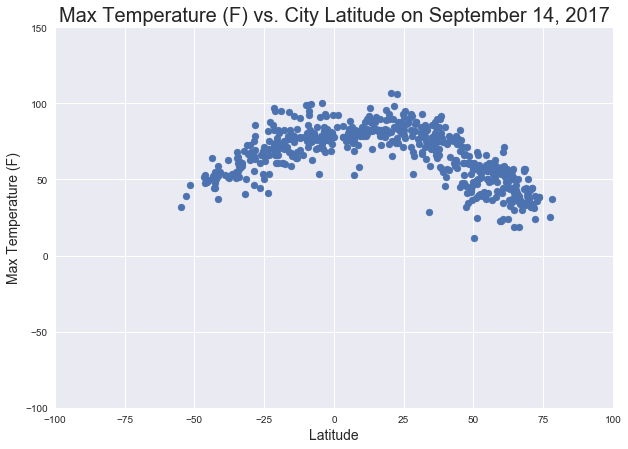
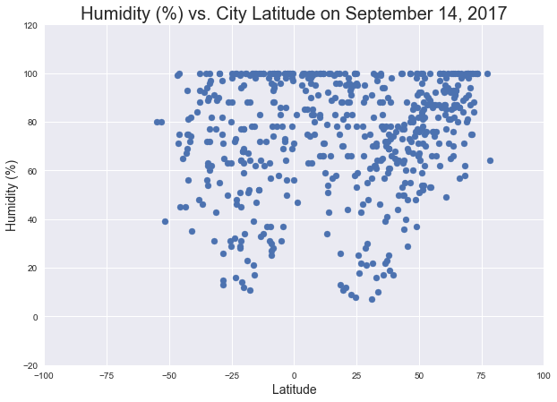
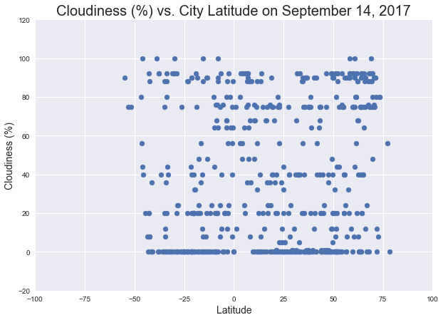
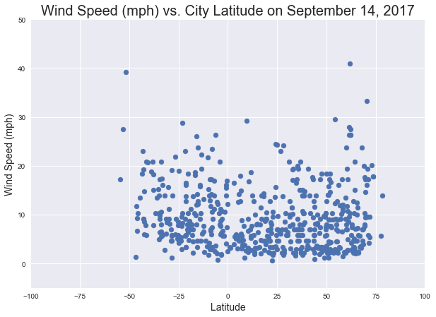
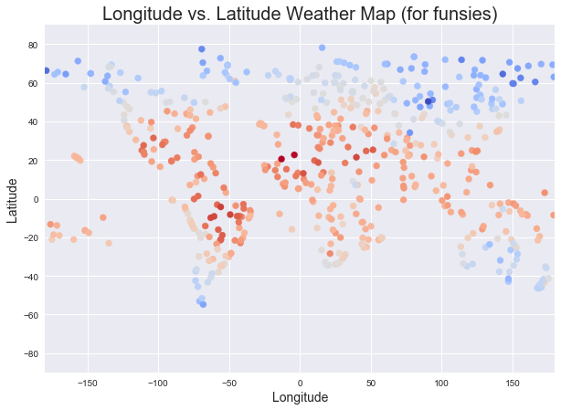

# WeatherPy

1. As expected, temperature peaks near the equator, with temperature gradually decreases as distance from the equator increases in both directions.
2. The lowest percentage humidity locations are nearest to the equator.
3. There does not seem to be any discernible relationship between latitude and wind speed.


```python
import matplotlib.pyplot as plt
import pandas as pd
import numpy as np
import json
import requests as req
import time
from citipy import citipy
import seaborn
```


```python
lat = np.random.uniform(low=-90.0, high=90.0, size=1300)
lng = np.random.uniform(low=-180.0, high=180.0, size=1300)
```


```python
weather_df = pd.DataFrame({"Latitude": lat, "Longitude": lng})
weather_df.head()
```


<div>
<style>
    .dataframe thead tr:only-child th {
        text-align: right;
    }

    .dataframe thead th {
        text-align: left;
    }

    .dataframe tbody tr th {
        vertical-align: top;
    }
</style>
<table border="1" class="dataframe">
  <thead>
    <tr style="text-align: right;">
      <th></th>
      <th>Latitude</th>
      <th>Longitude</th>
    </tr>
  </thead>
  <tbody>
    <tr>
      <th>0</th>
      <td>84.858551</td>
      <td>38.888021</td>
    </tr>
    <tr>
      <th>1</th>
      <td>-40.729878</td>
      <td>-124.679456</td>
    </tr>
    <tr>
      <th>2</th>
      <td>17.423483</td>
      <td>7.167504</td>
    </tr>
    <tr>
      <th>3</th>
      <td>76.032980</td>
      <td>98.447958</td>
    </tr>
    <tr>
      <th>4</th>
      <td>-46.540744</td>
      <td>-172.262122</td>
    </tr>
  </tbody>
</table>
</div>


```python
weather_df["City"] = ""
weather_df["Country"] = ""
weather_df["Date"] = ""
weather_df["Temperature (F)"] = ""
weather_df["Humidity (%)"] = ""
weather_df["Cloudiness (%)"] = ""
weather_df["Wind Speed (mph)"] = ""
```


```python
weather_df.head()
```


<div>
<style>
    .dataframe thead tr:only-child th {
        text-align: right;
    }

    .dataframe thead th {
        text-align: left;
    }

    .dataframe tbody tr th {
        vertical-align: top;
    }
</style>
<table border="1" class="dataframe">
  <thead>
    <tr style="text-align: right;">
      <th></th>
      <th>Latitude</th>
      <th>Longitude</th>
      <th>City</th>
      <th>Country</th>
      <th>Date</th>
      <th>Temperature (F)</th>
      <th>Humidity (%)</th>
      <th>Cloudiness (%)</th>
      <th>Wind Speed (mph)</th>
    </tr>
  </thead>
  <tbody>
    <tr>
      <th>0</th>
      <td>84.858551</td>
      <td>38.888021</td>
      <td></td>
      <td></td>
      <td></td>
      <td></td>
      <td></td>
      <td></td>
      <td></td>
    </tr>
    <tr>
      <th>1</th>
      <td>-40.729878</td>
      <td>-124.679456</td>
      <td></td>
      <td></td>
      <td></td>
      <td></td>
      <td></td>
      <td></td>
      <td></td>
    </tr>
    <tr>
      <th>2</th>
      <td>17.423483</td>
      <td>7.167504</td>
      <td></td>
      <td></td>
      <td></td>
      <td></td>
      <td></td>
      <td></td>
      <td></td>
    </tr>
    <tr>
      <th>3</th>
      <td>76.032980</td>
      <td>98.447958</td>
      <td></td>
      <td></td>
      <td></td>
      <td></td>
      <td></td>
      <td></td>
      <td></td>
    </tr>
    <tr>
      <th>4</th>
      <td>-46.540744</td>
      <td>-172.262122</td>
      <td></td>
      <td></td>
      <td></td>
      <td></td>
      <td></td>
      <td></td>
      <td></td>
    </tr>
  </tbody>
</table>
</div>


```python
api_key = "577f692bda463ed51e5e7f3632a90604"
url = "http://api.openweathermap.org/data/2.5/weather?" 
units = "imperial"
counter = 1

for index, row in weather_df.iterrows():
    try:
        lat_check = row["Latitude"]
        lng_check = row["Longitude"]
        city = citipy.nearest_city(lat_check, lng_check)
        cityname = city.city_name
        country_name = city.country_code
        
        query_url = url + "appid=" + api_key + "&units=" + units + "&q=" + cityname + "," + country_name
    
        print("Checking coordinates #" + str(counter) + " for " + cityname + "," + country_name)
        print("URL: " + query_url)
        print("-----------------------------------------------------------------------------")
    
        response = req.get(query_url).json()
        
        temp = response["main"]["temp_max"]
        humid = response["main"]["humidity"]
        cloudy = response["clouds"]["all"]
        wind = response["wind"]["speed"]
        date = response["dt"]
        newlat = response["coord"]["lat"]
        newlng = response["coord"]["lon"]
    
        weather_df.set_value(index, "City", cityname)
        weather_df.set_value(index, "Country", country_name)
        weather_df.set_value(index, "Date", date)
        weather_df.set_value(index, "Max Temperature (F)", pd.to_numeric(temp))
        weather_df.set_value(index, "Humidity (%)", humid)
        weather_df.set_value(index, "Cloudiness (%)", cloudy)
        weather_df.set_value(index, "Wind Speed (mph)", wind)
        #probably unnecessary, but replacing previous coordinates with city coordinates for accuracy
        weather_df.set_value(index, "Latitude", newlat)
        weather_df.set_value(index, "Longitude", newlng)
    except:
        print("Oops, skipping this one!")
    
    counter = counter + 1
    
    time.sleep(2)

```

    Checking coordinates #1 for tumannyy,ru
    URL: http://api.openweathermap.org/data/2.5/weather?appid=577f692bda463ed51e5e7f3632a90604&units=imperial&q=tumannyy,ru
    -----------------------------------------------------------------------------
    Checking coordinates #2 for rikitea,pf
    URL: http://api.openweathermap.org/data/2.5/weather?appid=577f692bda463ed51e5e7f3632a90604&units=imperial&q=rikitea,pf
    -----------------------------------------------------------------------------
    Checking coordinates #3 for agadez,ne
    URL: http://api.openweathermap.org/data/2.5/weather?appid=577f692bda463ed51e5e7f3632a90604&units=imperial&q=agadez,ne
    -----------------------------------------------------------------------------
    Checking coordinates #4 for khatanga,ru
    URL: http://api.openweathermap.org/data/2.5/weather?appid=577f692bda463ed51e5e7f3632a90604&units=imperial&q=khatanga,ru
    -----------------------------------------------------------------------------
    Checking coordinates #5 for vaini,to
    URL: http://api.openweathermap.org/data/2.5/weather?appid=577f692bda463ed51e5e7f3632a90604&units=imperial&q=vaini,to
    -----------------------------------------------------------------------------
    Checking coordinates #6 for taolanaro,mg
    URL: http://api.openweathermap.org/data/2.5/weather?appid=577f692bda463ed51e5e7f3632a90604&units=imperial&q=taolanaro,mg
    -----------------------------------------------------------------------------
    Checking coordinates #7 for lorengau,pg
    URL: http://api.openweathermap.org/data/2.5/weather?appid=577f692bda463ed51e5e7f3632a90604&units=imperial&q=lorengau,pg
    -----------------------------------------------------------------------------
    Checking coordinates #8 for redmond,us
    URL: http://api.openweathermap.org/data/2.5/weather?appid=577f692bda463ed51e5e7f3632a90604&units=imperial&q=redmond,us
    -----------------------------------------------------------------------------
    Checking coordinates #9 for neiafu,to
    URL: http://api.openweathermap.org/data/2.5/weather?appid=577f692bda463ed51e5e7f3632a90604&units=imperial&q=neiafu,to
    -----------------------------------------------------------------------------
    Checking coordinates #10 for hithadhoo,mv
    URL: http://api.openweathermap.org/data/2.5/weather?appid=577f692bda463ed51e5e7f3632a90604&units=imperial&q=hithadhoo,mv
    -----------------------------------------------------------------------------
    Checking coordinates #11 for new norfolk,au
    URL: http://api.openweathermap.org/data/2.5/weather?appid=577f692bda463ed51e5e7f3632a90604&units=imperial&q=new norfolk,au
    -----------------------------------------------------------------------------
    Checking coordinates #12 for samusu,ws
    URL: http://api.openweathermap.org/data/2.5/weather?appid=577f692bda463ed51e5e7f3632a90604&units=imperial&q=samusu,ws
    -----------------------------------------------------------------------------
    Checking coordinates #13 for punta arenas,cl
    URL: http://api.openweathermap.org/data/2.5/weather?appid=577f692bda463ed51e5e7f3632a90604&units=imperial&q=punta arenas,cl
    -----------------------------------------------------------------------------
    Checking coordinates #14 for gedo,et
    URL: http://api.openweathermap.org/data/2.5/weather?appid=577f692bda463ed51e5e7f3632a90604&units=imperial&q=gedo,et
    -----------------------------------------------------------------------------
    Checking coordinates #15 for bubaque,gw
    URL: http://api.openweathermap.org/data/2.5/weather?appid=577f692bda463ed51e5e7f3632a90604&units=imperial&q=bubaque,gw
    -----------------------------------------------------------------------------
    Checking coordinates #16 for meulaboh,id
    URL: http://api.openweathermap.org/data/2.5/weather?appid=577f692bda463ed51e5e7f3632a90604&units=imperial&q=meulaboh,id
    -----------------------------------------------------------------------------
    Checking coordinates #17 for lorengau,pg
    URL: http://api.openweathermap.org/data/2.5/weather?appid=577f692bda463ed51e5e7f3632a90604&units=imperial&q=lorengau,pg
    -----------------------------------------------------------------------------
    Checking coordinates #18 for bolshevik,ru
    URL: http://api.openweathermap.org/data/2.5/weather?appid=577f692bda463ed51e5e7f3632a90604&units=imperial&q=bolshevik,ru
    -----------------------------------------------------------------------------
    Checking coordinates #19 for vaini,to
    URL: http://api.openweathermap.org/data/2.5/weather?appid=577f692bda463ed51e5e7f3632a90604&units=imperial&q=vaini,to
    -----------------------------------------------------------------------------
    Checking coordinates #20 for atuona,pf
    URL: http://api.openweathermap.org/data/2.5/weather?appid=577f692bda463ed51e5e7f3632a90604&units=imperial&q=atuona,pf
    -----------------------------------------------------------------------------
    Checking coordinates #21 for banjar,id
    URL: http://api.openweathermap.org/data/2.5/weather?appid=577f692bda463ed51e5e7f3632a90604&units=imperial&q=banjar,id
    -----------------------------------------------------------------------------
    Checking coordinates #22 for abu kamal,sy
    URL: http://api.openweathermap.org/data/2.5/weather?appid=577f692bda463ed51e5e7f3632a90604&units=imperial&q=abu kamal,sy
    -----------------------------------------------------------------------------
    Checking coordinates #23 for omboue,ga
    URL: http://api.openweathermap.org/data/2.5/weather?appid=577f692bda463ed51e5e7f3632a90604&units=imperial&q=omboue,ga
    -----------------------------------------------------------------------------
    Checking coordinates #24 for naron,es
    URL: http://api.openweathermap.org/data/2.5/weather?appid=577f692bda463ed51e5e7f3632a90604&units=imperial&q=naron,es
    -----------------------------------------------------------------------------
    Checking coordinates #25 for shubarkuduk,kz
    URL: http://api.openweathermap.org/data/2.5/weather?appid=577f692bda463ed51e5e7f3632a90604&units=imperial&q=shubarkuduk,kz
    -----------------------------------------------------------------------------
    Checking coordinates #26 for port macquarie,au
    URL: http://api.openweathermap.org/data/2.5/weather?appid=577f692bda463ed51e5e7f3632a90604&units=imperial&q=port macquarie,au
    -----------------------------------------------------------------------------
    Checking coordinates #27 for yellowknife,ca
    URL: http://api.openweathermap.org/data/2.5/weather?appid=577f692bda463ed51e5e7f3632a90604&units=imperial&q=yellowknife,ca
    -----------------------------------------------------------------------------
    Checking coordinates #28 for hobart,au
    URL: http://api.openweathermap.org/data/2.5/weather?appid=577f692bda463ed51e5e7f3632a90604&units=imperial&q=hobart,au
    -----------------------------------------------------------------------------
    Checking coordinates #29 for albany,au
    URL: http://api.openweathermap.org/data/2.5/weather?appid=577f692bda463ed51e5e7f3632a90604&units=imperial&q=albany,au
    -----------------------------------------------------------------------------
    Checking coordinates #30 for chuy,uy
    URL: http://api.openweathermap.org/data/2.5/weather?appid=577f692bda463ed51e5e7f3632a90604&units=imperial&q=chuy,uy
    -----------------------------------------------------------------------------
    Checking coordinates #31 for mataura,pf
    URL: http://api.openweathermap.org/data/2.5/weather?appid=577f692bda463ed51e5e7f3632a90604&units=imperial&q=mataura,pf
    -----------------------------------------------------------------------------
    Checking coordinates #32 for hamilton,bm
    URL: http://api.openweathermap.org/data/2.5/weather?appid=577f692bda463ed51e5e7f3632a90604&units=imperial&q=hamilton,bm
    -----------------------------------------------------------------------------
    Checking coordinates #33 for punta arenas,cl
    URL: http://api.openweathermap.org/data/2.5/weather?appid=577f692bda463ed51e5e7f3632a90604&units=imperial&q=punta arenas,cl
    -----------------------------------------------------------------------------
    Checking coordinates #34 for saskylakh,ru
    URL: http://api.openweathermap.org/data/2.5/weather?appid=577f692bda463ed51e5e7f3632a90604&units=imperial&q=saskylakh,ru
    -----------------------------------------------------------------------------
    Checking coordinates #35 for karamea,nz
    URL: http://api.openweathermap.org/data/2.5/weather?appid=577f692bda463ed51e5e7f3632a90604&units=imperial&q=karamea,nz
    -----------------------------------------------------------------------------
    Checking coordinates #36 for amderma,ru
    URL: http://api.openweathermap.org/data/2.5/weather?appid=577f692bda463ed51e5e7f3632a90604&units=imperial&q=amderma,ru
    -----------------------------------------------------------------------------
    Checking coordinates #37 for ushuaia,ar
    URL: http://api.openweathermap.org/data/2.5/weather?appid=577f692bda463ed51e5e7f3632a90604&units=imperial&q=ushuaia,ar
    -----------------------------------------------------------------------------
    Checking coordinates #38 for shimanovsk,ru
    URL: http://api.openweathermap.org/data/2.5/weather?appid=577f692bda463ed51e5e7f3632a90604&units=imperial&q=shimanovsk,ru
    -----------------------------------------------------------------------------
    Checking coordinates #39 for mataura,pf
    URL: http://api.openweathermap.org/data/2.5/weather?appid=577f692bda463ed51e5e7f3632a90604&units=imperial&q=mataura,pf
    -----------------------------------------------------------------------------
    Checking coordinates #40 for chokurdakh,ru
    URL: http://api.openweathermap.org/data/2.5/weather?appid=577f692bda463ed51e5e7f3632a90604&units=imperial&q=chokurdakh,ru
    -----------------------------------------------------------------------------
    Checking coordinates #41 for illoqqortoormiut,gl
    URL: http://api.openweathermap.org/data/2.5/weather?appid=577f692bda463ed51e5e7f3632a90604&units=imperial&q=illoqqortoormiut,gl
    -----------------------------------------------------------------------------
    Checking coordinates #42 for licheng,cn
    URL: http://api.openweathermap.org/data/2.5/weather?appid=577f692bda463ed51e5e7f3632a90604&units=imperial&q=licheng,cn
    -----------------------------------------------------------------------------
    Checking coordinates #43 for tuktoyaktuk,ca
    URL: http://api.openweathermap.org/data/2.5/weather?appid=577f692bda463ed51e5e7f3632a90604&units=imperial&q=tuktoyaktuk,ca
    -----------------------------------------------------------------------------
    Checking coordinates #44 for albany,au
    URL: http://api.openweathermap.org/data/2.5/weather?appid=577f692bda463ed51e5e7f3632a90604&units=imperial&q=albany,au
    -----------------------------------------------------------------------------
    Checking coordinates #45 for klaksvik,fo
    URL: http://api.openweathermap.org/data/2.5/weather?appid=577f692bda463ed51e5e7f3632a90604&units=imperial&q=klaksvik,fo
    -----------------------------------------------------------------------------
    Checking coordinates #46 for ginir,et
    URL: http://api.openweathermap.org/data/2.5/weather?appid=577f692bda463ed51e5e7f3632a90604&units=imperial&q=ginir,et
    -----------------------------------------------------------------------------
    Checking coordinates #47 for barentsburg,sj
    URL: http://api.openweathermap.org/data/2.5/weather?appid=577f692bda463ed51e5e7f3632a90604&units=imperial&q=barentsburg,sj
    -----------------------------------------------------------------------------
    Oops, skipping this one!
    Checking coordinates #48 for palabuhanratu,id
    URL: http://api.openweathermap.org/data/2.5/weather?appid=577f692bda463ed51e5e7f3632a90604&units=imperial&q=palabuhanratu,id
    -----------------------------------------------------------------------------
    Checking coordinates #49 for puerto ayora,ec
    URL: http://api.openweathermap.org/data/2.5/weather?appid=577f692bda463ed51e5e7f3632a90604&units=imperial&q=puerto ayora,ec
    -----------------------------------------------------------------------------
    Checking coordinates #50 for santa maria,cv
    URL: http://api.openweathermap.org/data/2.5/weather?appid=577f692bda463ed51e5e7f3632a90604&units=imperial&q=santa maria,cv
    -----------------------------------------------------------------------------
    Checking coordinates #51 for khatanga,ru
    URL: http://api.openweathermap.org/data/2.5/weather?appid=577f692bda463ed51e5e7f3632a90604&units=imperial&q=khatanga,ru
    -----------------------------------------------------------------------------
    Checking coordinates #52 for marcona,pe
    URL: http://api.openweathermap.org/data/2.5/weather?appid=577f692bda463ed51e5e7f3632a90604&units=imperial&q=marcona,pe
    -----------------------------------------------------------------------------
    Checking coordinates #53 for chuy,uy
    URL: http://api.openweathermap.org/data/2.5/weather?appid=577f692bda463ed51e5e7f3632a90604&units=imperial&q=chuy,uy
    -----------------------------------------------------------------------------
    Checking coordinates #54 for lebu,cl
    URL: http://api.openweathermap.org/data/2.5/weather?appid=577f692bda463ed51e5e7f3632a90604&units=imperial&q=lebu,cl
    -----------------------------------------------------------------------------
    Checking coordinates #55 for mar del plata,ar
    URL: http://api.openweathermap.org/data/2.5/weather?appid=577f692bda463ed51e5e7f3632a90604&units=imperial&q=mar del plata,ar
    -----------------------------------------------------------------------------
    Checking coordinates #56 for ribeira grande,pt
    URL: http://api.openweathermap.org/data/2.5/weather?appid=577f692bda463ed51e5e7f3632a90604&units=imperial&q=ribeira grande,pt
    -----------------------------------------------------------------------------
    Checking coordinates #57 for taoudenni,ml
    URL: http://api.openweathermap.org/data/2.5/weather?appid=577f692bda463ed51e5e7f3632a90604&units=imperial&q=taoudenni,ml
    -----------------------------------------------------------------------------
    Checking coordinates #58 for bredasdorp,za
    URL: http://api.openweathermap.org/data/2.5/weather?appid=577f692bda463ed51e5e7f3632a90604&units=imperial&q=bredasdorp,za
    -----------------------------------------------------------------------------
    Checking coordinates #59 for illoqqortoormiut,gl
    URL: http://api.openweathermap.org/data/2.5/weather?appid=577f692bda463ed51e5e7f3632a90604&units=imperial&q=illoqqortoormiut,gl
    -----------------------------------------------------------------------------
    Checking coordinates #60 for ushuaia,ar
    URL: http://api.openweathermap.org/data/2.5/weather?appid=577f692bda463ed51e5e7f3632a90604&units=imperial&q=ushuaia,ar
    -----------------------------------------------------------------------------
    Checking coordinates #61 for bethel,us
    URL: http://api.openweathermap.org/data/2.5/weather?appid=577f692bda463ed51e5e7f3632a90604&units=imperial&q=bethel,us
    -----------------------------------------------------------------------------
    Checking coordinates #62 for neryungri,ru
    URL: http://api.openweathermap.org/data/2.5/weather?appid=577f692bda463ed51e5e7f3632a90604&units=imperial&q=neryungri,ru
    -----------------------------------------------------------------------------
    Checking coordinates #63 for khatanga,ru
    URL: http://api.openweathermap.org/data/2.5/weather?appid=577f692bda463ed51e5e7f3632a90604&units=imperial&q=khatanga,ru
    -----------------------------------------------------------------------------
    Checking coordinates #64 for mayo,ca
    URL: http://api.openweathermap.org/data/2.5/weather?appid=577f692bda463ed51e5e7f3632a90604&units=imperial&q=mayo,ca
    -----------------------------------------------------------------------------
    Checking coordinates #65 for bengkulu,id
    URL: http://api.openweathermap.org/data/2.5/weather?appid=577f692bda463ed51e5e7f3632a90604&units=imperial&q=bengkulu,id
    -----------------------------------------------------------------------------
    Checking coordinates #66 for punta arenas,cl
    URL: http://api.openweathermap.org/data/2.5/weather?appid=577f692bda463ed51e5e7f3632a90604&units=imperial&q=punta arenas,cl
    -----------------------------------------------------------------------------
    Checking coordinates #67 for busselton,au
    URL: http://api.openweathermap.org/data/2.5/weather?appid=577f692bda463ed51e5e7f3632a90604&units=imperial&q=busselton,au
    -----------------------------------------------------------------------------
    Checking coordinates #68 for thompson,ca
    URL: http://api.openweathermap.org/data/2.5/weather?appid=577f692bda463ed51e5e7f3632a90604&units=imperial&q=thompson,ca
    -----------------------------------------------------------------------------
    Checking coordinates #69 for yellowknife,ca
    URL: http://api.openweathermap.org/data/2.5/weather?appid=577f692bda463ed51e5e7f3632a90604&units=imperial&q=yellowknife,ca
    -----------------------------------------------------------------------------
    Checking coordinates #70 for borogontsy,ru
    URL: http://api.openweathermap.org/data/2.5/weather?appid=577f692bda463ed51e5e7f3632a90604&units=imperial&q=borogontsy,ru
    -----------------------------------------------------------------------------
    Checking coordinates #71 for matamoros,mx
    URL: http://api.openweathermap.org/data/2.5/weather?appid=577f692bda463ed51e5e7f3632a90604&units=imperial&q=matamoros,mx
    -----------------------------------------------------------------------------
    Checking coordinates #72 for oktyabrskiy,ru
    URL: http://api.openweathermap.org/data/2.5/weather?appid=577f692bda463ed51e5e7f3632a90604&units=imperial&q=oktyabrskiy,ru
    -----------------------------------------------------------------------------
    Checking coordinates #73 for ribeira grande,pt
    URL: http://api.openweathermap.org/data/2.5/weather?appid=577f692bda463ed51e5e7f3632a90604&units=imperial&q=ribeira grande,pt
    -----------------------------------------------------------------------------
    Checking coordinates #74 for broome,au
    URL: http://api.openweathermap.org/data/2.5/weather?appid=577f692bda463ed51e5e7f3632a90604&units=imperial&q=broome,au
    -----------------------------------------------------------------------------
    Checking coordinates #75 for souillac,mu
    URL: http://api.openweathermap.org/data/2.5/weather?appid=577f692bda463ed51e5e7f3632a90604&units=imperial&q=souillac,mu
    -----------------------------------------------------------------------------
    Checking coordinates #76 for mount gambier,au
    URL: http://api.openweathermap.org/data/2.5/weather?appid=577f692bda463ed51e5e7f3632a90604&units=imperial&q=mount gambier,au
    -----------------------------------------------------------------------------
    Checking coordinates #77 for fereydun kenar,ir
    URL: http://api.openweathermap.org/data/2.5/weather?appid=577f692bda463ed51e5e7f3632a90604&units=imperial&q=fereydun kenar,ir
    -----------------------------------------------------------------------------
    Checking coordinates #78 for ribeira grande,pt
    URL: http://api.openweathermap.org/data/2.5/weather?appid=577f692bda463ed51e5e7f3632a90604&units=imperial&q=ribeira grande,pt
    -----------------------------------------------------------------------------
    Checking coordinates #79 for jardim,br
    URL: http://api.openweathermap.org/data/2.5/weather?appid=577f692bda463ed51e5e7f3632a90604&units=imperial&q=jardim,br
    -----------------------------------------------------------------------------
    Checking coordinates #80 for shelburne,ca
    URL: http://api.openweathermap.org/data/2.5/weather?appid=577f692bda463ed51e5e7f3632a90604&units=imperial&q=shelburne,ca
    -----------------------------------------------------------------------------
    Checking coordinates #81 for alofi,nu
    URL: http://api.openweathermap.org/data/2.5/weather?appid=577f692bda463ed51e5e7f3632a90604&units=imperial&q=alofi,nu
    -----------------------------------------------------------------------------
    Checking coordinates #82 for illoqqortoormiut,gl
    URL: http://api.openweathermap.org/data/2.5/weather?appid=577f692bda463ed51e5e7f3632a90604&units=imperial&q=illoqqortoormiut,gl
    -----------------------------------------------------------------------------
    Checking coordinates #83 for maryborough,au
    URL: http://api.openweathermap.org/data/2.5/weather?appid=577f692bda463ed51e5e7f3632a90604&units=imperial&q=maryborough,au
    -----------------------------------------------------------------------------
    Checking coordinates #84 for tazovskiy,ru
    URL: http://api.openweathermap.org/data/2.5/weather?appid=577f692bda463ed51e5e7f3632a90604&units=imperial&q=tazovskiy,ru
    -----------------------------------------------------------------------------
    Checking coordinates #85 for tasiilaq,gl
    URL: http://api.openweathermap.org/data/2.5/weather?appid=577f692bda463ed51e5e7f3632a90604&units=imperial&q=tasiilaq,gl
    -----------------------------------------------------------------------------
    Checking coordinates #86 for yellowknife,ca
    URL: http://api.openweathermap.org/data/2.5/weather?appid=577f692bda463ed51e5e7f3632a90604&units=imperial&q=yellowknife,ca
    -----------------------------------------------------------------------------
    Checking coordinates #87 for merauke,id
    URL: http://api.openweathermap.org/data/2.5/weather?appid=577f692bda463ed51e5e7f3632a90604&units=imperial&q=merauke,id
    -----------------------------------------------------------------------------
    Checking coordinates #88 for egvekinot,ru
    URL: http://api.openweathermap.org/data/2.5/weather?appid=577f692bda463ed51e5e7f3632a90604&units=imperial&q=egvekinot,ru
    -----------------------------------------------------------------------------
    Checking coordinates #89 for ahipara,nz
    URL: http://api.openweathermap.org/data/2.5/weather?appid=577f692bda463ed51e5e7f3632a90604&units=imperial&q=ahipara,nz
    -----------------------------------------------------------------------------
    Checking coordinates #90 for cabo san lucas,mx
    URL: http://api.openweathermap.org/data/2.5/weather?appid=577f692bda463ed51e5e7f3632a90604&units=imperial&q=cabo san lucas,mx
    -----------------------------------------------------------------------------
    Checking coordinates #91 for samusu,ws
    URL: http://api.openweathermap.org/data/2.5/weather?appid=577f692bda463ed51e5e7f3632a90604&units=imperial&q=samusu,ws
    -----------------------------------------------------------------------------
    Checking coordinates #92 for khatanga,ru
    URL: http://api.openweathermap.org/data/2.5/weather?appid=577f692bda463ed51e5e7f3632a90604&units=imperial&q=khatanga,ru
    -----------------------------------------------------------------------------
    Checking coordinates #93 for tuktoyaktuk,ca
    URL: http://api.openweathermap.org/data/2.5/weather?appid=577f692bda463ed51e5e7f3632a90604&units=imperial&q=tuktoyaktuk,ca
    -----------------------------------------------------------------------------
    Checking coordinates #94 for hermanus,za
    URL: http://api.openweathermap.org/data/2.5/weather?appid=577f692bda463ed51e5e7f3632a90604&units=imperial&q=hermanus,za
    -----------------------------------------------------------------------------
    Checking coordinates #95 for bluff,nz
    URL: http://api.openweathermap.org/data/2.5/weather?appid=577f692bda463ed51e5e7f3632a90604&units=imperial&q=bluff,nz
    -----------------------------------------------------------------------------
    Checking coordinates #96 for college,us
    URL: http://api.openweathermap.org/data/2.5/weather?appid=577f692bda463ed51e5e7f3632a90604&units=imperial&q=college,us
    -----------------------------------------------------------------------------
    Checking coordinates #97 for katsuura,jp
    URL: http://api.openweathermap.org/data/2.5/weather?appid=577f692bda463ed51e5e7f3632a90604&units=imperial&q=katsuura,jp
    -----------------------------------------------------------------------------
    Checking coordinates #98 for punta arenas,cl
    URL: http://api.openweathermap.org/data/2.5/weather?appid=577f692bda463ed51e5e7f3632a90604&units=imperial&q=punta arenas,cl
    -----------------------------------------------------------------------------
    Checking coordinates #99 for upernavik,gl
    URL: http://api.openweathermap.org/data/2.5/weather?appid=577f692bda463ed51e5e7f3632a90604&units=imperial&q=upernavik,gl
    -----------------------------------------------------------------------------
    Checking coordinates #100 for belushya guba,ru
    URL: http://api.openweathermap.org/data/2.5/weather?appid=577f692bda463ed51e5e7f3632a90604&units=imperial&q=belushya guba,ru
    -----------------------------------------------------------------------------
    Checking coordinates #101 for taolanaro,mg
    URL: http://api.openweathermap.org/data/2.5/weather?appid=577f692bda463ed51e5e7f3632a90604&units=imperial&q=taolanaro,mg
    -----------------------------------------------------------------------------
    Checking coordinates #102 for victoria,sc
    URL: http://api.openweathermap.org/data/2.5/weather?appid=577f692bda463ed51e5e7f3632a90604&units=imperial&q=victoria,sc
    -----------------------------------------------------------------------------
    Checking coordinates #103 for kapaa,us
    URL: http://api.openweathermap.org/data/2.5/weather?appid=577f692bda463ed51e5e7f3632a90604&units=imperial&q=kapaa,us
    -----------------------------------------------------------------------------
    Checking coordinates #104 for manyana,bw
    URL: http://api.openweathermap.org/data/2.5/weather?appid=577f692bda463ed51e5e7f3632a90604&units=imperial&q=manyana,bw
    -----------------------------------------------------------------------------
    Checking coordinates #105 for nikolskoye,ru
    URL: http://api.openweathermap.org/data/2.5/weather?appid=577f692bda463ed51e5e7f3632a90604&units=imperial&q=nikolskoye,ru
    -----------------------------------------------------------------------------
    Checking coordinates #106 for ushuaia,ar
    URL: http://api.openweathermap.org/data/2.5/weather?appid=577f692bda463ed51e5e7f3632a90604&units=imperial&q=ushuaia,ar
    -----------------------------------------------------------------------------
    Checking coordinates #107 for vaini,to
    URL: http://api.openweathermap.org/data/2.5/weather?appid=577f692bda463ed51e5e7f3632a90604&units=imperial&q=vaini,to
    -----------------------------------------------------------------------------
    Checking coordinates #108 for safaga,eg
    URL: http://api.openweathermap.org/data/2.5/weather?appid=577f692bda463ed51e5e7f3632a90604&units=imperial&q=safaga,eg
    -----------------------------------------------------------------------------
    Checking coordinates #109 for rikitea,pf
    URL: http://api.openweathermap.org/data/2.5/weather?appid=577f692bda463ed51e5e7f3632a90604&units=imperial&q=rikitea,pf
    -----------------------------------------------------------------------------
    Checking coordinates #110 for port-cartier,ca
    URL: http://api.openweathermap.org/data/2.5/weather?appid=577f692bda463ed51e5e7f3632a90604&units=imperial&q=port-cartier,ca
    -----------------------------------------------------------------------------
    Checking coordinates #111 for chernyshevskiy,ru
    URL: http://api.openweathermap.org/data/2.5/weather?appid=577f692bda463ed51e5e7f3632a90604&units=imperial&q=chernyshevskiy,ru
    -----------------------------------------------------------------------------
    Checking coordinates #112 for ribeira grande,pt
    URL: http://api.openweathermap.org/data/2.5/weather?appid=577f692bda463ed51e5e7f3632a90604&units=imperial&q=ribeira grande,pt
    -----------------------------------------------------------------------------
    Checking coordinates #113 for bluff,nz
    URL: http://api.openweathermap.org/data/2.5/weather?appid=577f692bda463ed51e5e7f3632a90604&units=imperial&q=bluff,nz
    -----------------------------------------------------------------------------
    Checking coordinates #114 for souillac,mu
    URL: http://api.openweathermap.org/data/2.5/weather?appid=577f692bda463ed51e5e7f3632a90604&units=imperial&q=souillac,mu
    -----------------------------------------------------------------------------
    Checking coordinates #115 for monticello,us
    URL: http://api.openweathermap.org/data/2.5/weather?appid=577f692bda463ed51e5e7f3632a90604&units=imperial&q=monticello,us
    -----------------------------------------------------------------------------
    Checking coordinates #116 for vanimo,pg
    URL: http://api.openweathermap.org/data/2.5/weather?appid=577f692bda463ed51e5e7f3632a90604&units=imperial&q=vanimo,pg
    -----------------------------------------------------------------------------
    Checking coordinates #117 for aripuana,br
    URL: http://api.openweathermap.org/data/2.5/weather?appid=577f692bda463ed51e5e7f3632a90604&units=imperial&q=aripuana,br
    -----------------------------------------------------------------------------
    Checking coordinates #118 for attawapiskat,ca
    URL: http://api.openweathermap.org/data/2.5/weather?appid=577f692bda463ed51e5e7f3632a90604&units=imperial&q=attawapiskat,ca
    -----------------------------------------------------------------------------
    Checking coordinates #119 for albany,au
    URL: http://api.openweathermap.org/data/2.5/weather?appid=577f692bda463ed51e5e7f3632a90604&units=imperial&q=albany,au
    -----------------------------------------------------------------------------
    Checking coordinates #120 for chittaurgarh,in
    URL: http://api.openweathermap.org/data/2.5/weather?appid=577f692bda463ed51e5e7f3632a90604&units=imperial&q=chittaurgarh,in
    -----------------------------------------------------------------------------
    Checking coordinates #121 for cape town,za
    URL: http://api.openweathermap.org/data/2.5/weather?appid=577f692bda463ed51e5e7f3632a90604&units=imperial&q=cape town,za
    -----------------------------------------------------------------------------
    Checking coordinates #122 for port macquarie,au
    URL: http://api.openweathermap.org/data/2.5/weather?appid=577f692bda463ed51e5e7f3632a90604&units=imperial&q=port macquarie,au
    -----------------------------------------------------------------------------
    Checking coordinates #123 for nome,us
    URL: http://api.openweathermap.org/data/2.5/weather?appid=577f692bda463ed51e5e7f3632a90604&units=imperial&q=nome,us
    -----------------------------------------------------------------------------
    Checking coordinates #124 for mahebourg,mu
    URL: http://api.openweathermap.org/data/2.5/weather?appid=577f692bda463ed51e5e7f3632a90604&units=imperial&q=mahebourg,mu
    -----------------------------------------------------------------------------
    Checking coordinates #125 for rikitea,pf
    URL: http://api.openweathermap.org/data/2.5/weather?appid=577f692bda463ed51e5e7f3632a90604&units=imperial&q=rikitea,pf
    -----------------------------------------------------------------------------
    Checking coordinates #126 for lufilufi,ws
    URL: http://api.openweathermap.org/data/2.5/weather?appid=577f692bda463ed51e5e7f3632a90604&units=imperial&q=lufilufi,ws
    -----------------------------------------------------------------------------
    Checking coordinates #127 for cabo san lucas,mx
    URL: http://api.openweathermap.org/data/2.5/weather?appid=577f692bda463ed51e5e7f3632a90604&units=imperial&q=cabo san lucas,mx
    -----------------------------------------------------------------------------
    Checking coordinates #128 for barrow,us
    URL: http://api.openweathermap.org/data/2.5/weather?appid=577f692bda463ed51e5e7f3632a90604&units=imperial&q=barrow,us
    -----------------------------------------------------------------------------
    Checking coordinates #129 for penzance,gb
    URL: http://api.openweathermap.org/data/2.5/weather?appid=577f692bda463ed51e5e7f3632a90604&units=imperial&q=penzance,gb
    -----------------------------------------------------------------------------
    Checking coordinates #130 for clyde river,ca
    URL: http://api.openweathermap.org/data/2.5/weather?appid=577f692bda463ed51e5e7f3632a90604&units=imperial&q=clyde river,ca
    -----------------------------------------------------------------------------
    Checking coordinates #131 for uribia,co
    URL: http://api.openweathermap.org/data/2.5/weather?appid=577f692bda463ed51e5e7f3632a90604&units=imperial&q=uribia,co
    -----------------------------------------------------------------------------
    Checking coordinates #132 for oshkosh,us
    URL: http://api.openweathermap.org/data/2.5/weather?appid=577f692bda463ed51e5e7f3632a90604&units=imperial&q=oshkosh,us
    -----------------------------------------------------------------------------
    Checking coordinates #133 for ribeira grande,pt
    URL: http://api.openweathermap.org/data/2.5/weather?appid=577f692bda463ed51e5e7f3632a90604&units=imperial&q=ribeira grande,pt
    -----------------------------------------------------------------------------
    Checking coordinates #134 for tiksi,ru
    URL: http://api.openweathermap.org/data/2.5/weather?appid=577f692bda463ed51e5e7f3632a90604&units=imperial&q=tiksi,ru
    -----------------------------------------------------------------------------
    Checking coordinates #135 for kapaa,us
    URL: http://api.openweathermap.org/data/2.5/weather?appid=577f692bda463ed51e5e7f3632a90604&units=imperial&q=kapaa,us
    -----------------------------------------------------------------------------
    Checking coordinates #136 for hermanus,za
    URL: http://api.openweathermap.org/data/2.5/weather?appid=577f692bda463ed51e5e7f3632a90604&units=imperial&q=hermanus,za
    -----------------------------------------------------------------------------
    Checking coordinates #137 for angra,pt
    URL: http://api.openweathermap.org/data/2.5/weather?appid=577f692bda463ed51e5e7f3632a90604&units=imperial&q=angra,pt
    -----------------------------------------------------------------------------
    Checking coordinates #138 for beidao,cn
    URL: http://api.openweathermap.org/data/2.5/weather?appid=577f692bda463ed51e5e7f3632a90604&units=imperial&q=beidao,cn
    -----------------------------------------------------------------------------
    Checking coordinates #139 for jamestown,sh
    URL: http://api.openweathermap.org/data/2.5/weather?appid=577f692bda463ed51e5e7f3632a90604&units=imperial&q=jamestown,sh
    -----------------------------------------------------------------------------
    Checking coordinates #140 for illoqqortoormiut,gl
    URL: http://api.openweathermap.org/data/2.5/weather?appid=577f692bda463ed51e5e7f3632a90604&units=imperial&q=illoqqortoormiut,gl
    -----------------------------------------------------------------------------
    Checking coordinates #141 for cidreira,br
    URL: http://api.openweathermap.org/data/2.5/weather?appid=577f692bda463ed51e5e7f3632a90604&units=imperial&q=cidreira,br
    -----------------------------------------------------------------------------
    Checking coordinates #142 for taolanaro,mg
    URL: http://api.openweathermap.org/data/2.5/weather?appid=577f692bda463ed51e5e7f3632a90604&units=imperial&q=taolanaro,mg
    -----------------------------------------------------------------------------
    Checking coordinates #143 for port-gentil,ga
    URL: http://api.openweathermap.org/data/2.5/weather?appid=577f692bda463ed51e5e7f3632a90604&units=imperial&q=port-gentil,ga
    -----------------------------------------------------------------------------
    Checking coordinates #144 for jamestown,sh
    URL: http://api.openweathermap.org/data/2.5/weather?appid=577f692bda463ed51e5e7f3632a90604&units=imperial&q=jamestown,sh
    -----------------------------------------------------------------------------
    Checking coordinates #145 for yellowknife,ca
    URL: http://api.openweathermap.org/data/2.5/weather?appid=577f692bda463ed51e5e7f3632a90604&units=imperial&q=yellowknife,ca
    -----------------------------------------------------------------------------
    Checking coordinates #146 for bluff,nz
    URL: http://api.openweathermap.org/data/2.5/weather?appid=577f692bda463ed51e5e7f3632a90604&units=imperial&q=bluff,nz
    -----------------------------------------------------------------------------
    Checking coordinates #147 for port alfred,za
    URL: http://api.openweathermap.org/data/2.5/weather?appid=577f692bda463ed51e5e7f3632a90604&units=imperial&q=port alfred,za
    -----------------------------------------------------------------------------
    Checking coordinates #148 for kaitangata,nz
    URL: http://api.openweathermap.org/data/2.5/weather?appid=577f692bda463ed51e5e7f3632a90604&units=imperial&q=kaitangata,nz
    -----------------------------------------------------------------------------
    Checking coordinates #149 for busselton,au
    URL: http://api.openweathermap.org/data/2.5/weather?appid=577f692bda463ed51e5e7f3632a90604&units=imperial&q=busselton,au
    -----------------------------------------------------------------------------
    Checking coordinates #150 for saldanha,za
    URL: http://api.openweathermap.org/data/2.5/weather?appid=577f692bda463ed51e5e7f3632a90604&units=imperial&q=saldanha,za
    -----------------------------------------------------------------------------
    Checking coordinates #151 for upernavik,gl
    URL: http://api.openweathermap.org/data/2.5/weather?appid=577f692bda463ed51e5e7f3632a90604&units=imperial&q=upernavik,gl
    -----------------------------------------------------------------------------
    Checking coordinates #152 for geraldton,au
    URL: http://api.openweathermap.org/data/2.5/weather?appid=577f692bda463ed51e5e7f3632a90604&units=imperial&q=geraldton,au
    -----------------------------------------------------------------------------
    Checking coordinates #153 for itarema,br
    URL: http://api.openweathermap.org/data/2.5/weather?appid=577f692bda463ed51e5e7f3632a90604&units=imperial&q=itarema,br
    -----------------------------------------------------------------------------
    Checking coordinates #154 for ushuaia,ar
    URL: http://api.openweathermap.org/data/2.5/weather?appid=577f692bda463ed51e5e7f3632a90604&units=imperial&q=ushuaia,ar
    -----------------------------------------------------------------------------
    Checking coordinates #155 for hovd,mn
    URL: http://api.openweathermap.org/data/2.5/weather?appid=577f692bda463ed51e5e7f3632a90604&units=imperial&q=hovd,mn
    -----------------------------------------------------------------------------
    Checking coordinates #156 for new norfolk,au
    URL: http://api.openweathermap.org/data/2.5/weather?appid=577f692bda463ed51e5e7f3632a90604&units=imperial&q=new norfolk,au
    -----------------------------------------------------------------------------
    Checking coordinates #157 for hermanus,za
    URL: http://api.openweathermap.org/data/2.5/weather?appid=577f692bda463ed51e5e7f3632a90604&units=imperial&q=hermanus,za
    -----------------------------------------------------------------------------
    Checking coordinates #158 for lavrentiya,ru
    URL: http://api.openweathermap.org/data/2.5/weather?appid=577f692bda463ed51e5e7f3632a90604&units=imperial&q=lavrentiya,ru
    -----------------------------------------------------------------------------
    Checking coordinates #159 for lima,pe
    URL: http://api.openweathermap.org/data/2.5/weather?appid=577f692bda463ed51e5e7f3632a90604&units=imperial&q=lima,pe
    -----------------------------------------------------------------------------
    Checking coordinates #160 for barentsburg,sj
    URL: http://api.openweathermap.org/data/2.5/weather?appid=577f692bda463ed51e5e7f3632a90604&units=imperial&q=barentsburg,sj
    -----------------------------------------------------------------------------
    Oops, skipping this one!
    Checking coordinates #161 for isangel,vu
    URL: http://api.openweathermap.org/data/2.5/weather?appid=577f692bda463ed51e5e7f3632a90604&units=imperial&q=isangel,vu
    -----------------------------------------------------------------------------
    Checking coordinates #162 for beloha,mg
    URL: http://api.openweathermap.org/data/2.5/weather?appid=577f692bda463ed51e5e7f3632a90604&units=imperial&q=beloha,mg
    -----------------------------------------------------------------------------
    Checking coordinates #163 for seredka,ru
    URL: http://api.openweathermap.org/data/2.5/weather?appid=577f692bda463ed51e5e7f3632a90604&units=imperial&q=seredka,ru
    -----------------------------------------------------------------------------
    Checking coordinates #164 for nizhneyansk,ru
    URL: http://api.openweathermap.org/data/2.5/weather?appid=577f692bda463ed51e5e7f3632a90604&units=imperial&q=nizhneyansk,ru
    -----------------------------------------------------------------------------
    Checking coordinates #165 for hermanus,za
    URL: http://api.openweathermap.org/data/2.5/weather?appid=577f692bda463ed51e5e7f3632a90604&units=imperial&q=hermanus,za
    -----------------------------------------------------------------------------
    Checking coordinates #166 for east london,za
    URL: http://api.openweathermap.org/data/2.5/weather?appid=577f692bda463ed51e5e7f3632a90604&units=imperial&q=east london,za
    -----------------------------------------------------------------------------
    Checking coordinates #167 for brae,gb
    URL: http://api.openweathermap.org/data/2.5/weather?appid=577f692bda463ed51e5e7f3632a90604&units=imperial&q=brae,gb
    -----------------------------------------------------------------------------
    Checking coordinates #168 for ushuaia,ar
    URL: http://api.openweathermap.org/data/2.5/weather?appid=577f692bda463ed51e5e7f3632a90604&units=imperial&q=ushuaia,ar
    -----------------------------------------------------------------------------
    Checking coordinates #169 for punta arenas,cl
    URL: http://api.openweathermap.org/data/2.5/weather?appid=577f692bda463ed51e5e7f3632a90604&units=imperial&q=punta arenas,cl
    -----------------------------------------------------------------------------
    Checking coordinates #170 for ushuaia,ar
    URL: http://api.openweathermap.org/data/2.5/weather?appid=577f692bda463ed51e5e7f3632a90604&units=imperial&q=ushuaia,ar
    -----------------------------------------------------------------------------
    Checking coordinates #171 for bredasdorp,za
    URL: http://api.openweathermap.org/data/2.5/weather?appid=577f692bda463ed51e5e7f3632a90604&units=imperial&q=bredasdorp,za
    -----------------------------------------------------------------------------
    Checking coordinates #172 for moussoro,td
    URL: http://api.openweathermap.org/data/2.5/weather?appid=577f692bda463ed51e5e7f3632a90604&units=imperial&q=moussoro,td
    -----------------------------------------------------------------------------
    Checking coordinates #173 for nuuk,gl
    URL: http://api.openweathermap.org/data/2.5/weather?appid=577f692bda463ed51e5e7f3632a90604&units=imperial&q=nuuk,gl
    -----------------------------------------------------------------------------
    Checking coordinates #174 for castro,cl
    URL: http://api.openweathermap.org/data/2.5/weather?appid=577f692bda463ed51e5e7f3632a90604&units=imperial&q=castro,cl
    -----------------------------------------------------------------------------
    Checking coordinates #175 for new norfolk,au
    URL: http://api.openweathermap.org/data/2.5/weather?appid=577f692bda463ed51e5e7f3632a90604&units=imperial&q=new norfolk,au
    -----------------------------------------------------------------------------
    Checking coordinates #176 for amderma,ru
    URL: http://api.openweathermap.org/data/2.5/weather?appid=577f692bda463ed51e5e7f3632a90604&units=imperial&q=amderma,ru
    -----------------------------------------------------------------------------
    Checking coordinates #177 for attawapiskat,ca
    URL: http://api.openweathermap.org/data/2.5/weather?appid=577f692bda463ed51e5e7f3632a90604&units=imperial&q=attawapiskat,ca
    -----------------------------------------------------------------------------
    Checking coordinates #178 for barrow,us
    URL: http://api.openweathermap.org/data/2.5/weather?appid=577f692bda463ed51e5e7f3632a90604&units=imperial&q=barrow,us
    -----------------------------------------------------------------------------
    Checking coordinates #179 for castro,cl
    URL: http://api.openweathermap.org/data/2.5/weather?appid=577f692bda463ed51e5e7f3632a90604&units=imperial&q=castro,cl
    -----------------------------------------------------------------------------
    Checking coordinates #180 for miraflores,co
    URL: http://api.openweathermap.org/data/2.5/weather?appid=577f692bda463ed51e5e7f3632a90604&units=imperial&q=miraflores,co
    -----------------------------------------------------------------------------
    Checking coordinates #181 for kodiak,us
    URL: http://api.openweathermap.org/data/2.5/weather?appid=577f692bda463ed51e5e7f3632a90604&units=imperial&q=kodiak,us
    -----------------------------------------------------------------------------
    Checking coordinates #182 for dikson,ru
    URL: http://api.openweathermap.org/data/2.5/weather?appid=577f692bda463ed51e5e7f3632a90604&units=imperial&q=dikson,ru
    -----------------------------------------------------------------------------
    Checking coordinates #183 for khorramabad,ir
    URL: http://api.openweathermap.org/data/2.5/weather?appid=577f692bda463ed51e5e7f3632a90604&units=imperial&q=khorramabad,ir
    -----------------------------------------------------------------------------
    Checking coordinates #184 for kilindoni,tz
    URL: http://api.openweathermap.org/data/2.5/weather?appid=577f692bda463ed51e5e7f3632a90604&units=imperial&q=kilindoni,tz
    -----------------------------------------------------------------------------
    Checking coordinates #185 for pevek,ru
    URL: http://api.openweathermap.org/data/2.5/weather?appid=577f692bda463ed51e5e7f3632a90604&units=imperial&q=pevek,ru
    -----------------------------------------------------------------------------
    Checking coordinates #186 for busselton,au
    URL: http://api.openweathermap.org/data/2.5/weather?appid=577f692bda463ed51e5e7f3632a90604&units=imperial&q=busselton,au
    -----------------------------------------------------------------------------
    Checking coordinates #187 for atuona,pf
    URL: http://api.openweathermap.org/data/2.5/weather?appid=577f692bda463ed51e5e7f3632a90604&units=imperial&q=atuona,pf
    -----------------------------------------------------------------------------
    Checking coordinates #188 for vaini,to
    URL: http://api.openweathermap.org/data/2.5/weather?appid=577f692bda463ed51e5e7f3632a90604&units=imperial&q=vaini,to
    -----------------------------------------------------------------------------
    Checking coordinates #189 for nikolskoye,ru
    URL: http://api.openweathermap.org/data/2.5/weather?appid=577f692bda463ed51e5e7f3632a90604&units=imperial&q=nikolskoye,ru
    -----------------------------------------------------------------------------
    Checking coordinates #190 for butaritari,ki
    URL: http://api.openweathermap.org/data/2.5/weather?appid=577f692bda463ed51e5e7f3632a90604&units=imperial&q=butaritari,ki
    -----------------------------------------------------------------------------
    Checking coordinates #191 for el limon,ve
    URL: http://api.openweathermap.org/data/2.5/weather?appid=577f692bda463ed51e5e7f3632a90604&units=imperial&q=el limon,ve
    -----------------------------------------------------------------------------
    Checking coordinates #192 for bredasdorp,za
    URL: http://api.openweathermap.org/data/2.5/weather?appid=577f692bda463ed51e5e7f3632a90604&units=imperial&q=bredasdorp,za
    -----------------------------------------------------------------------------
    Checking coordinates #193 for port blair,in
    URL: http://api.openweathermap.org/data/2.5/weather?appid=577f692bda463ed51e5e7f3632a90604&units=imperial&q=port blair,in
    -----------------------------------------------------------------------------
    Checking coordinates #194 for vaini,to
    URL: http://api.openweathermap.org/data/2.5/weather?appid=577f692bda463ed51e5e7f3632a90604&units=imperial&q=vaini,to
    -----------------------------------------------------------------------------
    Checking coordinates #195 for souillac,mu
    URL: http://api.openweathermap.org/data/2.5/weather?appid=577f692bda463ed51e5e7f3632a90604&units=imperial&q=souillac,mu
    -----------------------------------------------------------------------------
    Checking coordinates #196 for barentsburg,sj
    URL: http://api.openweathermap.org/data/2.5/weather?appid=577f692bda463ed51e5e7f3632a90604&units=imperial&q=barentsburg,sj
    -----------------------------------------------------------------------------
    Oops, skipping this one!
    Checking coordinates #197 for port alfred,za
    URL: http://api.openweathermap.org/data/2.5/weather?appid=577f692bda463ed51e5e7f3632a90604&units=imperial&q=port alfred,za
    -----------------------------------------------------------------------------
    Checking coordinates #198 for ust-ilimsk,ru
    URL: http://api.openweathermap.org/data/2.5/weather?appid=577f692bda463ed51e5e7f3632a90604&units=imperial&q=ust-ilimsk,ru
    -----------------------------------------------------------------------------
    Checking coordinates #199 for ayan,ru
    URL: http://api.openweathermap.org/data/2.5/weather?appid=577f692bda463ed51e5e7f3632a90604&units=imperial&q=ayan,ru
    -----------------------------------------------------------------------------
    Checking coordinates #200 for hermanus,za
    URL: http://api.openweathermap.org/data/2.5/weather?appid=577f692bda463ed51e5e7f3632a90604&units=imperial&q=hermanus,za
    -----------------------------------------------------------------------------
    Checking coordinates #201 for digha,in
    URL: http://api.openweathermap.org/data/2.5/weather?appid=577f692bda463ed51e5e7f3632a90604&units=imperial&q=digha,in
    -----------------------------------------------------------------------------
    Checking coordinates #202 for darnah,ly
    URL: http://api.openweathermap.org/data/2.5/weather?appid=577f692bda463ed51e5e7f3632a90604&units=imperial&q=darnah,ly
    -----------------------------------------------------------------------------
    Checking coordinates #203 for uncia,bo
    URL: http://api.openweathermap.org/data/2.5/weather?appid=577f692bda463ed51e5e7f3632a90604&units=imperial&q=uncia,bo
    -----------------------------------------------------------------------------
    Checking coordinates #204 for durusu,tr
    URL: http://api.openweathermap.org/data/2.5/weather?appid=577f692bda463ed51e5e7f3632a90604&units=imperial&q=durusu,tr
    -----------------------------------------------------------------------------
    Checking coordinates #205 for qostanay,kz
    URL: http://api.openweathermap.org/data/2.5/weather?appid=577f692bda463ed51e5e7f3632a90604&units=imperial&q=qostanay,kz
    -----------------------------------------------------------------------------
    Checking coordinates #206 for dunedin,nz
    URL: http://api.openweathermap.org/data/2.5/weather?appid=577f692bda463ed51e5e7f3632a90604&units=imperial&q=dunedin,nz
    -----------------------------------------------------------------------------
    Checking coordinates #207 for tarakan,id
    URL: http://api.openweathermap.org/data/2.5/weather?appid=577f692bda463ed51e5e7f3632a90604&units=imperial&q=tarakan,id
    -----------------------------------------------------------------------------
    Checking coordinates #208 for grand river south east,mu
    URL: http://api.openweathermap.org/data/2.5/weather?appid=577f692bda463ed51e5e7f3632a90604&units=imperial&q=grand river south east,mu
    -----------------------------------------------------------------------------
    Checking coordinates #209 for nivala,fi
    URL: http://api.openweathermap.org/data/2.5/weather?appid=577f692bda463ed51e5e7f3632a90604&units=imperial&q=nivala,fi
    -----------------------------------------------------------------------------
    Checking coordinates #210 for prabumulih,id
    URL: http://api.openweathermap.org/data/2.5/weather?appid=577f692bda463ed51e5e7f3632a90604&units=imperial&q=prabumulih,id
    -----------------------------------------------------------------------------
    Checking coordinates #211 for luderitz,na
    URL: http://api.openweathermap.org/data/2.5/weather?appid=577f692bda463ed51e5e7f3632a90604&units=imperial&q=luderitz,na
    -----------------------------------------------------------------------------
    Checking coordinates #212 for katsuura,jp
    URL: http://api.openweathermap.org/data/2.5/weather?appid=577f692bda463ed51e5e7f3632a90604&units=imperial&q=katsuura,jp
    -----------------------------------------------------------------------------
    Checking coordinates #213 for ushuaia,ar
    URL: http://api.openweathermap.org/data/2.5/weather?appid=577f692bda463ed51e5e7f3632a90604&units=imperial&q=ushuaia,ar
    -----------------------------------------------------------------------------
    Checking coordinates #214 for hokitika,nz
    URL: http://api.openweathermap.org/data/2.5/weather?appid=577f692bda463ed51e5e7f3632a90604&units=imperial&q=hokitika,nz
    -----------------------------------------------------------------------------
    Checking coordinates #215 for hermanus,za
    URL: http://api.openweathermap.org/data/2.5/weather?appid=577f692bda463ed51e5e7f3632a90604&units=imperial&q=hermanus,za
    -----------------------------------------------------------------------------
    Checking coordinates #216 for mar del plata,ar
    URL: http://api.openweathermap.org/data/2.5/weather?appid=577f692bda463ed51e5e7f3632a90604&units=imperial&q=mar del plata,ar
    -----------------------------------------------------------------------------
    Checking coordinates #217 for bluff,nz
    URL: http://api.openweathermap.org/data/2.5/weather?appid=577f692bda463ed51e5e7f3632a90604&units=imperial&q=bluff,nz
    -----------------------------------------------------------------------------
    Checking coordinates #218 for avarua,ck
    URL: http://api.openweathermap.org/data/2.5/weather?appid=577f692bda463ed51e5e7f3632a90604&units=imperial&q=avarua,ck
    -----------------------------------------------------------------------------
    Checking coordinates #219 for rafaela,ar
    URL: http://api.openweathermap.org/data/2.5/weather?appid=577f692bda463ed51e5e7f3632a90604&units=imperial&q=rafaela,ar
    -----------------------------------------------------------------------------
    Checking coordinates #220 for bredasdorp,za
    URL: http://api.openweathermap.org/data/2.5/weather?appid=577f692bda463ed51e5e7f3632a90604&units=imperial&q=bredasdorp,za
    -----------------------------------------------------------------------------
    Checking coordinates #221 for new norfolk,au
    URL: http://api.openweathermap.org/data/2.5/weather?appid=577f692bda463ed51e5e7f3632a90604&units=imperial&q=new norfolk,au
    -----------------------------------------------------------------------------
    Checking coordinates #222 for norman wells,ca
    URL: http://api.openweathermap.org/data/2.5/weather?appid=577f692bda463ed51e5e7f3632a90604&units=imperial&q=norman wells,ca
    -----------------------------------------------------------------------------
    Checking coordinates #223 for itarema,br
    URL: http://api.openweathermap.org/data/2.5/weather?appid=577f692bda463ed51e5e7f3632a90604&units=imperial&q=itarema,br
    -----------------------------------------------------------------------------
    Checking coordinates #224 for port alfred,za
    URL: http://api.openweathermap.org/data/2.5/weather?appid=577f692bda463ed51e5e7f3632a90604&units=imperial&q=port alfred,za
    -----------------------------------------------------------------------------
    Checking coordinates #225 for lagoa,pt
    URL: http://api.openweathermap.org/data/2.5/weather?appid=577f692bda463ed51e5e7f3632a90604&units=imperial&q=lagoa,pt
    -----------------------------------------------------------------------------
    Checking coordinates #226 for vaini,to
    URL: http://api.openweathermap.org/data/2.5/weather?appid=577f692bda463ed51e5e7f3632a90604&units=imperial&q=vaini,to
    -----------------------------------------------------------------------------
    Checking coordinates #227 for rikitea,pf
    URL: http://api.openweathermap.org/data/2.5/weather?appid=577f692bda463ed51e5e7f3632a90604&units=imperial&q=rikitea,pf
    -----------------------------------------------------------------------------
    Checking coordinates #228 for bulawayo,zw
    URL: http://api.openweathermap.org/data/2.5/weather?appid=577f692bda463ed51e5e7f3632a90604&units=imperial&q=bulawayo,zw
    -----------------------------------------------------------------------------
    Checking coordinates #229 for pozoblanco,es
    URL: http://api.openweathermap.org/data/2.5/weather?appid=577f692bda463ed51e5e7f3632a90604&units=imperial&q=pozoblanco,es
    -----------------------------------------------------------------------------
    Checking coordinates #230 for punta arenas,cl
    URL: http://api.openweathermap.org/data/2.5/weather?appid=577f692bda463ed51e5e7f3632a90604&units=imperial&q=punta arenas,cl
    -----------------------------------------------------------------------------
    Checking coordinates #231 for bluff,nz
    URL: http://api.openweathermap.org/data/2.5/weather?appid=577f692bda463ed51e5e7f3632a90604&units=imperial&q=bluff,nz
    -----------------------------------------------------------------------------
    Checking coordinates #232 for souillac,mu
    URL: http://api.openweathermap.org/data/2.5/weather?appid=577f692bda463ed51e5e7f3632a90604&units=imperial&q=souillac,mu
    -----------------------------------------------------------------------------
    Checking coordinates #233 for rio gallegos,ar
    URL: http://api.openweathermap.org/data/2.5/weather?appid=577f692bda463ed51e5e7f3632a90604&units=imperial&q=rio gallegos,ar
    -----------------------------------------------------------------------------
    Checking coordinates #234 for fomboni,km
    URL: http://api.openweathermap.org/data/2.5/weather?appid=577f692bda463ed51e5e7f3632a90604&units=imperial&q=fomboni,km
    -----------------------------------------------------------------------------
    Checking coordinates #235 for half moon bay,us
    URL: http://api.openweathermap.org/data/2.5/weather?appid=577f692bda463ed51e5e7f3632a90604&units=imperial&q=half moon bay,us
    -----------------------------------------------------------------------------
    Checking coordinates #236 for ushuaia,ar
    URL: http://api.openweathermap.org/data/2.5/weather?appid=577f692bda463ed51e5e7f3632a90604&units=imperial&q=ushuaia,ar
    -----------------------------------------------------------------------------
    Checking coordinates #237 for urumqi,cn
    URL: http://api.openweathermap.org/data/2.5/weather?appid=577f692bda463ed51e5e7f3632a90604&units=imperial&q=urumqi,cn
    -----------------------------------------------------------------------------
    Checking coordinates #238 for powell river,ca
    URL: http://api.openweathermap.org/data/2.5/weather?appid=577f692bda463ed51e5e7f3632a90604&units=imperial&q=powell river,ca
    -----------------------------------------------------------------------------
    Checking coordinates #239 for narsaq,gl
    URL: http://api.openweathermap.org/data/2.5/weather?appid=577f692bda463ed51e5e7f3632a90604&units=imperial&q=narsaq,gl
    -----------------------------------------------------------------------------
    Checking coordinates #240 for rikitea,pf
    URL: http://api.openweathermap.org/data/2.5/weather?appid=577f692bda463ed51e5e7f3632a90604&units=imperial&q=rikitea,pf
    -----------------------------------------------------------------------------
    Checking coordinates #241 for dingle,ie
    URL: http://api.openweathermap.org/data/2.5/weather?appid=577f692bda463ed51e5e7f3632a90604&units=imperial&q=dingle,ie
    -----------------------------------------------------------------------------
    Checking coordinates #242 for pattani,th
    URL: http://api.openweathermap.org/data/2.5/weather?appid=577f692bda463ed51e5e7f3632a90604&units=imperial&q=pattani,th
    -----------------------------------------------------------------------------
    Checking coordinates #243 for gravdal,no
    URL: http://api.openweathermap.org/data/2.5/weather?appid=577f692bda463ed51e5e7f3632a90604&units=imperial&q=gravdal,no
    -----------------------------------------------------------------------------
    Checking coordinates #244 for atuona,pf
    URL: http://api.openweathermap.org/data/2.5/weather?appid=577f692bda463ed51e5e7f3632a90604&units=imperial&q=atuona,pf
    -----------------------------------------------------------------------------
    Checking coordinates #245 for luanda,ao
    URL: http://api.openweathermap.org/data/2.5/weather?appid=577f692bda463ed51e5e7f3632a90604&units=imperial&q=luanda,ao
    -----------------------------------------------------------------------------
    Checking coordinates #246 for caravelas,br
    URL: http://api.openweathermap.org/data/2.5/weather?appid=577f692bda463ed51e5e7f3632a90604&units=imperial&q=caravelas,br
    -----------------------------------------------------------------------------
    Checking coordinates #247 for rikitea,pf
    URL: http://api.openweathermap.org/data/2.5/weather?appid=577f692bda463ed51e5e7f3632a90604&units=imperial&q=rikitea,pf
    -----------------------------------------------------------------------------
    Checking coordinates #248 for taolanaro,mg
    URL: http://api.openweathermap.org/data/2.5/weather?appid=577f692bda463ed51e5e7f3632a90604&units=imperial&q=taolanaro,mg
    -----------------------------------------------------------------------------
    Checking coordinates #249 for thompson,ca
    URL: http://api.openweathermap.org/data/2.5/weather?appid=577f692bda463ed51e5e7f3632a90604&units=imperial&q=thompson,ca
    -----------------------------------------------------------------------------
    Checking coordinates #250 for qianguo,cn
    URL: http://api.openweathermap.org/data/2.5/weather?appid=577f692bda463ed51e5e7f3632a90604&units=imperial&q=qianguo,cn
    -----------------------------------------------------------------------------
    Checking coordinates #251 for kaitangata,nz
    URL: http://api.openweathermap.org/data/2.5/weather?appid=577f692bda463ed51e5e7f3632a90604&units=imperial&q=kaitangata,nz
    -----------------------------------------------------------------------------
    Checking coordinates #252 for busselton,au
    URL: http://api.openweathermap.org/data/2.5/weather?appid=577f692bda463ed51e5e7f3632a90604&units=imperial&q=busselton,au
    -----------------------------------------------------------------------------
    Checking coordinates #253 for hobart,au
    URL: http://api.openweathermap.org/data/2.5/weather?appid=577f692bda463ed51e5e7f3632a90604&units=imperial&q=hobart,au
    -----------------------------------------------------------------------------
    Checking coordinates #254 for saskylakh,ru
    URL: http://api.openweathermap.org/data/2.5/weather?appid=577f692bda463ed51e5e7f3632a90604&units=imperial&q=saskylakh,ru
    -----------------------------------------------------------------------------
    Checking coordinates #255 for ribeira grande,pt
    URL: http://api.openweathermap.org/data/2.5/weather?appid=577f692bda463ed51e5e7f3632a90604&units=imperial&q=ribeira grande,pt
    -----------------------------------------------------------------------------
    Checking coordinates #256 for hilo,us
    URL: http://api.openweathermap.org/data/2.5/weather?appid=577f692bda463ed51e5e7f3632a90604&units=imperial&q=hilo,us
    -----------------------------------------------------------------------------
    Checking coordinates #257 for taolanaro,mg
    URL: http://api.openweathermap.org/data/2.5/weather?appid=577f692bda463ed51e5e7f3632a90604&units=imperial&q=taolanaro,mg
    -----------------------------------------------------------------------------
    Checking coordinates #258 for santa ines,br
    URL: http://api.openweathermap.org/data/2.5/weather?appid=577f692bda463ed51e5e7f3632a90604&units=imperial&q=santa ines,br
    -----------------------------------------------------------------------------
    Checking coordinates #259 for atuona,pf
    URL: http://api.openweathermap.org/data/2.5/weather?appid=577f692bda463ed51e5e7f3632a90604&units=imperial&q=atuona,pf
    -----------------------------------------------------------------------------
    Checking coordinates #260 for busselton,au
    URL: http://api.openweathermap.org/data/2.5/weather?appid=577f692bda463ed51e5e7f3632a90604&units=imperial&q=busselton,au
    -----------------------------------------------------------------------------
    Checking coordinates #261 for ponta do sol,cv
    URL: http://api.openweathermap.org/data/2.5/weather?appid=577f692bda463ed51e5e7f3632a90604&units=imperial&q=ponta do sol,cv
    -----------------------------------------------------------------------------
    Checking coordinates #262 for macroom,ie
    URL: http://api.openweathermap.org/data/2.5/weather?appid=577f692bda463ed51e5e7f3632a90604&units=imperial&q=macroom,ie
    -----------------------------------------------------------------------------
    Checking coordinates #263 for ponta do sol,cv
    URL: http://api.openweathermap.org/data/2.5/weather?appid=577f692bda463ed51e5e7f3632a90604&units=imperial&q=ponta do sol,cv
    -----------------------------------------------------------------------------
    Checking coordinates #264 for tecoanapa,mx
    URL: http://api.openweathermap.org/data/2.5/weather?appid=577f692bda463ed51e5e7f3632a90604&units=imperial&q=tecoanapa,mx
    -----------------------------------------------------------------------------
    Checking coordinates #265 for albany,au
    URL: http://api.openweathermap.org/data/2.5/weather?appid=577f692bda463ed51e5e7f3632a90604&units=imperial&q=albany,au
    -----------------------------------------------------------------------------
    Checking coordinates #266 for port alfred,za
    URL: http://api.openweathermap.org/data/2.5/weather?appid=577f692bda463ed51e5e7f3632a90604&units=imperial&q=port alfred,za
    -----------------------------------------------------------------------------
    Checking coordinates #267 for santa cruz do sul,br
    URL: http://api.openweathermap.org/data/2.5/weather?appid=577f692bda463ed51e5e7f3632a90604&units=imperial&q=santa cruz do sul,br
    -----------------------------------------------------------------------------
    Checking coordinates #268 for karkaralinsk,kz
    URL: http://api.openweathermap.org/data/2.5/weather?appid=577f692bda463ed51e5e7f3632a90604&units=imperial&q=karkaralinsk,kz
    -----------------------------------------------------------------------------
    Checking coordinates #269 for coquimbo,cl
    URL: http://api.openweathermap.org/data/2.5/weather?appid=577f692bda463ed51e5e7f3632a90604&units=imperial&q=coquimbo,cl
    -----------------------------------------------------------------------------
    Checking coordinates #270 for isla mujeres,mx
    URL: http://api.openweathermap.org/data/2.5/weather?appid=577f692bda463ed51e5e7f3632a90604&units=imperial&q=isla mujeres,mx
    -----------------------------------------------------------------------------
    Checking coordinates #271 for atuona,pf
    URL: http://api.openweathermap.org/data/2.5/weather?appid=577f692bda463ed51e5e7f3632a90604&units=imperial&q=atuona,pf
    -----------------------------------------------------------------------------
    Checking coordinates #272 for saleaula,ws
    URL: http://api.openweathermap.org/data/2.5/weather?appid=577f692bda463ed51e5e7f3632a90604&units=imperial&q=saleaula,ws
    -----------------------------------------------------------------------------
    Checking coordinates #273 for canaries,lc
    URL: http://api.openweathermap.org/data/2.5/weather?appid=577f692bda463ed51e5e7f3632a90604&units=imperial&q=canaries,lc
    -----------------------------------------------------------------------------
    Checking coordinates #274 for mahajanga,mg
    URL: http://api.openweathermap.org/data/2.5/weather?appid=577f692bda463ed51e5e7f3632a90604&units=imperial&q=mahajanga,mg
    -----------------------------------------------------------------------------
    Checking coordinates #275 for jamestown,sh
    URL: http://api.openweathermap.org/data/2.5/weather?appid=577f692bda463ed51e5e7f3632a90604&units=imperial&q=jamestown,sh
    -----------------------------------------------------------------------------
    Checking coordinates #276 for rikitea,pf
    URL: http://api.openweathermap.org/data/2.5/weather?appid=577f692bda463ed51e5e7f3632a90604&units=imperial&q=rikitea,pf
    -----------------------------------------------------------------------------
    Checking coordinates #277 for pisco,pe
    URL: http://api.openweathermap.org/data/2.5/weather?appid=577f692bda463ed51e5e7f3632a90604&units=imperial&q=pisco,pe
    -----------------------------------------------------------------------------
    Checking coordinates #278 for kununurra,au
    URL: http://api.openweathermap.org/data/2.5/weather?appid=577f692bda463ed51e5e7f3632a90604&units=imperial&q=kununurra,au
    -----------------------------------------------------------------------------
    Checking coordinates #279 for jiayuguan,cn
    URL: http://api.openweathermap.org/data/2.5/weather?appid=577f692bda463ed51e5e7f3632a90604&units=imperial&q=jiayuguan,cn
    -----------------------------------------------------------------------------
    Checking coordinates #280 for yulara,au
    URL: http://api.openweathermap.org/data/2.5/weather?appid=577f692bda463ed51e5e7f3632a90604&units=imperial&q=yulara,au
    -----------------------------------------------------------------------------
    Checking coordinates #281 for butaritari,ki
    URL: http://api.openweathermap.org/data/2.5/weather?appid=577f692bda463ed51e5e7f3632a90604&units=imperial&q=butaritari,ki
    -----------------------------------------------------------------------------
    Checking coordinates #282 for clyde river,ca
    URL: http://api.openweathermap.org/data/2.5/weather?appid=577f692bda463ed51e5e7f3632a90604&units=imperial&q=clyde river,ca
    -----------------------------------------------------------------------------
    Checking coordinates #283 for lixourion,gr
    URL: http://api.openweathermap.org/data/2.5/weather?appid=577f692bda463ed51e5e7f3632a90604&units=imperial&q=lixourion,gr
    -----------------------------------------------------------------------------
    Checking coordinates #284 for hilo,us
    URL: http://api.openweathermap.org/data/2.5/weather?appid=577f692bda463ed51e5e7f3632a90604&units=imperial&q=hilo,us
    -----------------------------------------------------------------------------
    Checking coordinates #285 for bisert,ru
    URL: http://api.openweathermap.org/data/2.5/weather?appid=577f692bda463ed51e5e7f3632a90604&units=imperial&q=bisert,ru
    -----------------------------------------------------------------------------
    Checking coordinates #286 for mys shmidta,ru
    URL: http://api.openweathermap.org/data/2.5/weather?appid=577f692bda463ed51e5e7f3632a90604&units=imperial&q=mys shmidta,ru
    -----------------------------------------------------------------------------
    Checking coordinates #287 for port alfred,za
    URL: http://api.openweathermap.org/data/2.5/weather?appid=577f692bda463ed51e5e7f3632a90604&units=imperial&q=port alfred,za
    -----------------------------------------------------------------------------
    Checking coordinates #288 for belushya guba,ru
    URL: http://api.openweathermap.org/data/2.5/weather?appid=577f692bda463ed51e5e7f3632a90604&units=imperial&q=belushya guba,ru
    -----------------------------------------------------------------------------
    Checking coordinates #289 for mackenzie,ca
    URL: http://api.openweathermap.org/data/2.5/weather?appid=577f692bda463ed51e5e7f3632a90604&units=imperial&q=mackenzie,ca
    -----------------------------------------------------------------------------
    Checking coordinates #290 for barrow,us
    URL: http://api.openweathermap.org/data/2.5/weather?appid=577f692bda463ed51e5e7f3632a90604&units=imperial&q=barrow,us
    -----------------------------------------------------------------------------
    Checking coordinates #291 for provideniya,ru
    URL: http://api.openweathermap.org/data/2.5/weather?appid=577f692bda463ed51e5e7f3632a90604&units=imperial&q=provideniya,ru
    -----------------------------------------------------------------------------
    Checking coordinates #292 for barrow,us
    URL: http://api.openweathermap.org/data/2.5/weather?appid=577f692bda463ed51e5e7f3632a90604&units=imperial&q=barrow,us
    -----------------------------------------------------------------------------
    Checking coordinates #293 for saleaula,ws
    URL: http://api.openweathermap.org/data/2.5/weather?appid=577f692bda463ed51e5e7f3632a90604&units=imperial&q=saleaula,ws
    -----------------------------------------------------------------------------
    Checking coordinates #294 for sentyabrskiy,ru
    URL: http://api.openweathermap.org/data/2.5/weather?appid=577f692bda463ed51e5e7f3632a90604&units=imperial&q=sentyabrskiy,ru
    -----------------------------------------------------------------------------
    Checking coordinates #295 for taolanaro,mg
    URL: http://api.openweathermap.org/data/2.5/weather?appid=577f692bda463ed51e5e7f3632a90604&units=imperial&q=taolanaro,mg
    -----------------------------------------------------------------------------
    Checking coordinates #296 for vaini,to
    URL: http://api.openweathermap.org/data/2.5/weather?appid=577f692bda463ed51e5e7f3632a90604&units=imperial&q=vaini,to
    -----------------------------------------------------------------------------
    Checking coordinates #297 for narsaq,gl
    URL: http://api.openweathermap.org/data/2.5/weather?appid=577f692bda463ed51e5e7f3632a90604&units=imperial&q=narsaq,gl
    -----------------------------------------------------------------------------
    Checking coordinates #298 for sentyabrskiy,ru
    URL: http://api.openweathermap.org/data/2.5/weather?appid=577f692bda463ed51e5e7f3632a90604&units=imperial&q=sentyabrskiy,ru
    -----------------------------------------------------------------------------
    Checking coordinates #299 for busselton,au
    URL: http://api.openweathermap.org/data/2.5/weather?appid=577f692bda463ed51e5e7f3632a90604&units=imperial&q=busselton,au
    -----------------------------------------------------------------------------
    Checking coordinates #300 for qaanaaq,gl
    URL: http://api.openweathermap.org/data/2.5/weather?appid=577f692bda463ed51e5e7f3632a90604&units=imperial&q=qaanaaq,gl
    -----------------------------------------------------------------------------
    Checking coordinates #301 for taolanaro,mg
    URL: http://api.openweathermap.org/data/2.5/weather?appid=577f692bda463ed51e5e7f3632a90604&units=imperial&q=taolanaro,mg
    -----------------------------------------------------------------------------
    Checking coordinates #302 for mataura,pf
    URL: http://api.openweathermap.org/data/2.5/weather?appid=577f692bda463ed51e5e7f3632a90604&units=imperial&q=mataura,pf
    -----------------------------------------------------------------------------
    Checking coordinates #303 for arraial do cabo,br
    URL: http://api.openweathermap.org/data/2.5/weather?appid=577f692bda463ed51e5e7f3632a90604&units=imperial&q=arraial do cabo,br
    -----------------------------------------------------------------------------
    Checking coordinates #304 for bathsheba,bb
    URL: http://api.openweathermap.org/data/2.5/weather?appid=577f692bda463ed51e5e7f3632a90604&units=imperial&q=bathsheba,bb
    -----------------------------------------------------------------------------
    Checking coordinates #305 for ponta do sol,cv
    URL: http://api.openweathermap.org/data/2.5/weather?appid=577f692bda463ed51e5e7f3632a90604&units=imperial&q=ponta do sol,cv
    -----------------------------------------------------------------------------
    Checking coordinates #306 for bargal,so
    URL: http://api.openweathermap.org/data/2.5/weather?appid=577f692bda463ed51e5e7f3632a90604&units=imperial&q=bargal,so
    -----------------------------------------------------------------------------
    Checking coordinates #307 for qaanaaq,gl
    URL: http://api.openweathermap.org/data/2.5/weather?appid=577f692bda463ed51e5e7f3632a90604&units=imperial&q=qaanaaq,gl
    -----------------------------------------------------------------------------
    Checking coordinates #308 for constitucion,mx
    URL: http://api.openweathermap.org/data/2.5/weather?appid=577f692bda463ed51e5e7f3632a90604&units=imperial&q=constitucion,mx
    -----------------------------------------------------------------------------
    Checking coordinates #309 for bredasdorp,za
    URL: http://api.openweathermap.org/data/2.5/weather?appid=577f692bda463ed51e5e7f3632a90604&units=imperial&q=bredasdorp,za
    -----------------------------------------------------------------------------
    Checking coordinates #310 for margate,za
    URL: http://api.openweathermap.org/data/2.5/weather?appid=577f692bda463ed51e5e7f3632a90604&units=imperial&q=margate,za
    -----------------------------------------------------------------------------
    Checking coordinates #311 for albany,au
    URL: http://api.openweathermap.org/data/2.5/weather?appid=577f692bda463ed51e5e7f3632a90604&units=imperial&q=albany,au
    -----------------------------------------------------------------------------
    Checking coordinates #312 for hilo,us
    URL: http://api.openweathermap.org/data/2.5/weather?appid=577f692bda463ed51e5e7f3632a90604&units=imperial&q=hilo,us
    -----------------------------------------------------------------------------
    Checking coordinates #313 for nikolskoye,ru
    URL: http://api.openweathermap.org/data/2.5/weather?appid=577f692bda463ed51e5e7f3632a90604&units=imperial&q=nikolskoye,ru
    -----------------------------------------------------------------------------
    Checking coordinates #314 for itacoatiara,br
    URL: http://api.openweathermap.org/data/2.5/weather?appid=577f692bda463ed51e5e7f3632a90604&units=imperial&q=itacoatiara,br
    -----------------------------------------------------------------------------
    Checking coordinates #315 for cape town,za
    URL: http://api.openweathermap.org/data/2.5/weather?appid=577f692bda463ed51e5e7f3632a90604&units=imperial&q=cape town,za
    -----------------------------------------------------------------------------
    Checking coordinates #316 for taunggyi,mm
    URL: http://api.openweathermap.org/data/2.5/weather?appid=577f692bda463ed51e5e7f3632a90604&units=imperial&q=taunggyi,mm
    -----------------------------------------------------------------------------
    Checking coordinates #317 for dikson,ru
    URL: http://api.openweathermap.org/data/2.5/weather?appid=577f692bda463ed51e5e7f3632a90604&units=imperial&q=dikson,ru
    -----------------------------------------------------------------------------
    Checking coordinates #318 for kathmandu,np
    URL: http://api.openweathermap.org/data/2.5/weather?appid=577f692bda463ed51e5e7f3632a90604&units=imperial&q=kathmandu,np
    -----------------------------------------------------------------------------
    Checking coordinates #319 for isangel,vu
    URL: http://api.openweathermap.org/data/2.5/weather?appid=577f692bda463ed51e5e7f3632a90604&units=imperial&q=isangel,vu
    -----------------------------------------------------------------------------
    Checking coordinates #320 for ban nahin,la
    URL: http://api.openweathermap.org/data/2.5/weather?appid=577f692bda463ed51e5e7f3632a90604&units=imperial&q=ban nahin,la
    -----------------------------------------------------------------------------
    Checking coordinates #321 for ushuaia,ar
    URL: http://api.openweathermap.org/data/2.5/weather?appid=577f692bda463ed51e5e7f3632a90604&units=imperial&q=ushuaia,ar
    -----------------------------------------------------------------------------
    Checking coordinates #322 for kapaa,us
    URL: http://api.openweathermap.org/data/2.5/weather?appid=577f692bda463ed51e5e7f3632a90604&units=imperial&q=kapaa,us
    -----------------------------------------------------------------------------
    Checking coordinates #323 for barrow,us
    URL: http://api.openweathermap.org/data/2.5/weather?appid=577f692bda463ed51e5e7f3632a90604&units=imperial&q=barrow,us
    -----------------------------------------------------------------------------
    Checking coordinates #324 for rampura,in
    URL: http://api.openweathermap.org/data/2.5/weather?appid=577f692bda463ed51e5e7f3632a90604&units=imperial&q=rampura,in
    -----------------------------------------------------------------------------
    Checking coordinates #325 for moron,mn
    URL: http://api.openweathermap.org/data/2.5/weather?appid=577f692bda463ed51e5e7f3632a90604&units=imperial&q=moron,mn
    -----------------------------------------------------------------------------
    Checking coordinates #326 for magadan,ru
    URL: http://api.openweathermap.org/data/2.5/weather?appid=577f692bda463ed51e5e7f3632a90604&units=imperial&q=magadan,ru
    -----------------------------------------------------------------------------
    Checking coordinates #327 for saint-philippe,re
    URL: http://api.openweathermap.org/data/2.5/weather?appid=577f692bda463ed51e5e7f3632a90604&units=imperial&q=saint-philippe,re
    -----------------------------------------------------------------------------
    Checking coordinates #328 for belushya guba,ru
    URL: http://api.openweathermap.org/data/2.5/weather?appid=577f692bda463ed51e5e7f3632a90604&units=imperial&q=belushya guba,ru
    -----------------------------------------------------------------------------
    Checking coordinates #329 for coruripe,br
    URL: http://api.openweathermap.org/data/2.5/weather?appid=577f692bda463ed51e5e7f3632a90604&units=imperial&q=coruripe,br
    -----------------------------------------------------------------------------
    Checking coordinates #330 for hanmer springs,nz
    URL: http://api.openweathermap.org/data/2.5/weather?appid=577f692bda463ed51e5e7f3632a90604&units=imperial&q=hanmer springs,nz
    -----------------------------------------------------------------------------
    Checking coordinates #331 for gbadolite,cd
    URL: http://api.openweathermap.org/data/2.5/weather?appid=577f692bda463ed51e5e7f3632a90604&units=imperial&q=gbadolite,cd
    -----------------------------------------------------------------------------
    Checking coordinates #332 for tadine,nc
    URL: http://api.openweathermap.org/data/2.5/weather?appid=577f692bda463ed51e5e7f3632a90604&units=imperial&q=tadine,nc
    -----------------------------------------------------------------------------
    Checking coordinates #333 for ushuaia,ar
    URL: http://api.openweathermap.org/data/2.5/weather?appid=577f692bda463ed51e5e7f3632a90604&units=imperial&q=ushuaia,ar
    -----------------------------------------------------------------------------
    Checking coordinates #334 for hermanus,za
    URL: http://api.openweathermap.org/data/2.5/weather?appid=577f692bda463ed51e5e7f3632a90604&units=imperial&q=hermanus,za
    -----------------------------------------------------------------------------
    Checking coordinates #335 for north bend,us
    URL: http://api.openweathermap.org/data/2.5/weather?appid=577f692bda463ed51e5e7f3632a90604&units=imperial&q=north bend,us
    -----------------------------------------------------------------------------
    Checking coordinates #336 for yar-sale,ru
    URL: http://api.openweathermap.org/data/2.5/weather?appid=577f692bda463ed51e5e7f3632a90604&units=imperial&q=yar-sale,ru
    -----------------------------------------------------------------------------
    Checking coordinates #337 for krasnotorka,ua
    URL: http://api.openweathermap.org/data/2.5/weather?appid=577f692bda463ed51e5e7f3632a90604&units=imperial&q=krasnotorka,ua
    -----------------------------------------------------------------------------
    Checking coordinates #338 for bethel,us
    URL: http://api.openweathermap.org/data/2.5/weather?appid=577f692bda463ed51e5e7f3632a90604&units=imperial&q=bethel,us
    -----------------------------------------------------------------------------
    Checking coordinates #339 for ushuaia,ar
    URL: http://api.openweathermap.org/data/2.5/weather?appid=577f692bda463ed51e5e7f3632a90604&units=imperial&q=ushuaia,ar
    -----------------------------------------------------------------------------
    Checking coordinates #340 for bluff,nz
    URL: http://api.openweathermap.org/data/2.5/weather?appid=577f692bda463ed51e5e7f3632a90604&units=imperial&q=bluff,nz
    -----------------------------------------------------------------------------
    Checking coordinates #341 for qaanaaq,gl
    URL: http://api.openweathermap.org/data/2.5/weather?appid=577f692bda463ed51e5e7f3632a90604&units=imperial&q=qaanaaq,gl
    -----------------------------------------------------------------------------
    Checking coordinates #342 for atuona,pf
    URL: http://api.openweathermap.org/data/2.5/weather?appid=577f692bda463ed51e5e7f3632a90604&units=imperial&q=atuona,pf
    -----------------------------------------------------------------------------
    Checking coordinates #343 for taolanaro,mg
    URL: http://api.openweathermap.org/data/2.5/weather?appid=577f692bda463ed51e5e7f3632a90604&units=imperial&q=taolanaro,mg
    -----------------------------------------------------------------------------
    Checking coordinates #344 for poronaysk,ru
    URL: http://api.openweathermap.org/data/2.5/weather?appid=577f692bda463ed51e5e7f3632a90604&units=imperial&q=poronaysk,ru
    -----------------------------------------------------------------------------
    Checking coordinates #345 for saint-philippe,re
    URL: http://api.openweathermap.org/data/2.5/weather?appid=577f692bda463ed51e5e7f3632a90604&units=imperial&q=saint-philippe,re
    -----------------------------------------------------------------------------
    Checking coordinates #346 for kruisfontein,za
    URL: http://api.openweathermap.org/data/2.5/weather?appid=577f692bda463ed51e5e7f3632a90604&units=imperial&q=kruisfontein,za
    -----------------------------------------------------------------------------
    Checking coordinates #347 for iqaluit,ca
    URL: http://api.openweathermap.org/data/2.5/weather?appid=577f692bda463ed51e5e7f3632a90604&units=imperial&q=iqaluit,ca
    -----------------------------------------------------------------------------
    Checking coordinates #348 for rikitea,pf
    URL: http://api.openweathermap.org/data/2.5/weather?appid=577f692bda463ed51e5e7f3632a90604&units=imperial&q=rikitea,pf
    -----------------------------------------------------------------------------
    Checking coordinates #349 for salalah,om
    URL: http://api.openweathermap.org/data/2.5/weather?appid=577f692bda463ed51e5e7f3632a90604&units=imperial&q=salalah,om
    -----------------------------------------------------------------------------
    Checking coordinates #350 for ribeira grande,pt
    URL: http://api.openweathermap.org/data/2.5/weather?appid=577f692bda463ed51e5e7f3632a90604&units=imperial&q=ribeira grande,pt
    -----------------------------------------------------------------------------
    Checking coordinates #351 for snezhnogorsk,ru
    URL: http://api.openweathermap.org/data/2.5/weather?appid=577f692bda463ed51e5e7f3632a90604&units=imperial&q=snezhnogorsk,ru
    -----------------------------------------------------------------------------
    Oops, skipping this one!
    Checking coordinates #352 for srednekolymsk,ru
    URL: http://api.openweathermap.org/data/2.5/weather?appid=577f692bda463ed51e5e7f3632a90604&units=imperial&q=srednekolymsk,ru
    -----------------------------------------------------------------------------
    Checking coordinates #353 for yellowknife,ca
    URL: http://api.openweathermap.org/data/2.5/weather?appid=577f692bda463ed51e5e7f3632a90604&units=imperial&q=yellowknife,ca
    -----------------------------------------------------------------------------
    Checking coordinates #354 for east london,za
    URL: http://api.openweathermap.org/data/2.5/weather?appid=577f692bda463ed51e5e7f3632a90604&units=imperial&q=east london,za
    -----------------------------------------------------------------------------
    Checking coordinates #355 for bredasdorp,za
    URL: http://api.openweathermap.org/data/2.5/weather?appid=577f692bda463ed51e5e7f3632a90604&units=imperial&q=bredasdorp,za
    -----------------------------------------------------------------------------
    Checking coordinates #356 for ribeira grande,pt
    URL: http://api.openweathermap.org/data/2.5/weather?appid=577f692bda463ed51e5e7f3632a90604&units=imperial&q=ribeira grande,pt
    -----------------------------------------------------------------------------
    Checking coordinates #357 for juneau,us
    URL: http://api.openweathermap.org/data/2.5/weather?appid=577f692bda463ed51e5e7f3632a90604&units=imperial&q=juneau,us
    -----------------------------------------------------------------------------
    Checking coordinates #358 for norman wells,ca
    URL: http://api.openweathermap.org/data/2.5/weather?appid=577f692bda463ed51e5e7f3632a90604&units=imperial&q=norman wells,ca
    -----------------------------------------------------------------------------
    Checking coordinates #359 for bluff,nz
    URL: http://api.openweathermap.org/data/2.5/weather?appid=577f692bda463ed51e5e7f3632a90604&units=imperial&q=bluff,nz
    -----------------------------------------------------------------------------
    Checking coordinates #360 for kodiak,us
    URL: http://api.openweathermap.org/data/2.5/weather?appid=577f692bda463ed51e5e7f3632a90604&units=imperial&q=kodiak,us
    -----------------------------------------------------------------------------
    Checking coordinates #361 for busselton,au
    URL: http://api.openweathermap.org/data/2.5/weather?appid=577f692bda463ed51e5e7f3632a90604&units=imperial&q=busselton,au
    -----------------------------------------------------------------------------
    Checking coordinates #362 for barentsburg,sj
    URL: http://api.openweathermap.org/data/2.5/weather?appid=577f692bda463ed51e5e7f3632a90604&units=imperial&q=barentsburg,sj
    -----------------------------------------------------------------------------
    Oops, skipping this one!
    Checking coordinates #363 for palaikastron,gr
    URL: http://api.openweathermap.org/data/2.5/weather?appid=577f692bda463ed51e5e7f3632a90604&units=imperial&q=palaikastron,gr
    -----------------------------------------------------------------------------
    Checking coordinates #364 for mataura,pf
    URL: http://api.openweathermap.org/data/2.5/weather?appid=577f692bda463ed51e5e7f3632a90604&units=imperial&q=mataura,pf
    -----------------------------------------------------------------------------
    Checking coordinates #365 for toppenish,us
    URL: http://api.openweathermap.org/data/2.5/weather?appid=577f692bda463ed51e5e7f3632a90604&units=imperial&q=toppenish,us
    -----------------------------------------------------------------------------
    Checking coordinates #366 for dickinson,us
    URL: http://api.openweathermap.org/data/2.5/weather?appid=577f692bda463ed51e5e7f3632a90604&units=imperial&q=dickinson,us
    -----------------------------------------------------------------------------
    Checking coordinates #367 for mattru,sl
    URL: http://api.openweathermap.org/data/2.5/weather?appid=577f692bda463ed51e5e7f3632a90604&units=imperial&q=mattru,sl
    -----------------------------------------------------------------------------
    Checking coordinates #368 for rikitea,pf
    URL: http://api.openweathermap.org/data/2.5/weather?appid=577f692bda463ed51e5e7f3632a90604&units=imperial&q=rikitea,pf
    -----------------------------------------------------------------------------
    Checking coordinates #369 for bethel,us
    URL: http://api.openweathermap.org/data/2.5/weather?appid=577f692bda463ed51e5e7f3632a90604&units=imperial&q=bethel,us
    -----------------------------------------------------------------------------
    Checking coordinates #370 for rikitea,pf
    URL: http://api.openweathermap.org/data/2.5/weather?appid=577f692bda463ed51e5e7f3632a90604&units=imperial&q=rikitea,pf
    -----------------------------------------------------------------------------
    Checking coordinates #371 for vaini,to
    URL: http://api.openweathermap.org/data/2.5/weather?appid=577f692bda463ed51e5e7f3632a90604&units=imperial&q=vaini,to
    -----------------------------------------------------------------------------
    Checking coordinates #372 for thompson,ca
    URL: http://api.openweathermap.org/data/2.5/weather?appid=577f692bda463ed51e5e7f3632a90604&units=imperial&q=thompson,ca
    -----------------------------------------------------------------------------
    Checking coordinates #373 for san cristobal,ec
    URL: http://api.openweathermap.org/data/2.5/weather?appid=577f692bda463ed51e5e7f3632a90604&units=imperial&q=san cristobal,ec
    -----------------------------------------------------------------------------
    Checking coordinates #374 for busselton,au
    URL: http://api.openweathermap.org/data/2.5/weather?appid=577f692bda463ed51e5e7f3632a90604&units=imperial&q=busselton,au
    -----------------------------------------------------------------------------
    Checking coordinates #375 for kapaa,us
    URL: http://api.openweathermap.org/data/2.5/weather?appid=577f692bda463ed51e5e7f3632a90604&units=imperial&q=kapaa,us
    -----------------------------------------------------------------------------
    Checking coordinates #376 for saint-philippe,re
    URL: http://api.openweathermap.org/data/2.5/weather?appid=577f692bda463ed51e5e7f3632a90604&units=imperial&q=saint-philippe,re
    -----------------------------------------------------------------------------
    Checking coordinates #377 for halifax,ca
    URL: http://api.openweathermap.org/data/2.5/weather?appid=577f692bda463ed51e5e7f3632a90604&units=imperial&q=halifax,ca
    -----------------------------------------------------------------------------
    Checking coordinates #378 for aleksandrov gay,ru
    URL: http://api.openweathermap.org/data/2.5/weather?appid=577f692bda463ed51e5e7f3632a90604&units=imperial&q=aleksandrov gay,ru
    -----------------------------------------------------------------------------
    Checking coordinates #379 for butaritari,ki
    URL: http://api.openweathermap.org/data/2.5/weather?appid=577f692bda463ed51e5e7f3632a90604&units=imperial&q=butaritari,ki
    -----------------------------------------------------------------------------
    Checking coordinates #380 for albany,au
    URL: http://api.openweathermap.org/data/2.5/weather?appid=577f692bda463ed51e5e7f3632a90604&units=imperial&q=albany,au
    -----------------------------------------------------------------------------
    Checking coordinates #381 for binga,cd
    URL: http://api.openweathermap.org/data/2.5/weather?appid=577f692bda463ed51e5e7f3632a90604&units=imperial&q=binga,cd
    -----------------------------------------------------------------------------
    Checking coordinates #382 for sumenep,id
    URL: http://api.openweathermap.org/data/2.5/weather?appid=577f692bda463ed51e5e7f3632a90604&units=imperial&q=sumenep,id
    -----------------------------------------------------------------------------
    Checking coordinates #383 for richards bay,za
    URL: http://api.openweathermap.org/data/2.5/weather?appid=577f692bda463ed51e5e7f3632a90604&units=imperial&q=richards bay,za
    -----------------------------------------------------------------------------
    Checking coordinates #384 for hilo,us
    URL: http://api.openweathermap.org/data/2.5/weather?appid=577f692bda463ed51e5e7f3632a90604&units=imperial&q=hilo,us
    -----------------------------------------------------------------------------
    Checking coordinates #385 for srednekolymsk,ru
    URL: http://api.openweathermap.org/data/2.5/weather?appid=577f692bda463ed51e5e7f3632a90604&units=imperial&q=srednekolymsk,ru
    -----------------------------------------------------------------------------
    Checking coordinates #386 for ariquemes,br
    URL: http://api.openweathermap.org/data/2.5/weather?appid=577f692bda463ed51e5e7f3632a90604&units=imperial&q=ariquemes,br
    -----------------------------------------------------------------------------
    Checking coordinates #387 for kodiak,us
    URL: http://api.openweathermap.org/data/2.5/weather?appid=577f692bda463ed51e5e7f3632a90604&units=imperial&q=kodiak,us
    -----------------------------------------------------------------------------
    Checking coordinates #388 for arica,cl
    URL: http://api.openweathermap.org/data/2.5/weather?appid=577f692bda463ed51e5e7f3632a90604&units=imperial&q=arica,cl
    -----------------------------------------------------------------------------
    Checking coordinates #389 for ponta do sol,cv
    URL: http://api.openweathermap.org/data/2.5/weather?appid=577f692bda463ed51e5e7f3632a90604&units=imperial&q=ponta do sol,cv
    -----------------------------------------------------------------------------
    Checking coordinates #390 for zhigansk,ru
    URL: http://api.openweathermap.org/data/2.5/weather?appid=577f692bda463ed51e5e7f3632a90604&units=imperial&q=zhigansk,ru
    -----------------------------------------------------------------------------
    Checking coordinates #391 for bluff,nz
    URL: http://api.openweathermap.org/data/2.5/weather?appid=577f692bda463ed51e5e7f3632a90604&units=imperial&q=bluff,nz
    -----------------------------------------------------------------------------
    Checking coordinates #392 for puerto ayora,ec
    URL: http://api.openweathermap.org/data/2.5/weather?appid=577f692bda463ed51e5e7f3632a90604&units=imperial&q=puerto ayora,ec
    -----------------------------------------------------------------------------
    Checking coordinates #393 for torbay,ca
    URL: http://api.openweathermap.org/data/2.5/weather?appid=577f692bda463ed51e5e7f3632a90604&units=imperial&q=torbay,ca
    -----------------------------------------------------------------------------
    Checking coordinates #394 for qaanaaq,gl
    URL: http://api.openweathermap.org/data/2.5/weather?appid=577f692bda463ed51e5e7f3632a90604&units=imperial&q=qaanaaq,gl
    -----------------------------------------------------------------------------
    Checking coordinates #395 for new norfolk,au
    URL: http://api.openweathermap.org/data/2.5/weather?appid=577f692bda463ed51e5e7f3632a90604&units=imperial&q=new norfolk,au
    -----------------------------------------------------------------------------
    Checking coordinates #396 for la ronge,ca
    URL: http://api.openweathermap.org/data/2.5/weather?appid=577f692bda463ed51e5e7f3632a90604&units=imperial&q=la ronge,ca
    -----------------------------------------------------------------------------
    Checking coordinates #397 for norman wells,ca
    URL: http://api.openweathermap.org/data/2.5/weather?appid=577f692bda463ed51e5e7f3632a90604&units=imperial&q=norman wells,ca
    -----------------------------------------------------------------------------
    Checking coordinates #398 for qaanaaq,gl
    URL: http://api.openweathermap.org/data/2.5/weather?appid=577f692bda463ed51e5e7f3632a90604&units=imperial&q=qaanaaq,gl
    -----------------------------------------------------------------------------
    Checking coordinates #399 for luderitz,na
    URL: http://api.openweathermap.org/data/2.5/weather?appid=577f692bda463ed51e5e7f3632a90604&units=imperial&q=luderitz,na
    -----------------------------------------------------------------------------
    Checking coordinates #400 for hilo,us
    URL: http://api.openweathermap.org/data/2.5/weather?appid=577f692bda463ed51e5e7f3632a90604&units=imperial&q=hilo,us
    -----------------------------------------------------------------------------
    Checking coordinates #401 for chuy,uy
    URL: http://api.openweathermap.org/data/2.5/weather?appid=577f692bda463ed51e5e7f3632a90604&units=imperial&q=chuy,uy
    -----------------------------------------------------------------------------
    Checking coordinates #402 for rikitea,pf
    URL: http://api.openweathermap.org/data/2.5/weather?appid=577f692bda463ed51e5e7f3632a90604&units=imperial&q=rikitea,pf
    -----------------------------------------------------------------------------
    Checking coordinates #403 for taos,us
    URL: http://api.openweathermap.org/data/2.5/weather?appid=577f692bda463ed51e5e7f3632a90604&units=imperial&q=taos,us
    -----------------------------------------------------------------------------
    Checking coordinates #404 for camacha,pt
    URL: http://api.openweathermap.org/data/2.5/weather?appid=577f692bda463ed51e5e7f3632a90604&units=imperial&q=camacha,pt
    -----------------------------------------------------------------------------
    Checking coordinates #405 for chuy,uy
    URL: http://api.openweathermap.org/data/2.5/weather?appid=577f692bda463ed51e5e7f3632a90604&units=imperial&q=chuy,uy
    -----------------------------------------------------------------------------
    Checking coordinates #406 for mandalgovi,mn
    URL: http://api.openweathermap.org/data/2.5/weather?appid=577f692bda463ed51e5e7f3632a90604&units=imperial&q=mandalgovi,mn
    -----------------------------------------------------------------------------
    Checking coordinates #407 for luganville,vu
    URL: http://api.openweathermap.org/data/2.5/weather?appid=577f692bda463ed51e5e7f3632a90604&units=imperial&q=luganville,vu
    -----------------------------------------------------------------------------
    Checking coordinates #408 for hamilton,bm
    URL: http://api.openweathermap.org/data/2.5/weather?appid=577f692bda463ed51e5e7f3632a90604&units=imperial&q=hamilton,bm
    -----------------------------------------------------------------------------
    Checking coordinates #409 for punta alta,ar
    URL: http://api.openweathermap.org/data/2.5/weather?appid=577f692bda463ed51e5e7f3632a90604&units=imperial&q=punta alta,ar
    -----------------------------------------------------------------------------
    Checking coordinates #410 for atuona,pf
    URL: http://api.openweathermap.org/data/2.5/weather?appid=577f692bda463ed51e5e7f3632a90604&units=imperial&q=atuona,pf
    -----------------------------------------------------------------------------
    Checking coordinates #411 for san lawrenz,mt
    URL: http://api.openweathermap.org/data/2.5/weather?appid=577f692bda463ed51e5e7f3632a90604&units=imperial&q=san lawrenz,mt
    -----------------------------------------------------------------------------
    Checking coordinates #412 for kloulklubed,pw
    URL: http://api.openweathermap.org/data/2.5/weather?appid=577f692bda463ed51e5e7f3632a90604&units=imperial&q=kloulklubed,pw
    -----------------------------------------------------------------------------
    Checking coordinates #413 for saint-pierre,pm
    URL: http://api.openweathermap.org/data/2.5/weather?appid=577f692bda463ed51e5e7f3632a90604&units=imperial&q=saint-pierre,pm
    -----------------------------------------------------------------------------
    Checking coordinates #414 for qaqortoq,gl
    URL: http://api.openweathermap.org/data/2.5/weather?appid=577f692bda463ed51e5e7f3632a90604&units=imperial&q=qaqortoq,gl
    -----------------------------------------------------------------------------
    Checking coordinates #415 for aklavik,ca
    URL: http://api.openweathermap.org/data/2.5/weather?appid=577f692bda463ed51e5e7f3632a90604&units=imperial&q=aklavik,ca
    -----------------------------------------------------------------------------
    Checking coordinates #416 for upernavik,gl
    URL: http://api.openweathermap.org/data/2.5/weather?appid=577f692bda463ed51e5e7f3632a90604&units=imperial&q=upernavik,gl
    -----------------------------------------------------------------------------
    Checking coordinates #417 for yekaterinovka,ru
    URL: http://api.openweathermap.org/data/2.5/weather?appid=577f692bda463ed51e5e7f3632a90604&units=imperial&q=yekaterinovka,ru
    -----------------------------------------------------------------------------
    Checking coordinates #418 for punta arenas,cl
    URL: http://api.openweathermap.org/data/2.5/weather?appid=577f692bda463ed51e5e7f3632a90604&units=imperial&q=punta arenas,cl
    -----------------------------------------------------------------------------
    Checking coordinates #419 for hun,ly
    URL: http://api.openweathermap.org/data/2.5/weather?appid=577f692bda463ed51e5e7f3632a90604&units=imperial&q=hun,ly
    -----------------------------------------------------------------------------
    Checking coordinates #420 for ormara,pk
    URL: http://api.openweathermap.org/data/2.5/weather?appid=577f692bda463ed51e5e7f3632a90604&units=imperial&q=ormara,pk
    -----------------------------------------------------------------------------
    Checking coordinates #421 for butaritari,ki
    URL: http://api.openweathermap.org/data/2.5/weather?appid=577f692bda463ed51e5e7f3632a90604&units=imperial&q=butaritari,ki
    -----------------------------------------------------------------------------
    Checking coordinates #422 for ushuaia,ar
    URL: http://api.openweathermap.org/data/2.5/weather?appid=577f692bda463ed51e5e7f3632a90604&units=imperial&q=ushuaia,ar
    -----------------------------------------------------------------------------
    Checking coordinates #423 for port alfred,za
    URL: http://api.openweathermap.org/data/2.5/weather?appid=577f692bda463ed51e5e7f3632a90604&units=imperial&q=port alfred,za
    -----------------------------------------------------------------------------
    Checking coordinates #424 for beloha,mg
    URL: http://api.openweathermap.org/data/2.5/weather?appid=577f692bda463ed51e5e7f3632a90604&units=imperial&q=beloha,mg
    -----------------------------------------------------------------------------
    Checking coordinates #425 for rocha,uy
    URL: http://api.openweathermap.org/data/2.5/weather?appid=577f692bda463ed51e5e7f3632a90604&units=imperial&q=rocha,uy
    -----------------------------------------------------------------------------
    Checking coordinates #426 for qaanaaq,gl
    URL: http://api.openweathermap.org/data/2.5/weather?appid=577f692bda463ed51e5e7f3632a90604&units=imperial&q=qaanaaq,gl
    -----------------------------------------------------------------------------
    Checking coordinates #427 for punta arenas,cl
    URL: http://api.openweathermap.org/data/2.5/weather?appid=577f692bda463ed51e5e7f3632a90604&units=imperial&q=punta arenas,cl
    -----------------------------------------------------------------------------
    Checking coordinates #428 for bluff,nz
    URL: http://api.openweathermap.org/data/2.5/weather?appid=577f692bda463ed51e5e7f3632a90604&units=imperial&q=bluff,nz
    -----------------------------------------------------------------------------
    Checking coordinates #429 for taolanaro,mg
    URL: http://api.openweathermap.org/data/2.5/weather?appid=577f692bda463ed51e5e7f3632a90604&units=imperial&q=taolanaro,mg
    -----------------------------------------------------------------------------
    Checking coordinates #430 for kargopol,ru
    URL: http://api.openweathermap.org/data/2.5/weather?appid=577f692bda463ed51e5e7f3632a90604&units=imperial&q=kargopol,ru
    -----------------------------------------------------------------------------
    Checking coordinates #431 for nanortalik,gl
    URL: http://api.openweathermap.org/data/2.5/weather?appid=577f692bda463ed51e5e7f3632a90604&units=imperial&q=nanortalik,gl
    -----------------------------------------------------------------------------
    Checking coordinates #432 for kodiak,us
    URL: http://api.openweathermap.org/data/2.5/weather?appid=577f692bda463ed51e5e7f3632a90604&units=imperial&q=kodiak,us
    -----------------------------------------------------------------------------
    Checking coordinates #433 for kavieng,pg
    URL: http://api.openweathermap.org/data/2.5/weather?appid=577f692bda463ed51e5e7f3632a90604&units=imperial&q=kavieng,pg
    -----------------------------------------------------------------------------
    Checking coordinates #434 for hambantota,lk
    URL: http://api.openweathermap.org/data/2.5/weather?appid=577f692bda463ed51e5e7f3632a90604&units=imperial&q=hambantota,lk
    -----------------------------------------------------------------------------
    Checking coordinates #435 for saint-pierre,re
    URL: http://api.openweathermap.org/data/2.5/weather?appid=577f692bda463ed51e5e7f3632a90604&units=imperial&q=saint-pierre,re
    -----------------------------------------------------------------------------
    Checking coordinates #436 for nizhneyansk,ru
    URL: http://api.openweathermap.org/data/2.5/weather?appid=577f692bda463ed51e5e7f3632a90604&units=imperial&q=nizhneyansk,ru
    -----------------------------------------------------------------------------
    Checking coordinates #437 for hualmay,pe
    URL: http://api.openweathermap.org/data/2.5/weather?appid=577f692bda463ed51e5e7f3632a90604&units=imperial&q=hualmay,pe
    -----------------------------------------------------------------------------
    Checking coordinates #438 for mys shmidta,ru
    URL: http://api.openweathermap.org/data/2.5/weather?appid=577f692bda463ed51e5e7f3632a90604&units=imperial&q=mys shmidta,ru
    -----------------------------------------------------------------------------
    Checking coordinates #439 for puerto ayora,ec
    URL: http://api.openweathermap.org/data/2.5/weather?appid=577f692bda463ed51e5e7f3632a90604&units=imperial&q=puerto ayora,ec
    -----------------------------------------------------------------------------
    Checking coordinates #440 for belushya guba,ru
    URL: http://api.openweathermap.org/data/2.5/weather?appid=577f692bda463ed51e5e7f3632a90604&units=imperial&q=belushya guba,ru
    -----------------------------------------------------------------------------
    Checking coordinates #441 for chernitsyno,ru
    URL: http://api.openweathermap.org/data/2.5/weather?appid=577f692bda463ed51e5e7f3632a90604&units=imperial&q=chernitsyno,ru
    -----------------------------------------------------------------------------
    Checking coordinates #442 for saleaula,ws
    URL: http://api.openweathermap.org/data/2.5/weather?appid=577f692bda463ed51e5e7f3632a90604&units=imperial&q=saleaula,ws
    -----------------------------------------------------------------------------
    Checking coordinates #443 for cape town,za
    URL: http://api.openweathermap.org/data/2.5/weather?appid=577f692bda463ed51e5e7f3632a90604&units=imperial&q=cape town,za
    -----------------------------------------------------------------------------
    Checking coordinates #444 for lebu,cl
    URL: http://api.openweathermap.org/data/2.5/weather?appid=577f692bda463ed51e5e7f3632a90604&units=imperial&q=lebu,cl
    -----------------------------------------------------------------------------
    Checking coordinates #445 for port hardy,ca
    URL: http://api.openweathermap.org/data/2.5/weather?appid=577f692bda463ed51e5e7f3632a90604&units=imperial&q=port hardy,ca
    -----------------------------------------------------------------------------
    Checking coordinates #446 for kysyl-syr,ru
    URL: http://api.openweathermap.org/data/2.5/weather?appid=577f692bda463ed51e5e7f3632a90604&units=imperial&q=kysyl-syr,ru
    -----------------------------------------------------------------------------
    Checking coordinates #447 for novikovo,ru
    URL: http://api.openweathermap.org/data/2.5/weather?appid=577f692bda463ed51e5e7f3632a90604&units=imperial&q=novikovo,ru
    -----------------------------------------------------------------------------
    Checking coordinates #448 for taolanaro,mg
    URL: http://api.openweathermap.org/data/2.5/weather?appid=577f692bda463ed51e5e7f3632a90604&units=imperial&q=taolanaro,mg
    -----------------------------------------------------------------------------
    Checking coordinates #449 for kaspiyskiy,ru
    URL: http://api.openweathermap.org/data/2.5/weather?appid=577f692bda463ed51e5e7f3632a90604&units=imperial&q=kaspiyskiy,ru
    -----------------------------------------------------------------------------
    Checking coordinates #450 for thompson,ca
    URL: http://api.openweathermap.org/data/2.5/weather?appid=577f692bda463ed51e5e7f3632a90604&units=imperial&q=thompson,ca
    -----------------------------------------------------------------------------
    Checking coordinates #451 for nioro,ml
    URL: http://api.openweathermap.org/data/2.5/weather?appid=577f692bda463ed51e5e7f3632a90604&units=imperial&q=nioro,ml
    -----------------------------------------------------------------------------
    Checking coordinates #452 for pevek,ru
    URL: http://api.openweathermap.org/data/2.5/weather?appid=577f692bda463ed51e5e7f3632a90604&units=imperial&q=pevek,ru
    -----------------------------------------------------------------------------
    Checking coordinates #453 for punta arenas,cl
    URL: http://api.openweathermap.org/data/2.5/weather?appid=577f692bda463ed51e5e7f3632a90604&units=imperial&q=punta arenas,cl
    -----------------------------------------------------------------------------
    Checking coordinates #454 for taolanaro,mg
    URL: http://api.openweathermap.org/data/2.5/weather?appid=577f692bda463ed51e5e7f3632a90604&units=imperial&q=taolanaro,mg
    -----------------------------------------------------------------------------
    Checking coordinates #455 for zhigansk,ru
    URL: http://api.openweathermap.org/data/2.5/weather?appid=577f692bda463ed51e5e7f3632a90604&units=imperial&q=zhigansk,ru
    -----------------------------------------------------------------------------
    Checking coordinates #456 for hasaki,jp
    URL: http://api.openweathermap.org/data/2.5/weather?appid=577f692bda463ed51e5e7f3632a90604&units=imperial&q=hasaki,jp
    -----------------------------------------------------------------------------
    Checking coordinates #457 for saint george,bm
    URL: http://api.openweathermap.org/data/2.5/weather?appid=577f692bda463ed51e5e7f3632a90604&units=imperial&q=saint george,bm
    -----------------------------------------------------------------------------
    Checking coordinates #458 for clyde river,ca
    URL: http://api.openweathermap.org/data/2.5/weather?appid=577f692bda463ed51e5e7f3632a90604&units=imperial&q=clyde river,ca
    -----------------------------------------------------------------------------
    Checking coordinates #459 for butaritari,ki
    URL: http://api.openweathermap.org/data/2.5/weather?appid=577f692bda463ed51e5e7f3632a90604&units=imperial&q=butaritari,ki
    -----------------------------------------------------------------------------
    Checking coordinates #460 for ushuaia,ar
    URL: http://api.openweathermap.org/data/2.5/weather?appid=577f692bda463ed51e5e7f3632a90604&units=imperial&q=ushuaia,ar
    -----------------------------------------------------------------------------
    Checking coordinates #461 for cabo san lucas,mx
    URL: http://api.openweathermap.org/data/2.5/weather?appid=577f692bda463ed51e5e7f3632a90604&units=imperial&q=cabo san lucas,mx
    -----------------------------------------------------------------------------
    Checking coordinates #462 for adre,td
    URL: http://api.openweathermap.org/data/2.5/weather?appid=577f692bda463ed51e5e7f3632a90604&units=imperial&q=adre,td
    -----------------------------------------------------------------------------
    Checking coordinates #463 for stalis,gr
    URL: http://api.openweathermap.org/data/2.5/weather?appid=577f692bda463ed51e5e7f3632a90604&units=imperial&q=stalis,gr
    -----------------------------------------------------------------------------
    Checking coordinates #464 for dikson,ru
    URL: http://api.openweathermap.org/data/2.5/weather?appid=577f692bda463ed51e5e7f3632a90604&units=imperial&q=dikson,ru
    -----------------------------------------------------------------------------
    Checking coordinates #465 for rikitea,pf
    URL: http://api.openweathermap.org/data/2.5/weather?appid=577f692bda463ed51e5e7f3632a90604&units=imperial&q=rikitea,pf
    -----------------------------------------------------------------------------
    Checking coordinates #466 for hofn,is
    URL: http://api.openweathermap.org/data/2.5/weather?appid=577f692bda463ed51e5e7f3632a90604&units=imperial&q=hofn,is
    -----------------------------------------------------------------------------
    Checking coordinates #467 for narsaq,gl
    URL: http://api.openweathermap.org/data/2.5/weather?appid=577f692bda463ed51e5e7f3632a90604&units=imperial&q=narsaq,gl
    -----------------------------------------------------------------------------
    Checking coordinates #468 for zaysan,kz
    URL: http://api.openweathermap.org/data/2.5/weather?appid=577f692bda463ed51e5e7f3632a90604&units=imperial&q=zaysan,kz
    -----------------------------------------------------------------------------
    Checking coordinates #469 for fairbanks,us
    URL: http://api.openweathermap.org/data/2.5/weather?appid=577f692bda463ed51e5e7f3632a90604&units=imperial&q=fairbanks,us
    -----------------------------------------------------------------------------
    Checking coordinates #470 for baracoa,cu
    URL: http://api.openweathermap.org/data/2.5/weather?appid=577f692bda463ed51e5e7f3632a90604&units=imperial&q=baracoa,cu
    -----------------------------------------------------------------------------
    Checking coordinates #471 for mentok,id
    URL: http://api.openweathermap.org/data/2.5/weather?appid=577f692bda463ed51e5e7f3632a90604&units=imperial&q=mentok,id
    -----------------------------------------------------------------------------
    Checking coordinates #472 for montepulciano,it
    URL: http://api.openweathermap.org/data/2.5/weather?appid=577f692bda463ed51e5e7f3632a90604&units=imperial&q=montepulciano,it
    -----------------------------------------------------------------------------
    Checking coordinates #473 for chuy,uy
    URL: http://api.openweathermap.org/data/2.5/weather?appid=577f692bda463ed51e5e7f3632a90604&units=imperial&q=chuy,uy
    -----------------------------------------------------------------------------
    Checking coordinates #474 for busselton,au
    URL: http://api.openweathermap.org/data/2.5/weather?appid=577f692bda463ed51e5e7f3632a90604&units=imperial&q=busselton,au
    -----------------------------------------------------------------------------
    Checking coordinates #475 for bethel,us
    URL: http://api.openweathermap.org/data/2.5/weather?appid=577f692bda463ed51e5e7f3632a90604&units=imperial&q=bethel,us
    -----------------------------------------------------------------------------
    Checking coordinates #476 for mataura,pf
    URL: http://api.openweathermap.org/data/2.5/weather?appid=577f692bda463ed51e5e7f3632a90604&units=imperial&q=mataura,pf
    -----------------------------------------------------------------------------
    Checking coordinates #477 for bokspits,bw
    URL: http://api.openweathermap.org/data/2.5/weather?appid=577f692bda463ed51e5e7f3632a90604&units=imperial&q=bokspits,bw
    -----------------------------------------------------------------------------
    Checking coordinates #478 for palabuhanratu,id
    URL: http://api.openweathermap.org/data/2.5/weather?appid=577f692bda463ed51e5e7f3632a90604&units=imperial&q=palabuhanratu,id
    -----------------------------------------------------------------------------
    Checking coordinates #479 for tvoroyri,fo
    URL: http://api.openweathermap.org/data/2.5/weather?appid=577f692bda463ed51e5e7f3632a90604&units=imperial&q=tvoroyri,fo
    -----------------------------------------------------------------------------
    Checking coordinates #480 for kapaa,us
    URL: http://api.openweathermap.org/data/2.5/weather?appid=577f692bda463ed51e5e7f3632a90604&units=imperial&q=kapaa,us
    -----------------------------------------------------------------------------
    Checking coordinates #481 for kismayo,so
    URL: http://api.openweathermap.org/data/2.5/weather?appid=577f692bda463ed51e5e7f3632a90604&units=imperial&q=kismayo,so
    -----------------------------------------------------------------------------
    Checking coordinates #482 for anar darreh,af
    URL: http://api.openweathermap.org/data/2.5/weather?appid=577f692bda463ed51e5e7f3632a90604&units=imperial&q=anar darreh,af
    -----------------------------------------------------------------------------
    Checking coordinates #483 for ushuaia,ar
    URL: http://api.openweathermap.org/data/2.5/weather?appid=577f692bda463ed51e5e7f3632a90604&units=imperial&q=ushuaia,ar
    -----------------------------------------------------------------------------
    Checking coordinates #484 for pevek,ru
    URL: http://api.openweathermap.org/data/2.5/weather?appid=577f692bda463ed51e5e7f3632a90604&units=imperial&q=pevek,ru
    -----------------------------------------------------------------------------
    Checking coordinates #485 for dybbol,dk
    URL: http://api.openweathermap.org/data/2.5/weather?appid=577f692bda463ed51e5e7f3632a90604&units=imperial&q=dybbol,dk
    -----------------------------------------------------------------------------
    Checking coordinates #486 for alice springs,au
    URL: http://api.openweathermap.org/data/2.5/weather?appid=577f692bda463ed51e5e7f3632a90604&units=imperial&q=alice springs,au
    -----------------------------------------------------------------------------
    Checking coordinates #487 for vardo,no
    URL: http://api.openweathermap.org/data/2.5/weather?appid=577f692bda463ed51e5e7f3632a90604&units=imperial&q=vardo,no
    -----------------------------------------------------------------------------
    Checking coordinates #488 for vaini,to
    URL: http://api.openweathermap.org/data/2.5/weather?appid=577f692bda463ed51e5e7f3632a90604&units=imperial&q=vaini,to
    -----------------------------------------------------------------------------
    Checking coordinates #489 for taolanaro,mg
    URL: http://api.openweathermap.org/data/2.5/weather?appid=577f692bda463ed51e5e7f3632a90604&units=imperial&q=taolanaro,mg
    -----------------------------------------------------------------------------
    Checking coordinates #490 for arraial do cabo,br
    URL: http://api.openweathermap.org/data/2.5/weather?appid=577f692bda463ed51e5e7f3632a90604&units=imperial&q=arraial do cabo,br
    -----------------------------------------------------------------------------
    Checking coordinates #491 for yellowknife,ca
    URL: http://api.openweathermap.org/data/2.5/weather?appid=577f692bda463ed51e5e7f3632a90604&units=imperial&q=yellowknife,ca
    -----------------------------------------------------------------------------
    Checking coordinates #492 for rikitea,pf
    URL: http://api.openweathermap.org/data/2.5/weather?appid=577f692bda463ed51e5e7f3632a90604&units=imperial&q=rikitea,pf
    -----------------------------------------------------------------------------
    Checking coordinates #493 for mataura,pf
    URL: http://api.openweathermap.org/data/2.5/weather?appid=577f692bda463ed51e5e7f3632a90604&units=imperial&q=mataura,pf
    -----------------------------------------------------------------------------
    Checking coordinates #494 for mataura,pf
    URL: http://api.openweathermap.org/data/2.5/weather?appid=577f692bda463ed51e5e7f3632a90604&units=imperial&q=mataura,pf
    -----------------------------------------------------------------------------
    Checking coordinates #495 for castro,cl
    URL: http://api.openweathermap.org/data/2.5/weather?appid=577f692bda463ed51e5e7f3632a90604&units=imperial&q=castro,cl
    -----------------------------------------------------------------------------
    Checking coordinates #496 for ormos korthiou,gr
    URL: http://api.openweathermap.org/data/2.5/weather?appid=577f692bda463ed51e5e7f3632a90604&units=imperial&q=ormos korthiou,gr
    -----------------------------------------------------------------------------
    Checking coordinates #497 for torbay,ca
    URL: http://api.openweathermap.org/data/2.5/weather?appid=577f692bda463ed51e5e7f3632a90604&units=imperial&q=torbay,ca
    -----------------------------------------------------------------------------
    Checking coordinates #498 for taolanaro,mg
    URL: http://api.openweathermap.org/data/2.5/weather?appid=577f692bda463ed51e5e7f3632a90604&units=imperial&q=taolanaro,mg
    -----------------------------------------------------------------------------
    Checking coordinates #499 for mataura,pf
    URL: http://api.openweathermap.org/data/2.5/weather?appid=577f692bda463ed51e5e7f3632a90604&units=imperial&q=mataura,pf
    -----------------------------------------------------------------------------
    Checking coordinates #500 for mecca,sa
    URL: http://api.openweathermap.org/data/2.5/weather?appid=577f692bda463ed51e5e7f3632a90604&units=imperial&q=mecca,sa
    -----------------------------------------------------------------------------
    Checking coordinates #501 for moskovskiy,ru
    URL: http://api.openweathermap.org/data/2.5/weather?appid=577f692bda463ed51e5e7f3632a90604&units=imperial&q=moskovskiy,ru
    -----------------------------------------------------------------------------
    Checking coordinates #502 for rikitea,pf
    URL: http://api.openweathermap.org/data/2.5/weather?appid=577f692bda463ed51e5e7f3632a90604&units=imperial&q=rikitea,pf
    -----------------------------------------------------------------------------
    Checking coordinates #503 for roma,au
    URL: http://api.openweathermap.org/data/2.5/weather?appid=577f692bda463ed51e5e7f3632a90604&units=imperial&q=roma,au
    -----------------------------------------------------------------------------
    Checking coordinates #504 for nianzishan,cn
    URL: http://api.openweathermap.org/data/2.5/weather?appid=577f692bda463ed51e5e7f3632a90604&units=imperial&q=nianzishan,cn
    -----------------------------------------------------------------------------
    Checking coordinates #505 for butaritari,ki
    URL: http://api.openweathermap.org/data/2.5/weather?appid=577f692bda463ed51e5e7f3632a90604&units=imperial&q=butaritari,ki
    -----------------------------------------------------------------------------
    Checking coordinates #506 for nikolskoye,ru
    URL: http://api.openweathermap.org/data/2.5/weather?appid=577f692bda463ed51e5e7f3632a90604&units=imperial&q=nikolskoye,ru
    -----------------------------------------------------------------------------
    Checking coordinates #507 for pevek,ru
    URL: http://api.openweathermap.org/data/2.5/weather?appid=577f692bda463ed51e5e7f3632a90604&units=imperial&q=pevek,ru
    -----------------------------------------------------------------------------
    Checking coordinates #508 for santa rosa,bo
    URL: http://api.openweathermap.org/data/2.5/weather?appid=577f692bda463ed51e5e7f3632a90604&units=imperial&q=santa rosa,bo
    -----------------------------------------------------------------------------
    Checking coordinates #509 for mackay,au
    URL: http://api.openweathermap.org/data/2.5/weather?appid=577f692bda463ed51e5e7f3632a90604&units=imperial&q=mackay,au
    -----------------------------------------------------------------------------
    Checking coordinates #510 for nikolskoye,ru
    URL: http://api.openweathermap.org/data/2.5/weather?appid=577f692bda463ed51e5e7f3632a90604&units=imperial&q=nikolskoye,ru
    -----------------------------------------------------------------------------
    Checking coordinates #511 for constitucion,mx
    URL: http://api.openweathermap.org/data/2.5/weather?appid=577f692bda463ed51e5e7f3632a90604&units=imperial&q=constitucion,mx
    -----------------------------------------------------------------------------
    Checking coordinates #512 for nanortalik,gl
    URL: http://api.openweathermap.org/data/2.5/weather?appid=577f692bda463ed51e5e7f3632a90604&units=imperial&q=nanortalik,gl
    -----------------------------------------------------------------------------
    Checking coordinates #513 for victoria,sc
    URL: http://api.openweathermap.org/data/2.5/weather?appid=577f692bda463ed51e5e7f3632a90604&units=imperial&q=victoria,sc
    -----------------------------------------------------------------------------
    Checking coordinates #514 for albany,au
    URL: http://api.openweathermap.org/data/2.5/weather?appid=577f692bda463ed51e5e7f3632a90604&units=imperial&q=albany,au
    -----------------------------------------------------------------------------
    Checking coordinates #515 for hermanus,za
    URL: http://api.openweathermap.org/data/2.5/weather?appid=577f692bda463ed51e5e7f3632a90604&units=imperial&q=hermanus,za
    -----------------------------------------------------------------------------
    Checking coordinates #516 for punta arenas,cl
    URL: http://api.openweathermap.org/data/2.5/weather?appid=577f692bda463ed51e5e7f3632a90604&units=imperial&q=punta arenas,cl
    -----------------------------------------------------------------------------
    Checking coordinates #517 for lashio,mm
    URL: http://api.openweathermap.org/data/2.5/weather?appid=577f692bda463ed51e5e7f3632a90604&units=imperial&q=lashio,mm
    -----------------------------------------------------------------------------
    Checking coordinates #518 for busselton,au
    URL: http://api.openweathermap.org/data/2.5/weather?appid=577f692bda463ed51e5e7f3632a90604&units=imperial&q=busselton,au
    -----------------------------------------------------------------------------
    Checking coordinates #519 for jalu,ly
    URL: http://api.openweathermap.org/data/2.5/weather?appid=577f692bda463ed51e5e7f3632a90604&units=imperial&q=jalu,ly
    -----------------------------------------------------------------------------
    Checking coordinates #520 for rikitea,pf
    URL: http://api.openweathermap.org/data/2.5/weather?appid=577f692bda463ed51e5e7f3632a90604&units=imperial&q=rikitea,pf
    -----------------------------------------------------------------------------
    Checking coordinates #521 for punta arenas,cl
    URL: http://api.openweathermap.org/data/2.5/weather?appid=577f692bda463ed51e5e7f3632a90604&units=imperial&q=punta arenas,cl
    -----------------------------------------------------------------------------
    Checking coordinates #522 for upernavik,gl
    URL: http://api.openweathermap.org/data/2.5/weather?appid=577f692bda463ed51e5e7f3632a90604&units=imperial&q=upernavik,gl
    -----------------------------------------------------------------------------
    Checking coordinates #523 for broken hill,au
    URL: http://api.openweathermap.org/data/2.5/weather?appid=577f692bda463ed51e5e7f3632a90604&units=imperial&q=broken hill,au
    -----------------------------------------------------------------------------
    Checking coordinates #524 for albion,mu
    URL: http://api.openweathermap.org/data/2.5/weather?appid=577f692bda463ed51e5e7f3632a90604&units=imperial&q=albion,mu
    -----------------------------------------------------------------------------
    Checking coordinates #525 for dargaville,nz
    URL: http://api.openweathermap.org/data/2.5/weather?appid=577f692bda463ed51e5e7f3632a90604&units=imperial&q=dargaville,nz
    -----------------------------------------------------------------------------
    Checking coordinates #526 for buala,sb
    URL: http://api.openweathermap.org/data/2.5/weather?appid=577f692bda463ed51e5e7f3632a90604&units=imperial&q=buala,sb
    -----------------------------------------------------------------------------
    Checking coordinates #527 for pokanayevka,ru
    URL: http://api.openweathermap.org/data/2.5/weather?appid=577f692bda463ed51e5e7f3632a90604&units=imperial&q=pokanayevka,ru
    -----------------------------------------------------------------------------
    Oops, skipping this one!
    Checking coordinates #528 for clyde river,ca
    URL: http://api.openweathermap.org/data/2.5/weather?appid=577f692bda463ed51e5e7f3632a90604&units=imperial&q=clyde river,ca
    -----------------------------------------------------------------------------
    Checking coordinates #529 for rikitea,pf
    URL: http://api.openweathermap.org/data/2.5/weather?appid=577f692bda463ed51e5e7f3632a90604&units=imperial&q=rikitea,pf
    -----------------------------------------------------------------------------
    Checking coordinates #530 for ilulissat,gl
    URL: http://api.openweathermap.org/data/2.5/weather?appid=577f692bda463ed51e5e7f3632a90604&units=imperial&q=ilulissat,gl
    -----------------------------------------------------------------------------
    Checking coordinates #531 for la ronge,ca
    URL: http://api.openweathermap.org/data/2.5/weather?appid=577f692bda463ed51e5e7f3632a90604&units=imperial&q=la ronge,ca
    -----------------------------------------------------------------------------
    Checking coordinates #532 for avarua,ck
    URL: http://api.openweathermap.org/data/2.5/weather?appid=577f692bda463ed51e5e7f3632a90604&units=imperial&q=avarua,ck
    -----------------------------------------------------------------------------
    Checking coordinates #533 for vardo,no
    URL: http://api.openweathermap.org/data/2.5/weather?appid=577f692bda463ed51e5e7f3632a90604&units=imperial&q=vardo,no
    -----------------------------------------------------------------------------
    Checking coordinates #534 for tripoli,ly
    URL: http://api.openweathermap.org/data/2.5/weather?appid=577f692bda463ed51e5e7f3632a90604&units=imperial&q=tripoli,ly
    -----------------------------------------------------------------------------
    Checking coordinates #535 for bredasdorp,za
    URL: http://api.openweathermap.org/data/2.5/weather?appid=577f692bda463ed51e5e7f3632a90604&units=imperial&q=bredasdorp,za
    -----------------------------------------------------------------------------
    Checking coordinates #536 for rikitea,pf
    URL: http://api.openweathermap.org/data/2.5/weather?appid=577f692bda463ed51e5e7f3632a90604&units=imperial&q=rikitea,pf
    -----------------------------------------------------------------------------
    Checking coordinates #537 for airai,pw
    URL: http://api.openweathermap.org/data/2.5/weather?appid=577f692bda463ed51e5e7f3632a90604&units=imperial&q=airai,pw
    -----------------------------------------------------------------------------
    Checking coordinates #538 for punta arenas,cl
    URL: http://api.openweathermap.org/data/2.5/weather?appid=577f692bda463ed51e5e7f3632a90604&units=imperial&q=punta arenas,cl
    -----------------------------------------------------------------------------
    Checking coordinates #539 for rikitea,pf
    URL: http://api.openweathermap.org/data/2.5/weather?appid=577f692bda463ed51e5e7f3632a90604&units=imperial&q=rikitea,pf
    -----------------------------------------------------------------------------
    Checking coordinates #540 for ushuaia,ar
    URL: http://api.openweathermap.org/data/2.5/weather?appid=577f692bda463ed51e5e7f3632a90604&units=imperial&q=ushuaia,ar
    -----------------------------------------------------------------------------
    Checking coordinates #541 for norman wells,ca
    URL: http://api.openweathermap.org/data/2.5/weather?appid=577f692bda463ed51e5e7f3632a90604&units=imperial&q=norman wells,ca
    -----------------------------------------------------------------------------
    Checking coordinates #542 for meulaboh,id
    URL: http://api.openweathermap.org/data/2.5/weather?appid=577f692bda463ed51e5e7f3632a90604&units=imperial&q=meulaboh,id
    -----------------------------------------------------------------------------
    Checking coordinates #543 for jamestown,sh
    URL: http://api.openweathermap.org/data/2.5/weather?appid=577f692bda463ed51e5e7f3632a90604&units=imperial&q=jamestown,sh
    -----------------------------------------------------------------------------
    Checking coordinates #544 for narsaq,gl
    URL: http://api.openweathermap.org/data/2.5/weather?appid=577f692bda463ed51e5e7f3632a90604&units=imperial&q=narsaq,gl
    -----------------------------------------------------------------------------
    Checking coordinates #545 for iquique,cl
    URL: http://api.openweathermap.org/data/2.5/weather?appid=577f692bda463ed51e5e7f3632a90604&units=imperial&q=iquique,cl
    -----------------------------------------------------------------------------
    Checking coordinates #546 for atuona,pf
    URL: http://api.openweathermap.org/data/2.5/weather?appid=577f692bda463ed51e5e7f3632a90604&units=imperial&q=atuona,pf
    -----------------------------------------------------------------------------
    Checking coordinates #547 for vila franca do campo,pt
    URL: http://api.openweathermap.org/data/2.5/weather?appid=577f692bda463ed51e5e7f3632a90604&units=imperial&q=vila franca do campo,pt
    -----------------------------------------------------------------------------
    Checking coordinates #548 for vaini,to
    URL: http://api.openweathermap.org/data/2.5/weather?appid=577f692bda463ed51e5e7f3632a90604&units=imperial&q=vaini,to
    -----------------------------------------------------------------------------
    Checking coordinates #549 for hithadhoo,mv
    URL: http://api.openweathermap.org/data/2.5/weather?appid=577f692bda463ed51e5e7f3632a90604&units=imperial&q=hithadhoo,mv
    -----------------------------------------------------------------------------
    Checking coordinates #550 for barrow,us
    URL: http://api.openweathermap.org/data/2.5/weather?appid=577f692bda463ed51e5e7f3632a90604&units=imperial&q=barrow,us
    -----------------------------------------------------------------------------
    Checking coordinates #551 for tuatapere,nz
    URL: http://api.openweathermap.org/data/2.5/weather?appid=577f692bda463ed51e5e7f3632a90604&units=imperial&q=tuatapere,nz
    -----------------------------------------------------------------------------
    Checking coordinates #552 for yuanping,cn
    URL: http://api.openweathermap.org/data/2.5/weather?appid=577f692bda463ed51e5e7f3632a90604&units=imperial&q=yuanping,cn
    -----------------------------------------------------------------------------
    Checking coordinates #553 for kavaratti,in
    URL: http://api.openweathermap.org/data/2.5/weather?appid=577f692bda463ed51e5e7f3632a90604&units=imperial&q=kavaratti,in
    -----------------------------------------------------------------------------
    Checking coordinates #554 for mehamn,no
    URL: http://api.openweathermap.org/data/2.5/weather?appid=577f692bda463ed51e5e7f3632a90604&units=imperial&q=mehamn,no
    -----------------------------------------------------------------------------
    Checking coordinates #555 for padang,id
    URL: http://api.openweathermap.org/data/2.5/weather?appid=577f692bda463ed51e5e7f3632a90604&units=imperial&q=padang,id
    -----------------------------------------------------------------------------
    Checking coordinates #556 for laguna,br
    URL: http://api.openweathermap.org/data/2.5/weather?appid=577f692bda463ed51e5e7f3632a90604&units=imperial&q=laguna,br
    -----------------------------------------------------------------------------
    Checking coordinates #557 for brae,gb
    URL: http://api.openweathermap.org/data/2.5/weather?appid=577f692bda463ed51e5e7f3632a90604&units=imperial&q=brae,gb
    -----------------------------------------------------------------------------
    Checking coordinates #558 for punta arenas,cl
    URL: http://api.openweathermap.org/data/2.5/weather?appid=577f692bda463ed51e5e7f3632a90604&units=imperial&q=punta arenas,cl
    -----------------------------------------------------------------------------
    Checking coordinates #559 for zabol,ir
    URL: http://api.openweathermap.org/data/2.5/weather?appid=577f692bda463ed51e5e7f3632a90604&units=imperial&q=zabol,ir
    -----------------------------------------------------------------------------
    Checking coordinates #560 for caravelas,br
    URL: http://api.openweathermap.org/data/2.5/weather?appid=577f692bda463ed51e5e7f3632a90604&units=imperial&q=caravelas,br
    -----------------------------------------------------------------------------
    Checking coordinates #561 for narodychi,ua
    URL: http://api.openweathermap.org/data/2.5/weather?appid=577f692bda463ed51e5e7f3632a90604&units=imperial&q=narodychi,ua
    -----------------------------------------------------------------------------
    Checking coordinates #562 for lodja,cd
    URL: http://api.openweathermap.org/data/2.5/weather?appid=577f692bda463ed51e5e7f3632a90604&units=imperial&q=lodja,cd
    -----------------------------------------------------------------------------
    Checking coordinates #563 for rikitea,pf
    URL: http://api.openweathermap.org/data/2.5/weather?appid=577f692bda463ed51e5e7f3632a90604&units=imperial&q=rikitea,pf
    -----------------------------------------------------------------------------
    Checking coordinates #564 for talnakh,ru
    URL: http://api.openweathermap.org/data/2.5/weather?appid=577f692bda463ed51e5e7f3632a90604&units=imperial&q=talnakh,ru
    -----------------------------------------------------------------------------
    Checking coordinates #565 for busselton,au
    URL: http://api.openweathermap.org/data/2.5/weather?appid=577f692bda463ed51e5e7f3632a90604&units=imperial&q=busselton,au
    -----------------------------------------------------------------------------
    Checking coordinates #566 for jamestown,sh
    URL: http://api.openweathermap.org/data/2.5/weather?appid=577f692bda463ed51e5e7f3632a90604&units=imperial&q=jamestown,sh
    -----------------------------------------------------------------------------
    Checking coordinates #567 for tsihombe,mg
    URL: http://api.openweathermap.org/data/2.5/weather?appid=577f692bda463ed51e5e7f3632a90604&units=imperial&q=tsihombe,mg
    -----------------------------------------------------------------------------
    Checking coordinates #568 for zeya,ru
    URL: http://api.openweathermap.org/data/2.5/weather?appid=577f692bda463ed51e5e7f3632a90604&units=imperial&q=zeya,ru
    -----------------------------------------------------------------------------
    Checking coordinates #569 for port elizabeth,za
    URL: http://api.openweathermap.org/data/2.5/weather?appid=577f692bda463ed51e5e7f3632a90604&units=imperial&q=port elizabeth,za
    -----------------------------------------------------------------------------
    Checking coordinates #570 for jamestown,sh
    URL: http://api.openweathermap.org/data/2.5/weather?appid=577f692bda463ed51e5e7f3632a90604&units=imperial&q=jamestown,sh
    -----------------------------------------------------------------------------
    Checking coordinates #571 for lincoln,nz
    URL: http://api.openweathermap.org/data/2.5/weather?appid=577f692bda463ed51e5e7f3632a90604&units=imperial&q=lincoln,nz
    -----------------------------------------------------------------------------
    Checking coordinates #572 for surt,ly
    URL: http://api.openweathermap.org/data/2.5/weather?appid=577f692bda463ed51e5e7f3632a90604&units=imperial&q=surt,ly
    -----------------------------------------------------------------------------
    Checking coordinates #573 for souillac,mu
    URL: http://api.openweathermap.org/data/2.5/weather?appid=577f692bda463ed51e5e7f3632a90604&units=imperial&q=souillac,mu
    -----------------------------------------------------------------------------
    Checking coordinates #574 for taoudenni,ml
    URL: http://api.openweathermap.org/data/2.5/weather?appid=577f692bda463ed51e5e7f3632a90604&units=imperial&q=taoudenni,ml
    -----------------------------------------------------------------------------
    Checking coordinates #575 for ushuaia,ar
    URL: http://api.openweathermap.org/data/2.5/weather?appid=577f692bda463ed51e5e7f3632a90604&units=imperial&q=ushuaia,ar
    -----------------------------------------------------------------------------
    Checking coordinates #576 for bredasdorp,za
    URL: http://api.openweathermap.org/data/2.5/weather?appid=577f692bda463ed51e5e7f3632a90604&units=imperial&q=bredasdorp,za
    -----------------------------------------------------------------------------
    Checking coordinates #577 for ketchikan,us
    URL: http://api.openweathermap.org/data/2.5/weather?appid=577f692bda463ed51e5e7f3632a90604&units=imperial&q=ketchikan,us
    -----------------------------------------------------------------------------
    Checking coordinates #578 for cabo san lucas,mx
    URL: http://api.openweathermap.org/data/2.5/weather?appid=577f692bda463ed51e5e7f3632a90604&units=imperial&q=cabo san lucas,mx
    -----------------------------------------------------------------------------
    Checking coordinates #579 for kahului,us
    URL: http://api.openweathermap.org/data/2.5/weather?appid=577f692bda463ed51e5e7f3632a90604&units=imperial&q=kahului,us
    -----------------------------------------------------------------------------
    Checking coordinates #580 for illoqqortoormiut,gl
    URL: http://api.openweathermap.org/data/2.5/weather?appid=577f692bda463ed51e5e7f3632a90604&units=imperial&q=illoqqortoormiut,gl
    -----------------------------------------------------------------------------
    Checking coordinates #581 for ust-nera,ru
    URL: http://api.openweathermap.org/data/2.5/weather?appid=577f692bda463ed51e5e7f3632a90604&units=imperial&q=ust-nera,ru
    -----------------------------------------------------------------------------
    Checking coordinates #582 for barentsburg,sj
    URL: http://api.openweathermap.org/data/2.5/weather?appid=577f692bda463ed51e5e7f3632a90604&units=imperial&q=barentsburg,sj
    -----------------------------------------------------------------------------
    Oops, skipping this one!
    Checking coordinates #583 for khovu-aksy,ru
    URL: http://api.openweathermap.org/data/2.5/weather?appid=577f692bda463ed51e5e7f3632a90604&units=imperial&q=khovu-aksy,ru
    -----------------------------------------------------------------------------
    Checking coordinates #584 for dikson,ru
    URL: http://api.openweathermap.org/data/2.5/weather?appid=577f692bda463ed51e5e7f3632a90604&units=imperial&q=dikson,ru
    -----------------------------------------------------------------------------
    Checking coordinates #585 for port alfred,za
    URL: http://api.openweathermap.org/data/2.5/weather?appid=577f692bda463ed51e5e7f3632a90604&units=imperial&q=port alfred,za
    -----------------------------------------------------------------------------
    Checking coordinates #586 for shulin,tw
    URL: http://api.openweathermap.org/data/2.5/weather?appid=577f692bda463ed51e5e7f3632a90604&units=imperial&q=shulin,tw
    -----------------------------------------------------------------------------
    Checking coordinates #587 for bethel,us
    URL: http://api.openweathermap.org/data/2.5/weather?appid=577f692bda463ed51e5e7f3632a90604&units=imperial&q=bethel,us
    -----------------------------------------------------------------------------
    Checking coordinates #588 for tommot,ru
    URL: http://api.openweathermap.org/data/2.5/weather?appid=577f692bda463ed51e5e7f3632a90604&units=imperial&q=tommot,ru
    -----------------------------------------------------------------------------
    Checking coordinates #589 for nioaque,br
    URL: http://api.openweathermap.org/data/2.5/weather?appid=577f692bda463ed51e5e7f3632a90604&units=imperial&q=nioaque,br
    -----------------------------------------------------------------------------
    Checking coordinates #590 for bluff,nz
    URL: http://api.openweathermap.org/data/2.5/weather?appid=577f692bda463ed51e5e7f3632a90604&units=imperial&q=bluff,nz
    -----------------------------------------------------------------------------
    Checking coordinates #591 for ushuaia,ar
    URL: http://api.openweathermap.org/data/2.5/weather?appid=577f692bda463ed51e5e7f3632a90604&units=imperial&q=ushuaia,ar
    -----------------------------------------------------------------------------
    Checking coordinates #592 for shieli,kz
    URL: http://api.openweathermap.org/data/2.5/weather?appid=577f692bda463ed51e5e7f3632a90604&units=imperial&q=shieli,kz
    -----------------------------------------------------------------------------
    Checking coordinates #593 for hermanus,za
    URL: http://api.openweathermap.org/data/2.5/weather?appid=577f692bda463ed51e5e7f3632a90604&units=imperial&q=hermanus,za
    -----------------------------------------------------------------------------
    Checking coordinates #594 for bilma,ne
    URL: http://api.openweathermap.org/data/2.5/weather?appid=577f692bda463ed51e5e7f3632a90604&units=imperial&q=bilma,ne
    -----------------------------------------------------------------------------
    Checking coordinates #595 for nanga eboko,cm
    URL: http://api.openweathermap.org/data/2.5/weather?appid=577f692bda463ed51e5e7f3632a90604&units=imperial&q=nanga eboko,cm
    -----------------------------------------------------------------------------
    Checking coordinates #596 for rehti,in
    URL: http://api.openweathermap.org/data/2.5/weather?appid=577f692bda463ed51e5e7f3632a90604&units=imperial&q=rehti,in
    -----------------------------------------------------------------------------
    Checking coordinates #597 for vaini,to
    URL: http://api.openweathermap.org/data/2.5/weather?appid=577f692bda463ed51e5e7f3632a90604&units=imperial&q=vaini,to
    -----------------------------------------------------------------------------
    Checking coordinates #598 for beloha,mg
    URL: http://api.openweathermap.org/data/2.5/weather?appid=577f692bda463ed51e5e7f3632a90604&units=imperial&q=beloha,mg
    -----------------------------------------------------------------------------
    Checking coordinates #599 for taolanaro,mg
    URL: http://api.openweathermap.org/data/2.5/weather?appid=577f692bda463ed51e5e7f3632a90604&units=imperial&q=taolanaro,mg
    -----------------------------------------------------------------------------
    Checking coordinates #600 for neiafu,to
    URL: http://api.openweathermap.org/data/2.5/weather?appid=577f692bda463ed51e5e7f3632a90604&units=imperial&q=neiafu,to
    -----------------------------------------------------------------------------
    Checking coordinates #601 for richards bay,za
    URL: http://api.openweathermap.org/data/2.5/weather?appid=577f692bda463ed51e5e7f3632a90604&units=imperial&q=richards bay,za
    -----------------------------------------------------------------------------
    Checking coordinates #602 for cabo san lucas,mx
    URL: http://api.openweathermap.org/data/2.5/weather?appid=577f692bda463ed51e5e7f3632a90604&units=imperial&q=cabo san lucas,mx
    -----------------------------------------------------------------------------
    Checking coordinates #603 for nikolskoye,ru
    URL: http://api.openweathermap.org/data/2.5/weather?appid=577f692bda463ed51e5e7f3632a90604&units=imperial&q=nikolskoye,ru
    -----------------------------------------------------------------------------
    Checking coordinates #604 for caceres,br
    URL: http://api.openweathermap.org/data/2.5/weather?appid=577f692bda463ed51e5e7f3632a90604&units=imperial&q=caceres,br
    -----------------------------------------------------------------------------
    Checking coordinates #605 for atuona,pf
    URL: http://api.openweathermap.org/data/2.5/weather?appid=577f692bda463ed51e5e7f3632a90604&units=imperial&q=atuona,pf
    -----------------------------------------------------------------------------
    Checking coordinates #606 for chapais,ca
    URL: http://api.openweathermap.org/data/2.5/weather?appid=577f692bda463ed51e5e7f3632a90604&units=imperial&q=chapais,ca
    -----------------------------------------------------------------------------
    Checking coordinates #607 for qaanaaq,gl
    URL: http://api.openweathermap.org/data/2.5/weather?appid=577f692bda463ed51e5e7f3632a90604&units=imperial&q=qaanaaq,gl
    -----------------------------------------------------------------------------
    Checking coordinates #608 for bluff,nz
    URL: http://api.openweathermap.org/data/2.5/weather?appid=577f692bda463ed51e5e7f3632a90604&units=imperial&q=bluff,nz
    -----------------------------------------------------------------------------
    Checking coordinates #609 for new norfolk,au
    URL: http://api.openweathermap.org/data/2.5/weather?appid=577f692bda463ed51e5e7f3632a90604&units=imperial&q=new norfolk,au
    -----------------------------------------------------------------------------
    Checking coordinates #610 for nizhneyansk,ru
    URL: http://api.openweathermap.org/data/2.5/weather?appid=577f692bda463ed51e5e7f3632a90604&units=imperial&q=nizhneyansk,ru
    -----------------------------------------------------------------------------
    Checking coordinates #611 for rikitea,pf
    URL: http://api.openweathermap.org/data/2.5/weather?appid=577f692bda463ed51e5e7f3632a90604&units=imperial&q=rikitea,pf
    -----------------------------------------------------------------------------
    Checking coordinates #612 for kaitangata,nz
    URL: http://api.openweathermap.org/data/2.5/weather?appid=577f692bda463ed51e5e7f3632a90604&units=imperial&q=kaitangata,nz
    -----------------------------------------------------------------------------
    Checking coordinates #613 for kongoussi,bf
    URL: http://api.openweathermap.org/data/2.5/weather?appid=577f692bda463ed51e5e7f3632a90604&units=imperial&q=kongoussi,bf
    -----------------------------------------------------------------------------
    Checking coordinates #614 for chuy,uy
    URL: http://api.openweathermap.org/data/2.5/weather?appid=577f692bda463ed51e5e7f3632a90604&units=imperial&q=chuy,uy
    -----------------------------------------------------------------------------
    Checking coordinates #615 for new norfolk,au
    URL: http://api.openweathermap.org/data/2.5/weather?appid=577f692bda463ed51e5e7f3632a90604&units=imperial&q=new norfolk,au
    -----------------------------------------------------------------------------
    Checking coordinates #616 for rio verde de mato grosso,br
    URL: http://api.openweathermap.org/data/2.5/weather?appid=577f692bda463ed51e5e7f3632a90604&units=imperial&q=rio verde de mato grosso,br
    -----------------------------------------------------------------------------
    Checking coordinates #617 for surab,pk
    URL: http://api.openweathermap.org/data/2.5/weather?appid=577f692bda463ed51e5e7f3632a90604&units=imperial&q=surab,pk
    -----------------------------------------------------------------------------
    Checking coordinates #618 for mar del plata,ar
    URL: http://api.openweathermap.org/data/2.5/weather?appid=577f692bda463ed51e5e7f3632a90604&units=imperial&q=mar del plata,ar
    -----------------------------------------------------------------------------
    Checking coordinates #619 for hilo,us
    URL: http://api.openweathermap.org/data/2.5/weather?appid=577f692bda463ed51e5e7f3632a90604&units=imperial&q=hilo,us
    -----------------------------------------------------------------------------
    Checking coordinates #620 for coquimbo,cl
    URL: http://api.openweathermap.org/data/2.5/weather?appid=577f692bda463ed51e5e7f3632a90604&units=imperial&q=coquimbo,cl
    -----------------------------------------------------------------------------
    Checking coordinates #621 for kulhudhuffushi,mv
    URL: http://api.openweathermap.org/data/2.5/weather?appid=577f692bda463ed51e5e7f3632a90604&units=imperial&q=kulhudhuffushi,mv
    -----------------------------------------------------------------------------
    Checking coordinates #622 for makakilo city,us
    URL: http://api.openweathermap.org/data/2.5/weather?appid=577f692bda463ed51e5e7f3632a90604&units=imperial&q=makakilo city,us
    -----------------------------------------------------------------------------
    Checking coordinates #623 for mataura,pf
    URL: http://api.openweathermap.org/data/2.5/weather?appid=577f692bda463ed51e5e7f3632a90604&units=imperial&q=mataura,pf
    -----------------------------------------------------------------------------
    Checking coordinates #624 for rikitea,pf
    URL: http://api.openweathermap.org/data/2.5/weather?appid=577f692bda463ed51e5e7f3632a90604&units=imperial&q=rikitea,pf
    -----------------------------------------------------------------------------
    Checking coordinates #625 for maldonado,uy
    URL: http://api.openweathermap.org/data/2.5/weather?appid=577f692bda463ed51e5e7f3632a90604&units=imperial&q=maldonado,uy
    -----------------------------------------------------------------------------
    Checking coordinates #626 for shimoda,jp
    URL: http://api.openweathermap.org/data/2.5/weather?appid=577f692bda463ed51e5e7f3632a90604&units=imperial&q=shimoda,jp
    -----------------------------------------------------------------------------
    Checking coordinates #627 for taolanaro,mg
    URL: http://api.openweathermap.org/data/2.5/weather?appid=577f692bda463ed51e5e7f3632a90604&units=imperial&q=taolanaro,mg
    -----------------------------------------------------------------------------
    Checking coordinates #628 for catamarca,ar
    URL: http://api.openweathermap.org/data/2.5/weather?appid=577f692bda463ed51e5e7f3632a90604&units=imperial&q=catamarca,ar
    -----------------------------------------------------------------------------
    Checking coordinates #629 for kodiak,us
    URL: http://api.openweathermap.org/data/2.5/weather?appid=577f692bda463ed51e5e7f3632a90604&units=imperial&q=kodiak,us
    -----------------------------------------------------------------------------
    Checking coordinates #630 for taolanaro,mg
    URL: http://api.openweathermap.org/data/2.5/weather?appid=577f692bda463ed51e5e7f3632a90604&units=imperial&q=taolanaro,mg
    -----------------------------------------------------------------------------
    Checking coordinates #631 for mandalgovi,mn
    URL: http://api.openweathermap.org/data/2.5/weather?appid=577f692bda463ed51e5e7f3632a90604&units=imperial&q=mandalgovi,mn
    -----------------------------------------------------------------------------
    Checking coordinates #632 for iqaluit,ca
    URL: http://api.openweathermap.org/data/2.5/weather?appid=577f692bda463ed51e5e7f3632a90604&units=imperial&q=iqaluit,ca
    -----------------------------------------------------------------------------
    Checking coordinates #633 for rikitea,pf
    URL: http://api.openweathermap.org/data/2.5/weather?appid=577f692bda463ed51e5e7f3632a90604&units=imperial&q=rikitea,pf
    -----------------------------------------------------------------------------
    Checking coordinates #634 for hobart,au
    URL: http://api.openweathermap.org/data/2.5/weather?appid=577f692bda463ed51e5e7f3632a90604&units=imperial&q=hobart,au
    -----------------------------------------------------------------------------
    Checking coordinates #635 for wulanhaote,cn
    URL: http://api.openweathermap.org/data/2.5/weather?appid=577f692bda463ed51e5e7f3632a90604&units=imperial&q=wulanhaote,cn
    -----------------------------------------------------------------------------
    Checking coordinates #636 for komsomolskiy,ru
    URL: http://api.openweathermap.org/data/2.5/weather?appid=577f692bda463ed51e5e7f3632a90604&units=imperial&q=komsomolskiy,ru
    -----------------------------------------------------------------------------
    Checking coordinates #637 for busselton,au
    URL: http://api.openweathermap.org/data/2.5/weather?appid=577f692bda463ed51e5e7f3632a90604&units=imperial&q=busselton,au
    -----------------------------------------------------------------------------
    Checking coordinates #638 for albany,au
    URL: http://api.openweathermap.org/data/2.5/weather?appid=577f692bda463ed51e5e7f3632a90604&units=imperial&q=albany,au
    -----------------------------------------------------------------------------
    Checking coordinates #639 for port alfred,za
    URL: http://api.openweathermap.org/data/2.5/weather?appid=577f692bda463ed51e5e7f3632a90604&units=imperial&q=port alfred,za
    -----------------------------------------------------------------------------
    Checking coordinates #640 for port alfred,za
    URL: http://api.openweathermap.org/data/2.5/weather?appid=577f692bda463ed51e5e7f3632a90604&units=imperial&q=port alfred,za
    -----------------------------------------------------------------------------
    Checking coordinates #641 for hermanus,za
    URL: http://api.openweathermap.org/data/2.5/weather?appid=577f692bda463ed51e5e7f3632a90604&units=imperial&q=hermanus,za
    -----------------------------------------------------------------------------
    Checking coordinates #642 for nikolskoye,ru
    URL: http://api.openweathermap.org/data/2.5/weather?appid=577f692bda463ed51e5e7f3632a90604&units=imperial&q=nikolskoye,ru
    -----------------------------------------------------------------------------
    Checking coordinates #643 for cape town,za
    URL: http://api.openweathermap.org/data/2.5/weather?appid=577f692bda463ed51e5e7f3632a90604&units=imperial&q=cape town,za
    -----------------------------------------------------------------------------
    Checking coordinates #644 for hobart,au
    URL: http://api.openweathermap.org/data/2.5/weather?appid=577f692bda463ed51e5e7f3632a90604&units=imperial&q=hobart,au
    -----------------------------------------------------------------------------
    Checking coordinates #645 for saint george,bm
    URL: http://api.openweathermap.org/data/2.5/weather?appid=577f692bda463ed51e5e7f3632a90604&units=imperial&q=saint george,bm
    -----------------------------------------------------------------------------
    Checking coordinates #646 for srednekolymsk,ru
    URL: http://api.openweathermap.org/data/2.5/weather?appid=577f692bda463ed51e5e7f3632a90604&units=imperial&q=srednekolymsk,ru
    -----------------------------------------------------------------------------
    Checking coordinates #647 for krasnovishersk,ru
    URL: http://api.openweathermap.org/data/2.5/weather?appid=577f692bda463ed51e5e7f3632a90604&units=imperial&q=krasnovishersk,ru
    -----------------------------------------------------------------------------
    Checking coordinates #648 for thompson,ca
    URL: http://api.openweathermap.org/data/2.5/weather?appid=577f692bda463ed51e5e7f3632a90604&units=imperial&q=thompson,ca
    -----------------------------------------------------------------------------
    Checking coordinates #649 for barrow,us
    URL: http://api.openweathermap.org/data/2.5/weather?appid=577f692bda463ed51e5e7f3632a90604&units=imperial&q=barrow,us
    -----------------------------------------------------------------------------
    Checking coordinates #650 for sechura,pe
    URL: http://api.openweathermap.org/data/2.5/weather?appid=577f692bda463ed51e5e7f3632a90604&units=imperial&q=sechura,pe
    -----------------------------------------------------------------------------
    Checking coordinates #651 for bundaberg,au
    URL: http://api.openweathermap.org/data/2.5/weather?appid=577f692bda463ed51e5e7f3632a90604&units=imperial&q=bundaberg,au
    -----------------------------------------------------------------------------
    Checking coordinates #652 for atuona,pf
    URL: http://api.openweathermap.org/data/2.5/weather?appid=577f692bda463ed51e5e7f3632a90604&units=imperial&q=atuona,pf
    -----------------------------------------------------------------------------
    Checking coordinates #653 for saint-francois,gp
    URL: http://api.openweathermap.org/data/2.5/weather?appid=577f692bda463ed51e5e7f3632a90604&units=imperial&q=saint-francois,gp
    -----------------------------------------------------------------------------
    Checking coordinates #654 for taolanaro,mg
    URL: http://api.openweathermap.org/data/2.5/weather?appid=577f692bda463ed51e5e7f3632a90604&units=imperial&q=taolanaro,mg
    -----------------------------------------------------------------------------
    Checking coordinates #655 for talcahuano,cl
    URL: http://api.openweathermap.org/data/2.5/weather?appid=577f692bda463ed51e5e7f3632a90604&units=imperial&q=talcahuano,cl
    -----------------------------------------------------------------------------
    Checking coordinates #656 for tiksi,ru
    URL: http://api.openweathermap.org/data/2.5/weather?appid=577f692bda463ed51e5e7f3632a90604&units=imperial&q=tiksi,ru
    -----------------------------------------------------------------------------
    Checking coordinates #657 for hualmay,pe
    URL: http://api.openweathermap.org/data/2.5/weather?appid=577f692bda463ed51e5e7f3632a90604&units=imperial&q=hualmay,pe
    -----------------------------------------------------------------------------
    Checking coordinates #658 for vila velha,br
    URL: http://api.openweathermap.org/data/2.5/weather?appid=577f692bda463ed51e5e7f3632a90604&units=imperial&q=vila velha,br
    -----------------------------------------------------------------------------
    Checking coordinates #659 for tiksi,ru
    URL: http://api.openweathermap.org/data/2.5/weather?appid=577f692bda463ed51e5e7f3632a90604&units=imperial&q=tiksi,ru
    -----------------------------------------------------------------------------
    Checking coordinates #660 for albany,au
    URL: http://api.openweathermap.org/data/2.5/weather?appid=577f692bda463ed51e5e7f3632a90604&units=imperial&q=albany,au
    -----------------------------------------------------------------------------
    Checking coordinates #661 for aripuana,br
    URL: http://api.openweathermap.org/data/2.5/weather?appid=577f692bda463ed51e5e7f3632a90604&units=imperial&q=aripuana,br
    -----------------------------------------------------------------------------
    Checking coordinates #662 for severo-kurilsk,ru
    URL: http://api.openweathermap.org/data/2.5/weather?appid=577f692bda463ed51e5e7f3632a90604&units=imperial&q=severo-kurilsk,ru
    -----------------------------------------------------------------------------
    Checking coordinates #663 for erdenet,mn
    URL: http://api.openweathermap.org/data/2.5/weather?appid=577f692bda463ed51e5e7f3632a90604&units=imperial&q=erdenet,mn
    -----------------------------------------------------------------------------
    Checking coordinates #664 for hithadhoo,mv
    URL: http://api.openweathermap.org/data/2.5/weather?appid=577f692bda463ed51e5e7f3632a90604&units=imperial&q=hithadhoo,mv
    -----------------------------------------------------------------------------
    Checking coordinates #665 for nchelenge,zm
    URL: http://api.openweathermap.org/data/2.5/weather?appid=577f692bda463ed51e5e7f3632a90604&units=imperial&q=nchelenge,zm
    -----------------------------------------------------------------------------
    Checking coordinates #666 for along,in
    URL: http://api.openweathermap.org/data/2.5/weather?appid=577f692bda463ed51e5e7f3632a90604&units=imperial&q=along,in
    -----------------------------------------------------------------------------
    Checking coordinates #667 for lakes entrance,au
    URL: http://api.openweathermap.org/data/2.5/weather?appid=577f692bda463ed51e5e7f3632a90604&units=imperial&q=lakes entrance,au
    -----------------------------------------------------------------------------
    Checking coordinates #668 for taolanaro,mg
    URL: http://api.openweathermap.org/data/2.5/weather?appid=577f692bda463ed51e5e7f3632a90604&units=imperial&q=taolanaro,mg
    -----------------------------------------------------------------------------
    Checking coordinates #669 for khatanga,ru
    URL: http://api.openweathermap.org/data/2.5/weather?appid=577f692bda463ed51e5e7f3632a90604&units=imperial&q=khatanga,ru
    -----------------------------------------------------------------------------
    Checking coordinates #670 for kolpashevo,ru
    URL: http://api.openweathermap.org/data/2.5/weather?appid=577f692bda463ed51e5e7f3632a90604&units=imperial&q=kolpashevo,ru
    -----------------------------------------------------------------------------
    Checking coordinates #671 for vaini,to
    URL: http://api.openweathermap.org/data/2.5/weather?appid=577f692bda463ed51e5e7f3632a90604&units=imperial&q=vaini,to
    -----------------------------------------------------------------------------
    Checking coordinates #672 for derzhavinsk,kz
    URL: http://api.openweathermap.org/data/2.5/weather?appid=577f692bda463ed51e5e7f3632a90604&units=imperial&q=derzhavinsk,kz
    -----------------------------------------------------------------------------
    Checking coordinates #673 for butaritari,ki
    URL: http://api.openweathermap.org/data/2.5/weather?appid=577f692bda463ed51e5e7f3632a90604&units=imperial&q=butaritari,ki
    -----------------------------------------------------------------------------
    Checking coordinates #674 for grindavik,is
    URL: http://api.openweathermap.org/data/2.5/weather?appid=577f692bda463ed51e5e7f3632a90604&units=imperial&q=grindavik,is
    -----------------------------------------------------------------------------
    Checking coordinates #675 for mar del plata,ar
    URL: http://api.openweathermap.org/data/2.5/weather?appid=577f692bda463ed51e5e7f3632a90604&units=imperial&q=mar del plata,ar
    -----------------------------------------------------------------------------
    Checking coordinates #676 for pozo colorado,py
    URL: http://api.openweathermap.org/data/2.5/weather?appid=577f692bda463ed51e5e7f3632a90604&units=imperial&q=pozo colorado,py
    -----------------------------------------------------------------------------
    Checking coordinates #677 for ushuaia,ar
    URL: http://api.openweathermap.org/data/2.5/weather?appid=577f692bda463ed51e5e7f3632a90604&units=imperial&q=ushuaia,ar
    -----------------------------------------------------------------------------
    Checking coordinates #678 for hobart,au
    URL: http://api.openweathermap.org/data/2.5/weather?appid=577f692bda463ed51e5e7f3632a90604&units=imperial&q=hobart,au
    -----------------------------------------------------------------------------
    Checking coordinates #679 for ushuaia,ar
    URL: http://api.openweathermap.org/data/2.5/weather?appid=577f692bda463ed51e5e7f3632a90604&units=imperial&q=ushuaia,ar
    -----------------------------------------------------------------------------
    Checking coordinates #680 for esperance,au
    URL: http://api.openweathermap.org/data/2.5/weather?appid=577f692bda463ed51e5e7f3632a90604&units=imperial&q=esperance,au
    -----------------------------------------------------------------------------
    Checking coordinates #681 for lisakovsk,kz
    URL: http://api.openweathermap.org/data/2.5/weather?appid=577f692bda463ed51e5e7f3632a90604&units=imperial&q=lisakovsk,kz
    -----------------------------------------------------------------------------
    Checking coordinates #682 for hermanus,za
    URL: http://api.openweathermap.org/data/2.5/weather?appid=577f692bda463ed51e5e7f3632a90604&units=imperial&q=hermanus,za
    -----------------------------------------------------------------------------
    Checking coordinates #683 for durban,za
    URL: http://api.openweathermap.org/data/2.5/weather?appid=577f692bda463ed51e5e7f3632a90604&units=imperial&q=durban,za
    -----------------------------------------------------------------------------
    Checking coordinates #684 for busselton,au
    URL: http://api.openweathermap.org/data/2.5/weather?appid=577f692bda463ed51e5e7f3632a90604&units=imperial&q=busselton,au
    -----------------------------------------------------------------------------
    Checking coordinates #685 for seoul,kr
    URL: http://api.openweathermap.org/data/2.5/weather?appid=577f692bda463ed51e5e7f3632a90604&units=imperial&q=seoul,kr
    -----------------------------------------------------------------------------
    Checking coordinates #686 for artyk,ru
    URL: http://api.openweathermap.org/data/2.5/weather?appid=577f692bda463ed51e5e7f3632a90604&units=imperial&q=artyk,ru
    -----------------------------------------------------------------------------
    Checking coordinates #687 for beringovskiy,ru
    URL: http://api.openweathermap.org/data/2.5/weather?appid=577f692bda463ed51e5e7f3632a90604&units=imperial&q=beringovskiy,ru
    -----------------------------------------------------------------------------
    Checking coordinates #688 for launceston,au
    URL: http://api.openweathermap.org/data/2.5/weather?appid=577f692bda463ed51e5e7f3632a90604&units=imperial&q=launceston,au
    -----------------------------------------------------------------------------
    Checking coordinates #689 for iwanai,jp
    URL: http://api.openweathermap.org/data/2.5/weather?appid=577f692bda463ed51e5e7f3632a90604&units=imperial&q=iwanai,jp
    -----------------------------------------------------------------------------
    Checking coordinates #690 for seybaplaya,mx
    URL: http://api.openweathermap.org/data/2.5/weather?appid=577f692bda463ed51e5e7f3632a90604&units=imperial&q=seybaplaya,mx
    -----------------------------------------------------------------------------
    Checking coordinates #691 for albany,au
    URL: http://api.openweathermap.org/data/2.5/weather?appid=577f692bda463ed51e5e7f3632a90604&units=imperial&q=albany,au
    -----------------------------------------------------------------------------
    Checking coordinates #692 for tuktoyaktuk,ca
    URL: http://api.openweathermap.org/data/2.5/weather?appid=577f692bda463ed51e5e7f3632a90604&units=imperial&q=tuktoyaktuk,ca
    -----------------------------------------------------------------------------
    Oops, skipping this one!
    Checking coordinates #693 for ushuaia,ar
    URL: http://api.openweathermap.org/data/2.5/weather?appid=577f692bda463ed51e5e7f3632a90604&units=imperial&q=ushuaia,ar
    -----------------------------------------------------------------------------
    Checking coordinates #694 for port elizabeth,za
    URL: http://api.openweathermap.org/data/2.5/weather?appid=577f692bda463ed51e5e7f3632a90604&units=imperial&q=port elizabeth,za
    -----------------------------------------------------------------------------
    Checking coordinates #695 for mentok,id
    URL: http://api.openweathermap.org/data/2.5/weather?appid=577f692bda463ed51e5e7f3632a90604&units=imperial&q=mentok,id
    -----------------------------------------------------------------------------
    Checking coordinates #696 for geraldton,au
    URL: http://api.openweathermap.org/data/2.5/weather?appid=577f692bda463ed51e5e7f3632a90604&units=imperial&q=geraldton,au
    -----------------------------------------------------------------------------
    Checking coordinates #697 for monte azul,br
    URL: http://api.openweathermap.org/data/2.5/weather?appid=577f692bda463ed51e5e7f3632a90604&units=imperial&q=monte azul,br
    -----------------------------------------------------------------------------
    Checking coordinates #698 for grand centre,ca
    URL: http://api.openweathermap.org/data/2.5/weather?appid=577f692bda463ed51e5e7f3632a90604&units=imperial&q=grand centre,ca
    -----------------------------------------------------------------------------
    Checking coordinates #699 for darhan,mn
    URL: http://api.openweathermap.org/data/2.5/weather?appid=577f692bda463ed51e5e7f3632a90604&units=imperial&q=darhan,mn
    -----------------------------------------------------------------------------
    Checking coordinates #700 for carnarvon,au
    URL: http://api.openweathermap.org/data/2.5/weather?appid=577f692bda463ed51e5e7f3632a90604&units=imperial&q=carnarvon,au
    -----------------------------------------------------------------------------
    Checking coordinates #701 for butaritari,ki
    URL: http://api.openweathermap.org/data/2.5/weather?appid=577f692bda463ed51e5e7f3632a90604&units=imperial&q=butaritari,ki
    -----------------------------------------------------------------------------
    Checking coordinates #702 for cockburn town,bs
    URL: http://api.openweathermap.org/data/2.5/weather?appid=577f692bda463ed51e5e7f3632a90604&units=imperial&q=cockburn town,bs
    -----------------------------------------------------------------------------
    Checking coordinates #703 for cape town,za
    URL: http://api.openweathermap.org/data/2.5/weather?appid=577f692bda463ed51e5e7f3632a90604&units=imperial&q=cape town,za
    -----------------------------------------------------------------------------
    Checking coordinates #704 for mount isa,au
    URL: http://api.openweathermap.org/data/2.5/weather?appid=577f692bda463ed51e5e7f3632a90604&units=imperial&q=mount isa,au
    -----------------------------------------------------------------------------
    Checking coordinates #705 for chicama,pe
    URL: http://api.openweathermap.org/data/2.5/weather?appid=577f692bda463ed51e5e7f3632a90604&units=imperial&q=chicama,pe
    -----------------------------------------------------------------------------
    Checking coordinates #706 for attawapiskat,ca
    URL: http://api.openweathermap.org/data/2.5/weather?appid=577f692bda463ed51e5e7f3632a90604&units=imperial&q=attawapiskat,ca
    -----------------------------------------------------------------------------
    Checking coordinates #707 for barentsburg,sj
    URL: http://api.openweathermap.org/data/2.5/weather?appid=577f692bda463ed51e5e7f3632a90604&units=imperial&q=barentsburg,sj
    -----------------------------------------------------------------------------
    Oops, skipping this one!
    Checking coordinates #708 for puerto ayora,ec
    URL: http://api.openweathermap.org/data/2.5/weather?appid=577f692bda463ed51e5e7f3632a90604&units=imperial&q=puerto ayora,ec
    -----------------------------------------------------------------------------
    Checking coordinates #709 for bembereke,bj
    URL: http://api.openweathermap.org/data/2.5/weather?appid=577f692bda463ed51e5e7f3632a90604&units=imperial&q=bembereke,bj
    -----------------------------------------------------------------------------
    Checking coordinates #710 for fortuna,us
    URL: http://api.openweathermap.org/data/2.5/weather?appid=577f692bda463ed51e5e7f3632a90604&units=imperial&q=fortuna,us
    -----------------------------------------------------------------------------
    Checking coordinates #711 for mataura,pf
    URL: http://api.openweathermap.org/data/2.5/weather?appid=577f692bda463ed51e5e7f3632a90604&units=imperial&q=mataura,pf
    -----------------------------------------------------------------------------
    Checking coordinates #712 for chokurdakh,ru
    URL: http://api.openweathermap.org/data/2.5/weather?appid=577f692bda463ed51e5e7f3632a90604&units=imperial&q=chokurdakh,ru
    -----------------------------------------------------------------------------
    Checking coordinates #713 for cherskiy,ru
    URL: http://api.openweathermap.org/data/2.5/weather?appid=577f692bda463ed51e5e7f3632a90604&units=imperial&q=cherskiy,ru
    -----------------------------------------------------------------------------
    Checking coordinates #714 for bredasdorp,za
    URL: http://api.openweathermap.org/data/2.5/weather?appid=577f692bda463ed51e5e7f3632a90604&units=imperial&q=bredasdorp,za
    -----------------------------------------------------------------------------
    Checking coordinates #715 for afmadu,so
    URL: http://api.openweathermap.org/data/2.5/weather?appid=577f692bda463ed51e5e7f3632a90604&units=imperial&q=afmadu,so
    -----------------------------------------------------------------------------
    Checking coordinates #716 for luderitz,na
    URL: http://api.openweathermap.org/data/2.5/weather?appid=577f692bda463ed51e5e7f3632a90604&units=imperial&q=luderitz,na
    -----------------------------------------------------------------------------
    Checking coordinates #717 for cape town,za
    URL: http://api.openweathermap.org/data/2.5/weather?appid=577f692bda463ed51e5e7f3632a90604&units=imperial&q=cape town,za
    -----------------------------------------------------------------------------
    Checking coordinates #718 for laguna,br
    URL: http://api.openweathermap.org/data/2.5/weather?appid=577f692bda463ed51e5e7f3632a90604&units=imperial&q=laguna,br
    -----------------------------------------------------------------------------
    Checking coordinates #719 for jamestown,sh
    URL: http://api.openweathermap.org/data/2.5/weather?appid=577f692bda463ed51e5e7f3632a90604&units=imperial&q=jamestown,sh
    -----------------------------------------------------------------------------
    Checking coordinates #720 for ushuaia,ar
    URL: http://api.openweathermap.org/data/2.5/weather?appid=577f692bda463ed51e5e7f3632a90604&units=imperial&q=ushuaia,ar
    -----------------------------------------------------------------------------
    Checking coordinates #721 for jamestown,sh
    URL: http://api.openweathermap.org/data/2.5/weather?appid=577f692bda463ed51e5e7f3632a90604&units=imperial&q=jamestown,sh
    -----------------------------------------------------------------------------
    Checking coordinates #722 for bluff,nz
    URL: http://api.openweathermap.org/data/2.5/weather?appid=577f692bda463ed51e5e7f3632a90604&units=imperial&q=bluff,nz
    -----------------------------------------------------------------------------
    Checking coordinates #723 for port elizabeth,za
    URL: http://api.openweathermap.org/data/2.5/weather?appid=577f692bda463ed51e5e7f3632a90604&units=imperial&q=port elizabeth,za
    -----------------------------------------------------------------------------
    Checking coordinates #724 for wahiawa,us
    URL: http://api.openweathermap.org/data/2.5/weather?appid=577f692bda463ed51e5e7f3632a90604&units=imperial&q=wahiawa,us
    -----------------------------------------------------------------------------
    Checking coordinates #725 for thompson,ca
    URL: http://api.openweathermap.org/data/2.5/weather?appid=577f692bda463ed51e5e7f3632a90604&units=imperial&q=thompson,ca
    -----------------------------------------------------------------------------
    Checking coordinates #726 for bengkulu,id
    URL: http://api.openweathermap.org/data/2.5/weather?appid=577f692bda463ed51e5e7f3632a90604&units=imperial&q=bengkulu,id
    -----------------------------------------------------------------------------
    Checking coordinates #727 for gigmoto,ph
    URL: http://api.openweathermap.org/data/2.5/weather?appid=577f692bda463ed51e5e7f3632a90604&units=imperial&q=gigmoto,ph
    -----------------------------------------------------------------------------
    Checking coordinates #728 for saint-philippe,re
    URL: http://api.openweathermap.org/data/2.5/weather?appid=577f692bda463ed51e5e7f3632a90604&units=imperial&q=saint-philippe,re
    -----------------------------------------------------------------------------
    Checking coordinates #729 for asasa,et
    URL: http://api.openweathermap.org/data/2.5/weather?appid=577f692bda463ed51e5e7f3632a90604&units=imperial&q=asasa,et
    -----------------------------------------------------------------------------
    Checking coordinates #730 for camopi,gf
    URL: http://api.openweathermap.org/data/2.5/weather?appid=577f692bda463ed51e5e7f3632a90604&units=imperial&q=camopi,gf
    -----------------------------------------------------------------------------
    Checking coordinates #731 for sorvag,fo
    URL: http://api.openweathermap.org/data/2.5/weather?appid=577f692bda463ed51e5e7f3632a90604&units=imperial&q=sorvag,fo
    -----------------------------------------------------------------------------
    Checking coordinates #732 for qaanaaq,gl
    URL: http://api.openweathermap.org/data/2.5/weather?appid=577f692bda463ed51e5e7f3632a90604&units=imperial&q=qaanaaq,gl
    -----------------------------------------------------------------------------
    Checking coordinates #733 for dikson,ru
    URL: http://api.openweathermap.org/data/2.5/weather?appid=577f692bda463ed51e5e7f3632a90604&units=imperial&q=dikson,ru
    -----------------------------------------------------------------------------
    Checking coordinates #734 for champoton,mx
    URL: http://api.openweathermap.org/data/2.5/weather?appid=577f692bda463ed51e5e7f3632a90604&units=imperial&q=champoton,mx
    -----------------------------------------------------------------------------
    Checking coordinates #735 for marzuq,ly
    URL: http://api.openweathermap.org/data/2.5/weather?appid=577f692bda463ed51e5e7f3632a90604&units=imperial&q=marzuq,ly
    -----------------------------------------------------------------------------
    Checking coordinates #736 for atuona,pf
    URL: http://api.openweathermap.org/data/2.5/weather?appid=577f692bda463ed51e5e7f3632a90604&units=imperial&q=atuona,pf
    -----------------------------------------------------------------------------
    Checking coordinates #737 for kousseri,cm
    URL: http://api.openweathermap.org/data/2.5/weather?appid=577f692bda463ed51e5e7f3632a90604&units=imperial&q=kousseri,cm
    -----------------------------------------------------------------------------
    Checking coordinates #738 for bredasdorp,za
    URL: http://api.openweathermap.org/data/2.5/weather?appid=577f692bda463ed51e5e7f3632a90604&units=imperial&q=bredasdorp,za
    -----------------------------------------------------------------------------
    Checking coordinates #739 for hilo,us
    URL: http://api.openweathermap.org/data/2.5/weather?appid=577f692bda463ed51e5e7f3632a90604&units=imperial&q=hilo,us
    -----------------------------------------------------------------------------
    Checking coordinates #740 for tumannyy,ru
    URL: http://api.openweathermap.org/data/2.5/weather?appid=577f692bda463ed51e5e7f3632a90604&units=imperial&q=tumannyy,ru
    -----------------------------------------------------------------------------
    Checking coordinates #741 for vaini,to
    URL: http://api.openweathermap.org/data/2.5/weather?appid=577f692bda463ed51e5e7f3632a90604&units=imperial&q=vaini,to
    -----------------------------------------------------------------------------
    Checking coordinates #742 for vaini,to
    URL: http://api.openweathermap.org/data/2.5/weather?appid=577f692bda463ed51e5e7f3632a90604&units=imperial&q=vaini,to
    -----------------------------------------------------------------------------
    Checking coordinates #743 for albany,au
    URL: http://api.openweathermap.org/data/2.5/weather?appid=577f692bda463ed51e5e7f3632a90604&units=imperial&q=albany,au
    -----------------------------------------------------------------------------
    Checking coordinates #744 for keti bandar,pk
    URL: http://api.openweathermap.org/data/2.5/weather?appid=577f692bda463ed51e5e7f3632a90604&units=imperial&q=keti bandar,pk
    -----------------------------------------------------------------------------
    Checking coordinates #745 for katsuura,jp
    URL: http://api.openweathermap.org/data/2.5/weather?appid=577f692bda463ed51e5e7f3632a90604&units=imperial&q=katsuura,jp
    -----------------------------------------------------------------------------
    Checking coordinates #746 for kieta,pg
    URL: http://api.openweathermap.org/data/2.5/weather?appid=577f692bda463ed51e5e7f3632a90604&units=imperial&q=kieta,pg
    -----------------------------------------------------------------------------
    Checking coordinates #747 for virginia beach,us
    URL: http://api.openweathermap.org/data/2.5/weather?appid=577f692bda463ed51e5e7f3632a90604&units=imperial&q=virginia beach,us
    -----------------------------------------------------------------------------
    Checking coordinates #748 for qaanaaq,gl
    URL: http://api.openweathermap.org/data/2.5/weather?appid=577f692bda463ed51e5e7f3632a90604&units=imperial&q=qaanaaq,gl
    -----------------------------------------------------------------------------
    Checking coordinates #749 for zhanakorgan,kz
    URL: http://api.openweathermap.org/data/2.5/weather?appid=577f692bda463ed51e5e7f3632a90604&units=imperial&q=zhanakorgan,kz
    -----------------------------------------------------------------------------
    Checking coordinates #750 for coquimbo,cl
    URL: http://api.openweathermap.org/data/2.5/weather?appid=577f692bda463ed51e5e7f3632a90604&units=imperial&q=coquimbo,cl
    -----------------------------------------------------------------------------
    Checking coordinates #751 for tall kayf,iq
    URL: http://api.openweathermap.org/data/2.5/weather?appid=577f692bda463ed51e5e7f3632a90604&units=imperial&q=tall kayf,iq
    -----------------------------------------------------------------------------
    Checking coordinates #752 for camopi,gf
    URL: http://api.openweathermap.org/data/2.5/weather?appid=577f692bda463ed51e5e7f3632a90604&units=imperial&q=camopi,gf
    -----------------------------------------------------------------------------
    Checking coordinates #753 for vaini,to
    URL: http://api.openweathermap.org/data/2.5/weather?appid=577f692bda463ed51e5e7f3632a90604&units=imperial&q=vaini,to
    -----------------------------------------------------------------------------
    Checking coordinates #754 for albany,au
    URL: http://api.openweathermap.org/data/2.5/weather?appid=577f692bda463ed51e5e7f3632a90604&units=imperial&q=albany,au
    -----------------------------------------------------------------------------
    Checking coordinates #755 for chinna salem,in
    URL: http://api.openweathermap.org/data/2.5/weather?appid=577f692bda463ed51e5e7f3632a90604&units=imperial&q=chinna salem,in
    -----------------------------------------------------------------------------
    Checking coordinates #756 for ginir,et
    URL: http://api.openweathermap.org/data/2.5/weather?appid=577f692bda463ed51e5e7f3632a90604&units=imperial&q=ginir,et
    -----------------------------------------------------------------------------
    Checking coordinates #757 for hermanus,za
    URL: http://api.openweathermap.org/data/2.5/weather?appid=577f692bda463ed51e5e7f3632a90604&units=imperial&q=hermanus,za
    -----------------------------------------------------------------------------
    Checking coordinates #758 for dikson,ru
    URL: http://api.openweathermap.org/data/2.5/weather?appid=577f692bda463ed51e5e7f3632a90604&units=imperial&q=dikson,ru
    -----------------------------------------------------------------------------
    Checking coordinates #759 for saurimo,ao
    URL: http://api.openweathermap.org/data/2.5/weather?appid=577f692bda463ed51e5e7f3632a90604&units=imperial&q=saurimo,ao
    -----------------------------------------------------------------------------
    Checking coordinates #760 for taolanaro,mg
    URL: http://api.openweathermap.org/data/2.5/weather?appid=577f692bda463ed51e5e7f3632a90604&units=imperial&q=taolanaro,mg
    -----------------------------------------------------------------------------
    Checking coordinates #761 for sangar,ru
    URL: http://api.openweathermap.org/data/2.5/weather?appid=577f692bda463ed51e5e7f3632a90604&units=imperial&q=sangar,ru
    -----------------------------------------------------------------------------
    Checking coordinates #762 for ushuaia,ar
    URL: http://api.openweathermap.org/data/2.5/weather?appid=577f692bda463ed51e5e7f3632a90604&units=imperial&q=ushuaia,ar
    -----------------------------------------------------------------------------
    Checking coordinates #763 for puerto ayora,ec
    URL: http://api.openweathermap.org/data/2.5/weather?appid=577f692bda463ed51e5e7f3632a90604&units=imperial&q=puerto ayora,ec
    -----------------------------------------------------------------------------
    Checking coordinates #764 for sioux lookout,ca
    URL: http://api.openweathermap.org/data/2.5/weather?appid=577f692bda463ed51e5e7f3632a90604&units=imperial&q=sioux lookout,ca
    -----------------------------------------------------------------------------
    Checking coordinates #765 for rikitea,pf
    URL: http://api.openweathermap.org/data/2.5/weather?appid=577f692bda463ed51e5e7f3632a90604&units=imperial&q=rikitea,pf
    -----------------------------------------------------------------------------
    Checking coordinates #766 for severo-kurilsk,ru
    URL: http://api.openweathermap.org/data/2.5/weather?appid=577f692bda463ed51e5e7f3632a90604&units=imperial&q=severo-kurilsk,ru
    -----------------------------------------------------------------------------
    Checking coordinates #767 for lebu,cl
    URL: http://api.openweathermap.org/data/2.5/weather?appid=577f692bda463ed51e5e7f3632a90604&units=imperial&q=lebu,cl
    -----------------------------------------------------------------------------
    Checking coordinates #768 for khatanga,ru
    URL: http://api.openweathermap.org/data/2.5/weather?appid=577f692bda463ed51e5e7f3632a90604&units=imperial&q=khatanga,ru
    -----------------------------------------------------------------------------
    Checking coordinates #769 for constantine,dz
    URL: http://api.openweathermap.org/data/2.5/weather?appid=577f692bda463ed51e5e7f3632a90604&units=imperial&q=constantine,dz
    -----------------------------------------------------------------------------
    Checking coordinates #770 for boromo,bf
    URL: http://api.openweathermap.org/data/2.5/weather?appid=577f692bda463ed51e5e7f3632a90604&units=imperial&q=boromo,bf
    -----------------------------------------------------------------------------
    Checking coordinates #771 for bluff,nz
    URL: http://api.openweathermap.org/data/2.5/weather?appid=577f692bda463ed51e5e7f3632a90604&units=imperial&q=bluff,nz
    -----------------------------------------------------------------------------
    Checking coordinates #772 for vagur,fo
    URL: http://api.openweathermap.org/data/2.5/weather?appid=577f692bda463ed51e5e7f3632a90604&units=imperial&q=vagur,fo
    -----------------------------------------------------------------------------
    Checking coordinates #773 for marawi,sd
    URL: http://api.openweathermap.org/data/2.5/weather?appid=577f692bda463ed51e5e7f3632a90604&units=imperial&q=marawi,sd
    -----------------------------------------------------------------------------
    Checking coordinates #774 for vaitupu,wf
    URL: http://api.openweathermap.org/data/2.5/weather?appid=577f692bda463ed51e5e7f3632a90604&units=imperial&q=vaitupu,wf
    -----------------------------------------------------------------------------
    Checking coordinates #775 for upernavik,gl
    URL: http://api.openweathermap.org/data/2.5/weather?appid=577f692bda463ed51e5e7f3632a90604&units=imperial&q=upernavik,gl
    -----------------------------------------------------------------------------
    Checking coordinates #776 for hanzhong,cn
    URL: http://api.openweathermap.org/data/2.5/weather?appid=577f692bda463ed51e5e7f3632a90604&units=imperial&q=hanzhong,cn
    -----------------------------------------------------------------------------
    Checking coordinates #777 for vanimo,pg
    URL: http://api.openweathermap.org/data/2.5/weather?appid=577f692bda463ed51e5e7f3632a90604&units=imperial&q=vanimo,pg
    -----------------------------------------------------------------------------
    Checking coordinates #778 for casa nova,br
    URL: http://api.openweathermap.org/data/2.5/weather?appid=577f692bda463ed51e5e7f3632a90604&units=imperial&q=casa nova,br
    -----------------------------------------------------------------------------
    Checking coordinates #779 for rabo de peixe,pt
    URL: http://api.openweathermap.org/data/2.5/weather?appid=577f692bda463ed51e5e7f3632a90604&units=imperial&q=rabo de peixe,pt
    -----------------------------------------------------------------------------
    Checking coordinates #780 for gaziantep,tr
    URL: http://api.openweathermap.org/data/2.5/weather?appid=577f692bda463ed51e5e7f3632a90604&units=imperial&q=gaziantep,tr
    -----------------------------------------------------------------------------
    Checking coordinates #781 for ashland,us
    URL: http://api.openweathermap.org/data/2.5/weather?appid=577f692bda463ed51e5e7f3632a90604&units=imperial&q=ashland,us
    -----------------------------------------------------------------------------
    Checking coordinates #782 for yumen,cn
    URL: http://api.openweathermap.org/data/2.5/weather?appid=577f692bda463ed51e5e7f3632a90604&units=imperial&q=yumen,cn
    -----------------------------------------------------------------------------
    Checking coordinates #783 for puerto ayora,ec
    URL: http://api.openweathermap.org/data/2.5/weather?appid=577f692bda463ed51e5e7f3632a90604&units=imperial&q=puerto ayora,ec
    -----------------------------------------------------------------------------
    Checking coordinates #784 for namibe,ao
    URL: http://api.openweathermap.org/data/2.5/weather?appid=577f692bda463ed51e5e7f3632a90604&units=imperial&q=namibe,ao
    -----------------------------------------------------------------------------
    Checking coordinates #785 for busselton,au
    URL: http://api.openweathermap.org/data/2.5/weather?appid=577f692bda463ed51e5e7f3632a90604&units=imperial&q=busselton,au
    -----------------------------------------------------------------------------
    Checking coordinates #786 for wharton,us
    URL: http://api.openweathermap.org/data/2.5/weather?appid=577f692bda463ed51e5e7f3632a90604&units=imperial&q=wharton,us
    -----------------------------------------------------------------------------
    Checking coordinates #787 for hobart,au
    URL: http://api.openweathermap.org/data/2.5/weather?appid=577f692bda463ed51e5e7f3632a90604&units=imperial&q=hobart,au
    -----------------------------------------------------------------------------
    Checking coordinates #788 for punta arenas,cl
    URL: http://api.openweathermap.org/data/2.5/weather?appid=577f692bda463ed51e5e7f3632a90604&units=imperial&q=punta arenas,cl
    -----------------------------------------------------------------------------
    Checking coordinates #789 for albany,au
    URL: http://api.openweathermap.org/data/2.5/weather?appid=577f692bda463ed51e5e7f3632a90604&units=imperial&q=albany,au
    -----------------------------------------------------------------------------
    Checking coordinates #790 for sambava,mg
    URL: http://api.openweathermap.org/data/2.5/weather?appid=577f692bda463ed51e5e7f3632a90604&units=imperial&q=sambava,mg
    -----------------------------------------------------------------------------
    Checking coordinates #791 for panjwin,iq
    URL: http://api.openweathermap.org/data/2.5/weather?appid=577f692bda463ed51e5e7f3632a90604&units=imperial&q=panjwin,iq
    -----------------------------------------------------------------------------
    Checking coordinates #792 for maanshan,cn
    URL: http://api.openweathermap.org/data/2.5/weather?appid=577f692bda463ed51e5e7f3632a90604&units=imperial&q=maanshan,cn
    -----------------------------------------------------------------------------
    Checking coordinates #793 for ushuaia,ar
    URL: http://api.openweathermap.org/data/2.5/weather?appid=577f692bda463ed51e5e7f3632a90604&units=imperial&q=ushuaia,ar
    -----------------------------------------------------------------------------
    Checking coordinates #794 for tullow,ie
    URL: http://api.openweathermap.org/data/2.5/weather?appid=577f692bda463ed51e5e7f3632a90604&units=imperial&q=tullow,ie
    -----------------------------------------------------------------------------
    Checking coordinates #795 for narsaq,gl
    URL: http://api.openweathermap.org/data/2.5/weather?appid=577f692bda463ed51e5e7f3632a90604&units=imperial&q=narsaq,gl
    -----------------------------------------------------------------------------
    Checking coordinates #796 for east london,za
    URL: http://api.openweathermap.org/data/2.5/weather?appid=577f692bda463ed51e5e7f3632a90604&units=imperial&q=east london,za
    -----------------------------------------------------------------------------
    Checking coordinates #797 for illoqqortoormiut,gl
    URL: http://api.openweathermap.org/data/2.5/weather?appid=577f692bda463ed51e5e7f3632a90604&units=imperial&q=illoqqortoormiut,gl
    -----------------------------------------------------------------------------
    Checking coordinates #798 for cape town,za
    URL: http://api.openweathermap.org/data/2.5/weather?appid=577f692bda463ed51e5e7f3632a90604&units=imperial&q=cape town,za
    -----------------------------------------------------------------------------
    Checking coordinates #799 for vaini,to
    URL: http://api.openweathermap.org/data/2.5/weather?appid=577f692bda463ed51e5e7f3632a90604&units=imperial&q=vaini,to
    -----------------------------------------------------------------------------
    Checking coordinates #800 for vanimo,pg
    URL: http://api.openweathermap.org/data/2.5/weather?appid=577f692bda463ed51e5e7f3632a90604&units=imperial&q=vanimo,pg
    -----------------------------------------------------------------------------
    Checking coordinates #801 for taolanaro,mg
    URL: http://api.openweathermap.org/data/2.5/weather?appid=577f692bda463ed51e5e7f3632a90604&units=imperial&q=taolanaro,mg
    -----------------------------------------------------------------------------
    Checking coordinates #802 for maniitsoq,gl
    URL: http://api.openweathermap.org/data/2.5/weather?appid=577f692bda463ed51e5e7f3632a90604&units=imperial&q=maniitsoq,gl
    -----------------------------------------------------------------------------
    Checking coordinates #803 for bombay,in
    URL: http://api.openweathermap.org/data/2.5/weather?appid=577f692bda463ed51e5e7f3632a90604&units=imperial&q=bombay,in
    -----------------------------------------------------------------------------
    Checking coordinates #804 for cape town,za
    URL: http://api.openweathermap.org/data/2.5/weather?appid=577f692bda463ed51e5e7f3632a90604&units=imperial&q=cape town,za
    -----------------------------------------------------------------------------
    Checking coordinates #805 for mataura,pf
    URL: http://api.openweathermap.org/data/2.5/weather?appid=577f692bda463ed51e5e7f3632a90604&units=imperial&q=mataura,pf
    -----------------------------------------------------------------------------
    Checking coordinates #806 for vakhrushev,ru
    URL: http://api.openweathermap.org/data/2.5/weather?appid=577f692bda463ed51e5e7f3632a90604&units=imperial&q=vakhrushev,ru
    -----------------------------------------------------------------------------
    Checking coordinates #807 for yeppoon,au
    URL: http://api.openweathermap.org/data/2.5/weather?appid=577f692bda463ed51e5e7f3632a90604&units=imperial&q=yeppoon,au
    -----------------------------------------------------------------------------
    Checking coordinates #808 for morondava,mg
    URL: http://api.openweathermap.org/data/2.5/weather?appid=577f692bda463ed51e5e7f3632a90604&units=imperial&q=morondava,mg
    -----------------------------------------------------------------------------
    Checking coordinates #809 for mumford,gh
    URL: http://api.openweathermap.org/data/2.5/weather?appid=577f692bda463ed51e5e7f3632a90604&units=imperial&q=mumford,gh
    -----------------------------------------------------------------------------
    Checking coordinates #810 for ponta delgada,pt
    URL: http://api.openweathermap.org/data/2.5/weather?appid=577f692bda463ed51e5e7f3632a90604&units=imperial&q=ponta delgada,pt
    -----------------------------------------------------------------------------
    Checking coordinates #811 for ushuaia,ar
    URL: http://api.openweathermap.org/data/2.5/weather?appid=577f692bda463ed51e5e7f3632a90604&units=imperial&q=ushuaia,ar
    -----------------------------------------------------------------------------
    Checking coordinates #812 for port alfred,za
    URL: http://api.openweathermap.org/data/2.5/weather?appid=577f692bda463ed51e5e7f3632a90604&units=imperial&q=port alfred,za
    -----------------------------------------------------------------------------
    Checking coordinates #813 for narsaq,gl
    URL: http://api.openweathermap.org/data/2.5/weather?appid=577f692bda463ed51e5e7f3632a90604&units=imperial&q=narsaq,gl
    -----------------------------------------------------------------------------
    Checking coordinates #814 for saint-francois,gp
    URL: http://api.openweathermap.org/data/2.5/weather?appid=577f692bda463ed51e5e7f3632a90604&units=imperial&q=saint-francois,gp
    -----------------------------------------------------------------------------
    Checking coordinates #815 for ibotirama,br
    URL: http://api.openweathermap.org/data/2.5/weather?appid=577f692bda463ed51e5e7f3632a90604&units=imperial&q=ibotirama,br
    -----------------------------------------------------------------------------
    Checking coordinates #816 for rikitea,pf
    URL: http://api.openweathermap.org/data/2.5/weather?appid=577f692bda463ed51e5e7f3632a90604&units=imperial&q=rikitea,pf
    -----------------------------------------------------------------------------
    Checking coordinates #817 for mys shmidta,ru
    URL: http://api.openweathermap.org/data/2.5/weather?appid=577f692bda463ed51e5e7f3632a90604&units=imperial&q=mys shmidta,ru
    -----------------------------------------------------------------------------
    Checking coordinates #818 for hirara,jp
    URL: http://api.openweathermap.org/data/2.5/weather?appid=577f692bda463ed51e5e7f3632a90604&units=imperial&q=hirara,jp
    -----------------------------------------------------------------------------
    Checking coordinates #819 for oranjestad,aw
    URL: http://api.openweathermap.org/data/2.5/weather?appid=577f692bda463ed51e5e7f3632a90604&units=imperial&q=oranjestad,aw
    -----------------------------------------------------------------------------
    Checking coordinates #820 for saint george,bm
    URL: http://api.openweathermap.org/data/2.5/weather?appid=577f692bda463ed51e5e7f3632a90604&units=imperial&q=saint george,bm
    -----------------------------------------------------------------------------
    Checking coordinates #821 for haines junction,ca
    URL: http://api.openweathermap.org/data/2.5/weather?appid=577f692bda463ed51e5e7f3632a90604&units=imperial&q=haines junction,ca
    -----------------------------------------------------------------------------
    Checking coordinates #822 for khoriyion,gr
    URL: http://api.openweathermap.org/data/2.5/weather?appid=577f692bda463ed51e5e7f3632a90604&units=imperial&q=khoriyion,gr
    -----------------------------------------------------------------------------
    Checking coordinates #823 for hobart,au
    URL: http://api.openweathermap.org/data/2.5/weather?appid=577f692bda463ed51e5e7f3632a90604&units=imperial&q=hobart,au
    -----------------------------------------------------------------------------
    Checking coordinates #824 for taoudenni,ml
    URL: http://api.openweathermap.org/data/2.5/weather?appid=577f692bda463ed51e5e7f3632a90604&units=imperial&q=taoudenni,ml
    -----------------------------------------------------------------------------
    Checking coordinates #825 for east london,za
    URL: http://api.openweathermap.org/data/2.5/weather?appid=577f692bda463ed51e5e7f3632a90604&units=imperial&q=east london,za
    -----------------------------------------------------------------------------
    Checking coordinates #826 for chincha alta,pe
    URL: http://api.openweathermap.org/data/2.5/weather?appid=577f692bda463ed51e5e7f3632a90604&units=imperial&q=chincha alta,pe
    -----------------------------------------------------------------------------
    Checking coordinates #827 for albany,au
    URL: http://api.openweathermap.org/data/2.5/weather?appid=577f692bda463ed51e5e7f3632a90604&units=imperial&q=albany,au
    -----------------------------------------------------------------------------
    Checking coordinates #828 for lorengau,pg
    URL: http://api.openweathermap.org/data/2.5/weather?appid=577f692bda463ed51e5e7f3632a90604&units=imperial&q=lorengau,pg
    -----------------------------------------------------------------------------
    Checking coordinates #829 for rawson,ar
    URL: http://api.openweathermap.org/data/2.5/weather?appid=577f692bda463ed51e5e7f3632a90604&units=imperial&q=rawson,ar
    -----------------------------------------------------------------------------
    Checking coordinates #830 for rungata,ki
    URL: http://api.openweathermap.org/data/2.5/weather?appid=577f692bda463ed51e5e7f3632a90604&units=imperial&q=rungata,ki
    -----------------------------------------------------------------------------
    Checking coordinates #831 for omsukchan,ru
    URL: http://api.openweathermap.org/data/2.5/weather?appid=577f692bda463ed51e5e7f3632a90604&units=imperial&q=omsukchan,ru
    -----------------------------------------------------------------------------
    Checking coordinates #832 for yellowknife,ca
    URL: http://api.openweathermap.org/data/2.5/weather?appid=577f692bda463ed51e5e7f3632a90604&units=imperial&q=yellowknife,ca
    -----------------------------------------------------------------------------
    Checking coordinates #833 for provideniya,ru
    URL: http://api.openweathermap.org/data/2.5/weather?appid=577f692bda463ed51e5e7f3632a90604&units=imperial&q=provideniya,ru
    -----------------------------------------------------------------------------
    Checking coordinates #834 for atuona,pf
    URL: http://api.openweathermap.org/data/2.5/weather?appid=577f692bda463ed51e5e7f3632a90604&units=imperial&q=atuona,pf
    -----------------------------------------------------------------------------
    Checking coordinates #835 for albany,au
    URL: http://api.openweathermap.org/data/2.5/weather?appid=577f692bda463ed51e5e7f3632a90604&units=imperial&q=albany,au
    -----------------------------------------------------------------------------
    Checking coordinates #836 for gornyak,ru
    URL: http://api.openweathermap.org/data/2.5/weather?appid=577f692bda463ed51e5e7f3632a90604&units=imperial&q=gornyak,ru
    -----------------------------------------------------------------------------
    Checking coordinates #837 for ushuaia,ar
    URL: http://api.openweathermap.org/data/2.5/weather?appid=577f692bda463ed51e5e7f3632a90604&units=imperial&q=ushuaia,ar
    -----------------------------------------------------------------------------
    Checking coordinates #838 for codrington,ag
    URL: http://api.openweathermap.org/data/2.5/weather?appid=577f692bda463ed51e5e7f3632a90604&units=imperial&q=codrington,ag
    -----------------------------------------------------------------------------
    Checking coordinates #839 for maryborough,au
    URL: http://api.openweathermap.org/data/2.5/weather?appid=577f692bda463ed51e5e7f3632a90604&units=imperial&q=maryborough,au
    -----------------------------------------------------------------------------
    Checking coordinates #840 for rikitea,pf
    URL: http://api.openweathermap.org/data/2.5/weather?appid=577f692bda463ed51e5e7f3632a90604&units=imperial&q=rikitea,pf
    -----------------------------------------------------------------------------
    Checking coordinates #841 for new norfolk,au
    URL: http://api.openweathermap.org/data/2.5/weather?appid=577f692bda463ed51e5e7f3632a90604&units=imperial&q=new norfolk,au
    -----------------------------------------------------------------------------
    Checking coordinates #842 for jamestown,sh
    URL: http://api.openweathermap.org/data/2.5/weather?appid=577f692bda463ed51e5e7f3632a90604&units=imperial&q=jamestown,sh
    -----------------------------------------------------------------------------
    Checking coordinates #843 for east london,za
    URL: http://api.openweathermap.org/data/2.5/weather?appid=577f692bda463ed51e5e7f3632a90604&units=imperial&q=east london,za
    -----------------------------------------------------------------------------
    Checking coordinates #844 for punta arenas,cl
    URL: http://api.openweathermap.org/data/2.5/weather?appid=577f692bda463ed51e5e7f3632a90604&units=imperial&q=punta arenas,cl
    -----------------------------------------------------------------------------
    Checking coordinates #845 for taolanaro,mg
    URL: http://api.openweathermap.org/data/2.5/weather?appid=577f692bda463ed51e5e7f3632a90604&units=imperial&q=taolanaro,mg
    -----------------------------------------------------------------------------
    Checking coordinates #846 for novikovo,ru
    URL: http://api.openweathermap.org/data/2.5/weather?appid=577f692bda463ed51e5e7f3632a90604&units=imperial&q=novikovo,ru
    -----------------------------------------------------------------------------
    Checking coordinates #847 for say,ne
    URL: http://api.openweathermap.org/data/2.5/weather?appid=577f692bda463ed51e5e7f3632a90604&units=imperial&q=say,ne
    -----------------------------------------------------------------------------
    Checking coordinates #848 for lambakin,ph
    URL: http://api.openweathermap.org/data/2.5/weather?appid=577f692bda463ed51e5e7f3632a90604&units=imperial&q=lambakin,ph
    -----------------------------------------------------------------------------
    Checking coordinates #849 for mananjary,mg
    URL: http://api.openweathermap.org/data/2.5/weather?appid=577f692bda463ed51e5e7f3632a90604&units=imperial&q=mananjary,mg
    -----------------------------------------------------------------------------
    Checking coordinates #850 for lebu,cl
    URL: http://api.openweathermap.org/data/2.5/weather?appid=577f692bda463ed51e5e7f3632a90604&units=imperial&q=lebu,cl
    -----------------------------------------------------------------------------
    Checking coordinates #851 for victoria,sc
    URL: http://api.openweathermap.org/data/2.5/weather?appid=577f692bda463ed51e5e7f3632a90604&units=imperial&q=victoria,sc
    -----------------------------------------------------------------------------
    Checking coordinates #852 for bethel,us
    URL: http://api.openweathermap.org/data/2.5/weather?appid=577f692bda463ed51e5e7f3632a90604&units=imperial&q=bethel,us
    -----------------------------------------------------------------------------
    Checking coordinates #853 for maldonado,uy
    URL: http://api.openweathermap.org/data/2.5/weather?appid=577f692bda463ed51e5e7f3632a90604&units=imperial&q=maldonado,uy
    -----------------------------------------------------------------------------
    Checking coordinates #854 for bethel,us
    URL: http://api.openweathermap.org/data/2.5/weather?appid=577f692bda463ed51e5e7f3632a90604&units=imperial&q=bethel,us
    -----------------------------------------------------------------------------
    Checking coordinates #855 for zhigansk,ru
    URL: http://api.openweathermap.org/data/2.5/weather?appid=577f692bda463ed51e5e7f3632a90604&units=imperial&q=zhigansk,ru
    -----------------------------------------------------------------------------
    Checking coordinates #856 for barrow,us
    URL: http://api.openweathermap.org/data/2.5/weather?appid=577f692bda463ed51e5e7f3632a90604&units=imperial&q=barrow,us
    -----------------------------------------------------------------------------
    Checking coordinates #857 for mahebourg,mu
    URL: http://api.openweathermap.org/data/2.5/weather?appid=577f692bda463ed51e5e7f3632a90604&units=imperial&q=mahebourg,mu
    -----------------------------------------------------------------------------
    Checking coordinates #858 for jamestown,sh
    URL: http://api.openweathermap.org/data/2.5/weather?appid=577f692bda463ed51e5e7f3632a90604&units=imperial&q=jamestown,sh
    -----------------------------------------------------------------------------
    Checking coordinates #859 for vaini,to
    URL: http://api.openweathermap.org/data/2.5/weather?appid=577f692bda463ed51e5e7f3632a90604&units=imperial&q=vaini,to
    -----------------------------------------------------------------------------
    Checking coordinates #860 for maldonado,uy
    URL: http://api.openweathermap.org/data/2.5/weather?appid=577f692bda463ed51e5e7f3632a90604&units=imperial&q=maldonado,uy
    -----------------------------------------------------------------------------
    Checking coordinates #861 for saint-francois,gp
    URL: http://api.openweathermap.org/data/2.5/weather?appid=577f692bda463ed51e5e7f3632a90604&units=imperial&q=saint-francois,gp
    -----------------------------------------------------------------------------
    Checking coordinates #862 for aklavik,ca
    URL: http://api.openweathermap.org/data/2.5/weather?appid=577f692bda463ed51e5e7f3632a90604&units=imperial&q=aklavik,ca
    -----------------------------------------------------------------------------
    Checking coordinates #863 for mount gambier,au
    URL: http://api.openweathermap.org/data/2.5/weather?appid=577f692bda463ed51e5e7f3632a90604&units=imperial&q=mount gambier,au
    -----------------------------------------------------------------------------
    Checking coordinates #864 for pevek,ru
    URL: http://api.openweathermap.org/data/2.5/weather?appid=577f692bda463ed51e5e7f3632a90604&units=imperial&q=pevek,ru
    -----------------------------------------------------------------------------
    Checking coordinates #865 for vestmanna,fo
    URL: http://api.openweathermap.org/data/2.5/weather?appid=577f692bda463ed51e5e7f3632a90604&units=imperial&q=vestmanna,fo
    -----------------------------------------------------------------------------
    Checking coordinates #866 for yellowknife,ca
    URL: http://api.openweathermap.org/data/2.5/weather?appid=577f692bda463ed51e5e7f3632a90604&units=imperial&q=yellowknife,ca
    -----------------------------------------------------------------------------
    Checking coordinates #867 for bandarbeyla,so
    URL: http://api.openweathermap.org/data/2.5/weather?appid=577f692bda463ed51e5e7f3632a90604&units=imperial&q=bandarbeyla,so
    -----------------------------------------------------------------------------
    Checking coordinates #868 for isangel,vu
    URL: http://api.openweathermap.org/data/2.5/weather?appid=577f692bda463ed51e5e7f3632a90604&units=imperial&q=isangel,vu
    -----------------------------------------------------------------------------
    Checking coordinates #869 for rikitea,pf
    URL: http://api.openweathermap.org/data/2.5/weather?appid=577f692bda463ed51e5e7f3632a90604&units=imperial&q=rikitea,pf
    -----------------------------------------------------------------------------
    Checking coordinates #870 for leningradskiy,ru
    URL: http://api.openweathermap.org/data/2.5/weather?appid=577f692bda463ed51e5e7f3632a90604&units=imperial&q=leningradskiy,ru
    -----------------------------------------------------------------------------
    Checking coordinates #871 for new norfolk,au
    URL: http://api.openweathermap.org/data/2.5/weather?appid=577f692bda463ed51e5e7f3632a90604&units=imperial&q=new norfolk,au
    -----------------------------------------------------------------------------
    Checking coordinates #872 for chapais,ca
    URL: http://api.openweathermap.org/data/2.5/weather?appid=577f692bda463ed51e5e7f3632a90604&units=imperial&q=chapais,ca
    -----------------------------------------------------------------------------
    Checking coordinates #873 for rawson,ar
    URL: http://api.openweathermap.org/data/2.5/weather?appid=577f692bda463ed51e5e7f3632a90604&units=imperial&q=rawson,ar
    -----------------------------------------------------------------------------
    Checking coordinates #874 for imbituba,br
    URL: http://api.openweathermap.org/data/2.5/weather?appid=577f692bda463ed51e5e7f3632a90604&units=imperial&q=imbituba,br
    -----------------------------------------------------------------------------
    Checking coordinates #875 for alberdi,py
    URL: http://api.openweathermap.org/data/2.5/weather?appid=577f692bda463ed51e5e7f3632a90604&units=imperial&q=alberdi,py
    -----------------------------------------------------------------------------
    Checking coordinates #876 for esperance,au
    URL: http://api.openweathermap.org/data/2.5/weather?appid=577f692bda463ed51e5e7f3632a90604&units=imperial&q=esperance,au
    -----------------------------------------------------------------------------
    Checking coordinates #877 for mataura,pf
    URL: http://api.openweathermap.org/data/2.5/weather?appid=577f692bda463ed51e5e7f3632a90604&units=imperial&q=mataura,pf
    -----------------------------------------------------------------------------
    Checking coordinates #878 for geraldton,au
    URL: http://api.openweathermap.org/data/2.5/weather?appid=577f692bda463ed51e5e7f3632a90604&units=imperial&q=geraldton,au
    -----------------------------------------------------------------------------
    Checking coordinates #879 for hithadhoo,mv
    URL: http://api.openweathermap.org/data/2.5/weather?appid=577f692bda463ed51e5e7f3632a90604&units=imperial&q=hithadhoo,mv
    -----------------------------------------------------------------------------
    Checking coordinates #880 for sao raimundo nonato,br
    URL: http://api.openweathermap.org/data/2.5/weather?appid=577f692bda463ed51e5e7f3632a90604&units=imperial&q=sao raimundo nonato,br
    -----------------------------------------------------------------------------
    Checking coordinates #881 for kaitangata,nz
    URL: http://api.openweathermap.org/data/2.5/weather?appid=577f692bda463ed51e5e7f3632a90604&units=imperial&q=kaitangata,nz
    -----------------------------------------------------------------------------
    Checking coordinates #882 for roma,au
    URL: http://api.openweathermap.org/data/2.5/weather?appid=577f692bda463ed51e5e7f3632a90604&units=imperial&q=roma,au
    -----------------------------------------------------------------------------
    Checking coordinates #883 for taolanaro,mg
    URL: http://api.openweathermap.org/data/2.5/weather?appid=577f692bda463ed51e5e7f3632a90604&units=imperial&q=taolanaro,mg
    -----------------------------------------------------------------------------
    Checking coordinates #884 for tiksi,ru
    URL: http://api.openweathermap.org/data/2.5/weather?appid=577f692bda463ed51e5e7f3632a90604&units=imperial&q=tiksi,ru
    -----------------------------------------------------------------------------
    Checking coordinates #885 for kapaa,us
    URL: http://api.openweathermap.org/data/2.5/weather?appid=577f692bda463ed51e5e7f3632a90604&units=imperial&q=kapaa,us
    -----------------------------------------------------------------------------
    Checking coordinates #886 for dikson,ru
    URL: http://api.openweathermap.org/data/2.5/weather?appid=577f692bda463ed51e5e7f3632a90604&units=imperial&q=dikson,ru
    -----------------------------------------------------------------------------
    Checking coordinates #887 for meulaboh,id
    URL: http://api.openweathermap.org/data/2.5/weather?appid=577f692bda463ed51e5e7f3632a90604&units=imperial&q=meulaboh,id
    -----------------------------------------------------------------------------
    Checking coordinates #888 for souillac,mu
    URL: http://api.openweathermap.org/data/2.5/weather?appid=577f692bda463ed51e5e7f3632a90604&units=imperial&q=souillac,mu
    -----------------------------------------------------------------------------
    Checking coordinates #889 for mount pleasant,us
    URL: http://api.openweathermap.org/data/2.5/weather?appid=577f692bda463ed51e5e7f3632a90604&units=imperial&q=mount pleasant,us
    -----------------------------------------------------------------------------
    Checking coordinates #890 for mutsamudu,km
    URL: http://api.openweathermap.org/data/2.5/weather?appid=577f692bda463ed51e5e7f3632a90604&units=imperial&q=mutsamudu,km
    -----------------------------------------------------------------------------
    Checking coordinates #891 for azrow,af
    URL: http://api.openweathermap.org/data/2.5/weather?appid=577f692bda463ed51e5e7f3632a90604&units=imperial&q=azrow,af
    -----------------------------------------------------------------------------
    Checking coordinates #892 for mataura,pf
    URL: http://api.openweathermap.org/data/2.5/weather?appid=577f692bda463ed51e5e7f3632a90604&units=imperial&q=mataura,pf
    -----------------------------------------------------------------------------
    Checking coordinates #893 for ushuaia,ar
    URL: http://api.openweathermap.org/data/2.5/weather?appid=577f692bda463ed51e5e7f3632a90604&units=imperial&q=ushuaia,ar
    -----------------------------------------------------------------------------
    Checking coordinates #894 for tahe,cn
    URL: http://api.openweathermap.org/data/2.5/weather?appid=577f692bda463ed51e5e7f3632a90604&units=imperial&q=tahe,cn
    -----------------------------------------------------------------------------
    Checking coordinates #895 for lypnyazhka,ua
    URL: http://api.openweathermap.org/data/2.5/weather?appid=577f692bda463ed51e5e7f3632a90604&units=imperial&q=lypnyazhka,ua
    -----------------------------------------------------------------------------
    Checking coordinates #896 for toliary,mg
    URL: http://api.openweathermap.org/data/2.5/weather?appid=577f692bda463ed51e5e7f3632a90604&units=imperial&q=toliary,mg
    -----------------------------------------------------------------------------
    Checking coordinates #897 for jamestown,sh
    URL: http://api.openweathermap.org/data/2.5/weather?appid=577f692bda463ed51e5e7f3632a90604&units=imperial&q=jamestown,sh
    -----------------------------------------------------------------------------
    Checking coordinates #898 for korla,cn
    URL: http://api.openweathermap.org/data/2.5/weather?appid=577f692bda463ed51e5e7f3632a90604&units=imperial&q=korla,cn
    -----------------------------------------------------------------------------
    Checking coordinates #899 for nikolskoye,ru
    URL: http://api.openweathermap.org/data/2.5/weather?appid=577f692bda463ed51e5e7f3632a90604&units=imperial&q=nikolskoye,ru
    -----------------------------------------------------------------------------
    Checking coordinates #900 for mys shmidta,ru
    URL: http://api.openweathermap.org/data/2.5/weather?appid=577f692bda463ed51e5e7f3632a90604&units=imperial&q=mys shmidta,ru
    -----------------------------------------------------------------------------
    Checking coordinates #901 for nikolskoye,ru
    URL: http://api.openweathermap.org/data/2.5/weather?appid=577f692bda463ed51e5e7f3632a90604&units=imperial&q=nikolskoye,ru
    -----------------------------------------------------------------------------
    Checking coordinates #902 for cabedelo,br
    URL: http://api.openweathermap.org/data/2.5/weather?appid=577f692bda463ed51e5e7f3632a90604&units=imperial&q=cabedelo,br
    -----------------------------------------------------------------------------
    Checking coordinates #903 for tuktoyaktuk,ca
    URL: http://api.openweathermap.org/data/2.5/weather?appid=577f692bda463ed51e5e7f3632a90604&units=imperial&q=tuktoyaktuk,ca
    -----------------------------------------------------------------------------
    Checking coordinates #904 for ushuaia,ar
    URL: http://api.openweathermap.org/data/2.5/weather?appid=577f692bda463ed51e5e7f3632a90604&units=imperial&q=ushuaia,ar
    -----------------------------------------------------------------------------
    Checking coordinates #905 for qaanaaq,gl
    URL: http://api.openweathermap.org/data/2.5/weather?appid=577f692bda463ed51e5e7f3632a90604&units=imperial&q=qaanaaq,gl
    -----------------------------------------------------------------------------
    Checking coordinates #906 for edd,er
    URL: http://api.openweathermap.org/data/2.5/weather?appid=577f692bda463ed51e5e7f3632a90604&units=imperial&q=edd,er
    -----------------------------------------------------------------------------
    Checking coordinates #907 for port elizabeth,za
    URL: http://api.openweathermap.org/data/2.5/weather?appid=577f692bda463ed51e5e7f3632a90604&units=imperial&q=port elizabeth,za
    -----------------------------------------------------------------------------
    Checking coordinates #908 for sitka,us
    URL: http://api.openweathermap.org/data/2.5/weather?appid=577f692bda463ed51e5e7f3632a90604&units=imperial&q=sitka,us
    -----------------------------------------------------------------------------
    Checking coordinates #909 for auki,sb
    URL: http://api.openweathermap.org/data/2.5/weather?appid=577f692bda463ed51e5e7f3632a90604&units=imperial&q=auki,sb
    -----------------------------------------------------------------------------
    Checking coordinates #910 for rikitea,pf
    URL: http://api.openweathermap.org/data/2.5/weather?appid=577f692bda463ed51e5e7f3632a90604&units=imperial&q=rikitea,pf
    -----------------------------------------------------------------------------
    Checking coordinates #911 for busselton,au
    URL: http://api.openweathermap.org/data/2.5/weather?appid=577f692bda463ed51e5e7f3632a90604&units=imperial&q=busselton,au
    -----------------------------------------------------------------------------
    Checking coordinates #912 for sur,om
    URL: http://api.openweathermap.org/data/2.5/weather?appid=577f692bda463ed51e5e7f3632a90604&units=imperial&q=sur,om
    -----------------------------------------------------------------------------
    Checking coordinates #913 for punta arenas,cl
    URL: http://api.openweathermap.org/data/2.5/weather?appid=577f692bda463ed51e5e7f3632a90604&units=imperial&q=punta arenas,cl
    -----------------------------------------------------------------------------
    Checking coordinates #914 for chokurdakh,ru
    URL: http://api.openweathermap.org/data/2.5/weather?appid=577f692bda463ed51e5e7f3632a90604&units=imperial&q=chokurdakh,ru
    -----------------------------------------------------------------------------
    Checking coordinates #915 for lompoc,us
    URL: http://api.openweathermap.org/data/2.5/weather?appid=577f692bda463ed51e5e7f3632a90604&units=imperial&q=lompoc,us
    -----------------------------------------------------------------------------
    Checking coordinates #916 for inuvik,ca
    URL: http://api.openweathermap.org/data/2.5/weather?appid=577f692bda463ed51e5e7f3632a90604&units=imperial&q=inuvik,ca
    -----------------------------------------------------------------------------
    Checking coordinates #917 for tari,pg
    URL: http://api.openweathermap.org/data/2.5/weather?appid=577f692bda463ed51e5e7f3632a90604&units=imperial&q=tari,pg
    -----------------------------------------------------------------------------
    Checking coordinates #918 for faanui,pf
    URL: http://api.openweathermap.org/data/2.5/weather?appid=577f692bda463ed51e5e7f3632a90604&units=imperial&q=faanui,pf
    -----------------------------------------------------------------------------
    Checking coordinates #919 for georgetown,sh
    URL: http://api.openweathermap.org/data/2.5/weather?appid=577f692bda463ed51e5e7f3632a90604&units=imperial&q=georgetown,sh
    -----------------------------------------------------------------------------
    Checking coordinates #920 for arman,ru
    URL: http://api.openweathermap.org/data/2.5/weather?appid=577f692bda463ed51e5e7f3632a90604&units=imperial&q=arman,ru
    -----------------------------------------------------------------------------
    Checking coordinates #921 for namibe,ao
    URL: http://api.openweathermap.org/data/2.5/weather?appid=577f692bda463ed51e5e7f3632a90604&units=imperial&q=namibe,ao
    -----------------------------------------------------------------------------
    Checking coordinates #922 for arraial do cabo,br
    URL: http://api.openweathermap.org/data/2.5/weather?appid=577f692bda463ed51e5e7f3632a90604&units=imperial&q=arraial do cabo,br
    -----------------------------------------------------------------------------
    Checking coordinates #923 for torbay,ca
    URL: http://api.openweathermap.org/data/2.5/weather?appid=577f692bda463ed51e5e7f3632a90604&units=imperial&q=torbay,ca
    -----------------------------------------------------------------------------
    Checking coordinates #924 for albany,au
    URL: http://api.openweathermap.org/data/2.5/weather?appid=577f692bda463ed51e5e7f3632a90604&units=imperial&q=albany,au
    -----------------------------------------------------------------------------
    Checking coordinates #925 for ilo,pe
    URL: http://api.openweathermap.org/data/2.5/weather?appid=577f692bda463ed51e5e7f3632a90604&units=imperial&q=ilo,pe
    -----------------------------------------------------------------------------
    Checking coordinates #926 for khatanga,ru
    URL: http://api.openweathermap.org/data/2.5/weather?appid=577f692bda463ed51e5e7f3632a90604&units=imperial&q=khatanga,ru
    -----------------------------------------------------------------------------
    Checking coordinates #927 for kulob,tj
    URL: http://api.openweathermap.org/data/2.5/weather?appid=577f692bda463ed51e5e7f3632a90604&units=imperial&q=kulob,tj
    -----------------------------------------------------------------------------
    Checking coordinates #928 for taolanaro,mg
    URL: http://api.openweathermap.org/data/2.5/weather?appid=577f692bda463ed51e5e7f3632a90604&units=imperial&q=taolanaro,mg
    -----------------------------------------------------------------------------
    Checking coordinates #929 for bluff,nz
    URL: http://api.openweathermap.org/data/2.5/weather?appid=577f692bda463ed51e5e7f3632a90604&units=imperial&q=bluff,nz
    -----------------------------------------------------------------------------
    Checking coordinates #930 for rungata,ki
    URL: http://api.openweathermap.org/data/2.5/weather?appid=577f692bda463ed51e5e7f3632a90604&units=imperial&q=rungata,ki
    -----------------------------------------------------------------------------
    Checking coordinates #931 for bambous virieux,mu
    URL: http://api.openweathermap.org/data/2.5/weather?appid=577f692bda463ed51e5e7f3632a90604&units=imperial&q=bambous virieux,mu
    -----------------------------------------------------------------------------
    Checking coordinates #932 for amahai,id
    URL: http://api.openweathermap.org/data/2.5/weather?appid=577f692bda463ed51e5e7f3632a90604&units=imperial&q=amahai,id
    -----------------------------------------------------------------------------
    Oops, skipping this one!
    Checking coordinates #933 for east london,za
    URL: http://api.openweathermap.org/data/2.5/weather?appid=577f692bda463ed51e5e7f3632a90604&units=imperial&q=east london,za
    -----------------------------------------------------------------------------
    Checking coordinates #934 for jamestown,sh
    URL: http://api.openweathermap.org/data/2.5/weather?appid=577f692bda463ed51e5e7f3632a90604&units=imperial&q=jamestown,sh
    -----------------------------------------------------------------------------
    Checking coordinates #935 for sentyabrskiy,ru
    URL: http://api.openweathermap.org/data/2.5/weather?appid=577f692bda463ed51e5e7f3632a90604&units=imperial&q=sentyabrskiy,ru
    -----------------------------------------------------------------------------
    Checking coordinates #936 for luwuk,id
    URL: http://api.openweathermap.org/data/2.5/weather?appid=577f692bda463ed51e5e7f3632a90604&units=imperial&q=luwuk,id
    -----------------------------------------------------------------------------
    Oops, skipping this one!
    Checking coordinates #937 for half moon bay,us
    URL: http://api.openweathermap.org/data/2.5/weather?appid=577f692bda463ed51e5e7f3632a90604&units=imperial&q=half moon bay,us
    -----------------------------------------------------------------------------
    Checking coordinates #938 for barrow,us
    URL: http://api.openweathermap.org/data/2.5/weather?appid=577f692bda463ed51e5e7f3632a90604&units=imperial&q=barrow,us
    -----------------------------------------------------------------------------
    Checking coordinates #939 for cabo san lucas,mx
    URL: http://api.openweathermap.org/data/2.5/weather?appid=577f692bda463ed51e5e7f3632a90604&units=imperial&q=cabo san lucas,mx
    -----------------------------------------------------------------------------
    Checking coordinates #940 for port alfred,za
    URL: http://api.openweathermap.org/data/2.5/weather?appid=577f692bda463ed51e5e7f3632a90604&units=imperial&q=port alfred,za
    -----------------------------------------------------------------------------
    Checking coordinates #941 for nisia floresta,br
    URL: http://api.openweathermap.org/data/2.5/weather?appid=577f692bda463ed51e5e7f3632a90604&units=imperial&q=nisia floresta,br
    -----------------------------------------------------------------------------
    Checking coordinates #942 for mataura,pf
    URL: http://api.openweathermap.org/data/2.5/weather?appid=577f692bda463ed51e5e7f3632a90604&units=imperial&q=mataura,pf
    -----------------------------------------------------------------------------
    Checking coordinates #943 for puerto ayora,ec
    URL: http://api.openweathermap.org/data/2.5/weather?appid=577f692bda463ed51e5e7f3632a90604&units=imperial&q=puerto ayora,ec
    -----------------------------------------------------------------------------
    Checking coordinates #944 for utiroa,ki
    URL: http://api.openweathermap.org/data/2.5/weather?appid=577f692bda463ed51e5e7f3632a90604&units=imperial&q=utiroa,ki
    -----------------------------------------------------------------------------
    Checking coordinates #945 for nouakchott,mr
    URL: http://api.openweathermap.org/data/2.5/weather?appid=577f692bda463ed51e5e7f3632a90604&units=imperial&q=nouakchott,mr
    -----------------------------------------------------------------------------
    Checking coordinates #946 for norman wells,ca
    URL: http://api.openweathermap.org/data/2.5/weather?appid=577f692bda463ed51e5e7f3632a90604&units=imperial&q=norman wells,ca
    -----------------------------------------------------------------------------
    Checking coordinates #947 for bredasdorp,za
    URL: http://api.openweathermap.org/data/2.5/weather?appid=577f692bda463ed51e5e7f3632a90604&units=imperial&q=bredasdorp,za
    -----------------------------------------------------------------------------
    Checking coordinates #948 for flin flon,ca
    URL: http://api.openweathermap.org/data/2.5/weather?appid=577f692bda463ed51e5e7f3632a90604&units=imperial&q=flin flon,ca
    -----------------------------------------------------------------------------
    Checking coordinates #949 for albany,au
    URL: http://api.openweathermap.org/data/2.5/weather?appid=577f692bda463ed51e5e7f3632a90604&units=imperial&q=albany,au
    -----------------------------------------------------------------------------
    Checking coordinates #950 for awbari,ly
    URL: http://api.openweathermap.org/data/2.5/weather?appid=577f692bda463ed51e5e7f3632a90604&units=imperial&q=awbari,ly
    -----------------------------------------------------------------------------
    Checking coordinates #951 for maldonado,uy
    URL: http://api.openweathermap.org/data/2.5/weather?appid=577f692bda463ed51e5e7f3632a90604&units=imperial&q=maldonado,uy
    -----------------------------------------------------------------------------
    Checking coordinates #952 for ushuaia,ar
    URL: http://api.openweathermap.org/data/2.5/weather?appid=577f692bda463ed51e5e7f3632a90604&units=imperial&q=ushuaia,ar
    -----------------------------------------------------------------------------
    Checking coordinates #953 for alofi,nu
    URL: http://api.openweathermap.org/data/2.5/weather?appid=577f692bda463ed51e5e7f3632a90604&units=imperial&q=alofi,nu
    -----------------------------------------------------------------------------
    Checking coordinates #954 for reefton,nz
    URL: http://api.openweathermap.org/data/2.5/weather?appid=577f692bda463ed51e5e7f3632a90604&units=imperial&q=reefton,nz
    -----------------------------------------------------------------------------
    Checking coordinates #955 for mackenzie,ca
    URL: http://api.openweathermap.org/data/2.5/weather?appid=577f692bda463ed51e5e7f3632a90604&units=imperial&q=mackenzie,ca
    -----------------------------------------------------------------------------
    Checking coordinates #956 for vizinga,ru
    URL: http://api.openweathermap.org/data/2.5/weather?appid=577f692bda463ed51e5e7f3632a90604&units=imperial&q=vizinga,ru
    -----------------------------------------------------------------------------
    Checking coordinates #957 for san cristobal,ec
    URL: http://api.openweathermap.org/data/2.5/weather?appid=577f692bda463ed51e5e7f3632a90604&units=imperial&q=san cristobal,ec
    -----------------------------------------------------------------------------
    Checking coordinates #958 for san patricio,mx
    URL: http://api.openweathermap.org/data/2.5/weather?appid=577f692bda463ed51e5e7f3632a90604&units=imperial&q=san patricio,mx
    -----------------------------------------------------------------------------
    Checking coordinates #959 for kasane,bw
    URL: http://api.openweathermap.org/data/2.5/weather?appid=577f692bda463ed51e5e7f3632a90604&units=imperial&q=kasane,bw
    -----------------------------------------------------------------------------
    Checking coordinates #960 for luau,ao
    URL: http://api.openweathermap.org/data/2.5/weather?appid=577f692bda463ed51e5e7f3632a90604&units=imperial&q=luau,ao
    -----------------------------------------------------------------------------
    Checking coordinates #961 for barrow,us
    URL: http://api.openweathermap.org/data/2.5/weather?appid=577f692bda463ed51e5e7f3632a90604&units=imperial&q=barrow,us
    -----------------------------------------------------------------------------
    Checking coordinates #962 for lagoa,pt
    URL: http://api.openweathermap.org/data/2.5/weather?appid=577f692bda463ed51e5e7f3632a90604&units=imperial&q=lagoa,pt
    -----------------------------------------------------------------------------
    Checking coordinates #963 for upernavik,gl
    URL: http://api.openweathermap.org/data/2.5/weather?appid=577f692bda463ed51e5e7f3632a90604&units=imperial&q=upernavik,gl
    -----------------------------------------------------------------------------
    Checking coordinates #964 for yellowknife,ca
    URL: http://api.openweathermap.org/data/2.5/weather?appid=577f692bda463ed51e5e7f3632a90604&units=imperial&q=yellowknife,ca
    -----------------------------------------------------------------------------
    Checking coordinates #965 for birao,cf
    URL: http://api.openweathermap.org/data/2.5/weather?appid=577f692bda463ed51e5e7f3632a90604&units=imperial&q=birao,cf
    -----------------------------------------------------------------------------
    Checking coordinates #966 for sistranda,no
    URL: http://api.openweathermap.org/data/2.5/weather?appid=577f692bda463ed51e5e7f3632a90604&units=imperial&q=sistranda,no
    -----------------------------------------------------------------------------
    Checking coordinates #967 for khatanga,ru
    URL: http://api.openweathermap.org/data/2.5/weather?appid=577f692bda463ed51e5e7f3632a90604&units=imperial&q=khatanga,ru
    -----------------------------------------------------------------------------
    Checking coordinates #968 for attawapiskat,ca
    URL: http://api.openweathermap.org/data/2.5/weather?appid=577f692bda463ed51e5e7f3632a90604&units=imperial&q=attawapiskat,ca
    -----------------------------------------------------------------------------
    Checking coordinates #969 for mataura,pf
    URL: http://api.openweathermap.org/data/2.5/weather?appid=577f692bda463ed51e5e7f3632a90604&units=imperial&q=mataura,pf
    -----------------------------------------------------------------------------
    Checking coordinates #970 for tazovskiy,ru
    URL: http://api.openweathermap.org/data/2.5/weather?appid=577f692bda463ed51e5e7f3632a90604&units=imperial&q=tazovskiy,ru
    -----------------------------------------------------------------------------
    Checking coordinates #971 for albany,au
    URL: http://api.openweathermap.org/data/2.5/weather?appid=577f692bda463ed51e5e7f3632a90604&units=imperial&q=albany,au
    -----------------------------------------------------------------------------
    Checking coordinates #972 for east london,za
    URL: http://api.openweathermap.org/data/2.5/weather?appid=577f692bda463ed51e5e7f3632a90604&units=imperial&q=east london,za
    -----------------------------------------------------------------------------
    Checking coordinates #973 for castro,cl
    URL: http://api.openweathermap.org/data/2.5/weather?appid=577f692bda463ed51e5e7f3632a90604&units=imperial&q=castro,cl
    -----------------------------------------------------------------------------
    Checking coordinates #974 for yellowknife,ca
    URL: http://api.openweathermap.org/data/2.5/weather?appid=577f692bda463ed51e5e7f3632a90604&units=imperial&q=yellowknife,ca
    -----------------------------------------------------------------------------
    Checking coordinates #975 for albany,au
    URL: http://api.openweathermap.org/data/2.5/weather?appid=577f692bda463ed51e5e7f3632a90604&units=imperial&q=albany,au
    -----------------------------------------------------------------------------
    Checking coordinates #976 for flinders,au
    URL: http://api.openweathermap.org/data/2.5/weather?appid=577f692bda463ed51e5e7f3632a90604&units=imperial&q=flinders,au
    -----------------------------------------------------------------------------
    Checking coordinates #977 for qaanaaq,gl
    URL: http://api.openweathermap.org/data/2.5/weather?appid=577f692bda463ed51e5e7f3632a90604&units=imperial&q=qaanaaq,gl
    -----------------------------------------------------------------------------
    Checking coordinates #978 for vaini,to
    URL: http://api.openweathermap.org/data/2.5/weather?appid=577f692bda463ed51e5e7f3632a90604&units=imperial&q=vaini,to
    -----------------------------------------------------------------------------
    Checking coordinates #979 for puerto ayora,ec
    URL: http://api.openweathermap.org/data/2.5/weather?appid=577f692bda463ed51e5e7f3632a90604&units=imperial&q=puerto ayora,ec
    -----------------------------------------------------------------------------
    Checking coordinates #980 for san patricio,mx
    URL: http://api.openweathermap.org/data/2.5/weather?appid=577f692bda463ed51e5e7f3632a90604&units=imperial&q=san patricio,mx
    -----------------------------------------------------------------------------
    Checking coordinates #981 for conceicao do araguaia,br
    URL: http://api.openweathermap.org/data/2.5/weather?appid=577f692bda463ed51e5e7f3632a90604&units=imperial&q=conceicao do araguaia,br
    -----------------------------------------------------------------------------
    Checking coordinates #982 for vaini,to
    URL: http://api.openweathermap.org/data/2.5/weather?appid=577f692bda463ed51e5e7f3632a90604&units=imperial&q=vaini,to
    -----------------------------------------------------------------------------
    Checking coordinates #983 for darlowo,pl
    URL: http://api.openweathermap.org/data/2.5/weather?appid=577f692bda463ed51e5e7f3632a90604&units=imperial&q=darlowo,pl
    -----------------------------------------------------------------------------
    Checking coordinates #984 for paamiut,gl
    URL: http://api.openweathermap.org/data/2.5/weather?appid=577f692bda463ed51e5e7f3632a90604&units=imperial&q=paamiut,gl
    -----------------------------------------------------------------------------
    Checking coordinates #985 for leh,in
    URL: http://api.openweathermap.org/data/2.5/weather?appid=577f692bda463ed51e5e7f3632a90604&units=imperial&q=leh,in
    -----------------------------------------------------------------------------
    Checking coordinates #986 for el carmen,co
    URL: http://api.openweathermap.org/data/2.5/weather?appid=577f692bda463ed51e5e7f3632a90604&units=imperial&q=el carmen,co
    -----------------------------------------------------------------------------
    Checking coordinates #987 for mugur-aksy,ru
    URL: http://api.openweathermap.org/data/2.5/weather?appid=577f692bda463ed51e5e7f3632a90604&units=imperial&q=mugur-aksy,ru
    -----------------------------------------------------------------------------
    Checking coordinates #988 for georgetown,sh
    URL: http://api.openweathermap.org/data/2.5/weather?appid=577f692bda463ed51e5e7f3632a90604&units=imperial&q=georgetown,sh
    -----------------------------------------------------------------------------
    Checking coordinates #989 for nemuro,jp
    URL: http://api.openweathermap.org/data/2.5/weather?appid=577f692bda463ed51e5e7f3632a90604&units=imperial&q=nemuro,jp
    -----------------------------------------------------------------------------
    Checking coordinates #990 for saint-francois,gp
    URL: http://api.openweathermap.org/data/2.5/weather?appid=577f692bda463ed51e5e7f3632a90604&units=imperial&q=saint-francois,gp
    -----------------------------------------------------------------------------
    Checking coordinates #991 for mar del plata,ar
    URL: http://api.openweathermap.org/data/2.5/weather?appid=577f692bda463ed51e5e7f3632a90604&units=imperial&q=mar del plata,ar
    -----------------------------------------------------------------------------
    Checking coordinates #992 for yellowknife,ca
    URL: http://api.openweathermap.org/data/2.5/weather?appid=577f692bda463ed51e5e7f3632a90604&units=imperial&q=yellowknife,ca
    -----------------------------------------------------------------------------
    Checking coordinates #993 for punta arenas,cl
    URL: http://api.openweathermap.org/data/2.5/weather?appid=577f692bda463ed51e5e7f3632a90604&units=imperial&q=punta arenas,cl
    -----------------------------------------------------------------------------
    Checking coordinates #994 for punta arenas,cl
    URL: http://api.openweathermap.org/data/2.5/weather?appid=577f692bda463ed51e5e7f3632a90604&units=imperial&q=punta arenas,cl
    -----------------------------------------------------------------------------
    Checking coordinates #995 for ustron,pl
    URL: http://api.openweathermap.org/data/2.5/weather?appid=577f692bda463ed51e5e7f3632a90604&units=imperial&q=ustron,pl
    -----------------------------------------------------------------------------
    Checking coordinates #996 for viedma,ar
    URL: http://api.openweathermap.org/data/2.5/weather?appid=577f692bda463ed51e5e7f3632a90604&units=imperial&q=viedma,ar
    -----------------------------------------------------------------------------
    Checking coordinates #997 for quatre cocos,mu
    URL: http://api.openweathermap.org/data/2.5/weather?appid=577f692bda463ed51e5e7f3632a90604&units=imperial&q=quatre cocos,mu
    -----------------------------------------------------------------------------
    Checking coordinates #998 for airai,pw
    URL: http://api.openweathermap.org/data/2.5/weather?appid=577f692bda463ed51e5e7f3632a90604&units=imperial&q=airai,pw
    -----------------------------------------------------------------------------
    Checking coordinates #999 for cherskiy,ru
    URL: http://api.openweathermap.org/data/2.5/weather?appid=577f692bda463ed51e5e7f3632a90604&units=imperial&q=cherskiy,ru
    -----------------------------------------------------------------------------
    Checking coordinates #1000 for tiksi,ru
    URL: http://api.openweathermap.org/data/2.5/weather?appid=577f692bda463ed51e5e7f3632a90604&units=imperial&q=tiksi,ru
    -----------------------------------------------------------------------------
    Checking coordinates #1001 for serenje,zm
    URL: http://api.openweathermap.org/data/2.5/weather?appid=577f692bda463ed51e5e7f3632a90604&units=imperial&q=serenje,zm
    -----------------------------------------------------------------------------
    Checking coordinates #1002 for port hedland,au
    URL: http://api.openweathermap.org/data/2.5/weather?appid=577f692bda463ed51e5e7f3632a90604&units=imperial&q=port hedland,au
    -----------------------------------------------------------------------------
    Checking coordinates #1003 for cape coast,gh
    URL: http://api.openweathermap.org/data/2.5/weather?appid=577f692bda463ed51e5e7f3632a90604&units=imperial&q=cape coast,gh
    -----------------------------------------------------------------------------
    Checking coordinates #1004 for laguna,br
    URL: http://api.openweathermap.org/data/2.5/weather?appid=577f692bda463ed51e5e7f3632a90604&units=imperial&q=laguna,br
    -----------------------------------------------------------------------------
    Checking coordinates #1005 for punta arenas,cl
    URL: http://api.openweathermap.org/data/2.5/weather?appid=577f692bda463ed51e5e7f3632a90604&units=imperial&q=punta arenas,cl
    -----------------------------------------------------------------------------
    Checking coordinates #1006 for port alfred,za
    URL: http://api.openweathermap.org/data/2.5/weather?appid=577f692bda463ed51e5e7f3632a90604&units=imperial&q=port alfred,za
    -----------------------------------------------------------------------------
    Checking coordinates #1007 for puerto ayora,ec
    URL: http://api.openweathermap.org/data/2.5/weather?appid=577f692bda463ed51e5e7f3632a90604&units=imperial&q=puerto ayora,ec
    -----------------------------------------------------------------------------
    Checking coordinates #1008 for jamestown,sh
    URL: http://api.openweathermap.org/data/2.5/weather?appid=577f692bda463ed51e5e7f3632a90604&units=imperial&q=jamestown,sh
    -----------------------------------------------------------------------------
    Checking coordinates #1009 for tsihombe,mg
    URL: http://api.openweathermap.org/data/2.5/weather?appid=577f692bda463ed51e5e7f3632a90604&units=imperial&q=tsihombe,mg
    -----------------------------------------------------------------------------
    Checking coordinates #1010 for taolanaro,mg
    URL: http://api.openweathermap.org/data/2.5/weather?appid=577f692bda463ed51e5e7f3632a90604&units=imperial&q=taolanaro,mg
    -----------------------------------------------------------------------------
    Checking coordinates #1011 for taolanaro,mg
    URL: http://api.openweathermap.org/data/2.5/weather?appid=577f692bda463ed51e5e7f3632a90604&units=imperial&q=taolanaro,mg
    -----------------------------------------------------------------------------
    Checking coordinates #1012 for illoqqortoormiut,gl
    URL: http://api.openweathermap.org/data/2.5/weather?appid=577f692bda463ed51e5e7f3632a90604&units=imperial&q=illoqqortoormiut,gl
    -----------------------------------------------------------------------------
    Checking coordinates #1013 for illoqqortoormiut,gl
    URL: http://api.openweathermap.org/data/2.5/weather?appid=577f692bda463ed51e5e7f3632a90604&units=imperial&q=illoqqortoormiut,gl
    -----------------------------------------------------------------------------
    Checking coordinates #1014 for el alto,pe
    URL: http://api.openweathermap.org/data/2.5/weather?appid=577f692bda463ed51e5e7f3632a90604&units=imperial&q=el alto,pe
    -----------------------------------------------------------------------------
    Checking coordinates #1015 for monrovia,lr
    URL: http://api.openweathermap.org/data/2.5/weather?appid=577f692bda463ed51e5e7f3632a90604&units=imperial&q=monrovia,lr
    -----------------------------------------------------------------------------
    Checking coordinates #1016 for bredasdorp,za
    URL: http://api.openweathermap.org/data/2.5/weather?appid=577f692bda463ed51e5e7f3632a90604&units=imperial&q=bredasdorp,za
    -----------------------------------------------------------------------------
    Checking coordinates #1017 for tuatapere,nz
    URL: http://api.openweathermap.org/data/2.5/weather?appid=577f692bda463ed51e5e7f3632a90604&units=imperial&q=tuatapere,nz
    -----------------------------------------------------------------------------
    Checking coordinates #1018 for la paz,mx
    URL: http://api.openweathermap.org/data/2.5/weather?appid=577f692bda463ed51e5e7f3632a90604&units=imperial&q=la paz,mx
    -----------------------------------------------------------------------------
    Checking coordinates #1019 for narsaq,gl
    URL: http://api.openweathermap.org/data/2.5/weather?appid=577f692bda463ed51e5e7f3632a90604&units=imperial&q=narsaq,gl
    -----------------------------------------------------------------------------
    Checking coordinates #1020 for yumen,cn
    URL: http://api.openweathermap.org/data/2.5/weather?appid=577f692bda463ed51e5e7f3632a90604&units=imperial&q=yumen,cn
    -----------------------------------------------------------------------------
    Checking coordinates #1021 for mundi,in
    URL: http://api.openweathermap.org/data/2.5/weather?appid=577f692bda463ed51e5e7f3632a90604&units=imperial&q=mundi,in
    -----------------------------------------------------------------------------
    Checking coordinates #1022 for rio tercero,ar
    URL: http://api.openweathermap.org/data/2.5/weather?appid=577f692bda463ed51e5e7f3632a90604&units=imperial&q=rio tercero,ar
    -----------------------------------------------------------------------------
    Checking coordinates #1023 for punta arenas,cl
    URL: http://api.openweathermap.org/data/2.5/weather?appid=577f692bda463ed51e5e7f3632a90604&units=imperial&q=punta arenas,cl
    -----------------------------------------------------------------------------
    Checking coordinates #1024 for mareeba,au
    URL: http://api.openweathermap.org/data/2.5/weather?appid=577f692bda463ed51e5e7f3632a90604&units=imperial&q=mareeba,au
    -----------------------------------------------------------------------------
    Checking coordinates #1025 for lolua,tv
    URL: http://api.openweathermap.org/data/2.5/weather?appid=577f692bda463ed51e5e7f3632a90604&units=imperial&q=lolua,tv
    -----------------------------------------------------------------------------
    Checking coordinates #1026 for lasa,cn
    URL: http://api.openweathermap.org/data/2.5/weather?appid=577f692bda463ed51e5e7f3632a90604&units=imperial&q=lasa,cn
    -----------------------------------------------------------------------------
    Checking coordinates #1027 for malwan,in
    URL: http://api.openweathermap.org/data/2.5/weather?appid=577f692bda463ed51e5e7f3632a90604&units=imperial&q=malwan,in
    -----------------------------------------------------------------------------
    Checking coordinates #1028 for hilo,us
    URL: http://api.openweathermap.org/data/2.5/weather?appid=577f692bda463ed51e5e7f3632a90604&units=imperial&q=hilo,us
    -----------------------------------------------------------------------------
    Checking coordinates #1029 for ushuaia,ar
    URL: http://api.openweathermap.org/data/2.5/weather?appid=577f692bda463ed51e5e7f3632a90604&units=imperial&q=ushuaia,ar
    -----------------------------------------------------------------------------
    Checking coordinates #1030 for pecos,us
    URL: http://api.openweathermap.org/data/2.5/weather?appid=577f692bda463ed51e5e7f3632a90604&units=imperial&q=pecos,us
    -----------------------------------------------------------------------------
    Checking coordinates #1031 for arraial do cabo,br
    URL: http://api.openweathermap.org/data/2.5/weather?appid=577f692bda463ed51e5e7f3632a90604&units=imperial&q=arraial do cabo,br
    -----------------------------------------------------------------------------
    Checking coordinates #1032 for cape town,za
    URL: http://api.openweathermap.org/data/2.5/weather?appid=577f692bda463ed51e5e7f3632a90604&units=imperial&q=cape town,za
    -----------------------------------------------------------------------------
    Checking coordinates #1033 for bom jesus,br
    URL: http://api.openweathermap.org/data/2.5/weather?appid=577f692bda463ed51e5e7f3632a90604&units=imperial&q=bom jesus,br
    -----------------------------------------------------------------------------
    Checking coordinates #1034 for marcona,pe
    URL: http://api.openweathermap.org/data/2.5/weather?appid=577f692bda463ed51e5e7f3632a90604&units=imperial&q=marcona,pe
    -----------------------------------------------------------------------------
    Checking coordinates #1035 for honningsvag,no
    URL: http://api.openweathermap.org/data/2.5/weather?appid=577f692bda463ed51e5e7f3632a90604&units=imperial&q=honningsvag,no
    -----------------------------------------------------------------------------
    Checking coordinates #1036 for beyneu,kz
    URL: http://api.openweathermap.org/data/2.5/weather?appid=577f692bda463ed51e5e7f3632a90604&units=imperial&q=beyneu,kz
    -----------------------------------------------------------------------------
    Checking coordinates #1037 for namibe,ao
    URL: http://api.openweathermap.org/data/2.5/weather?appid=577f692bda463ed51e5e7f3632a90604&units=imperial&q=namibe,ao
    -----------------------------------------------------------------------------
    Checking coordinates #1038 for taolanaro,mg
    URL: http://api.openweathermap.org/data/2.5/weather?appid=577f692bda463ed51e5e7f3632a90604&units=imperial&q=taolanaro,mg
    -----------------------------------------------------------------------------
    Checking coordinates #1039 for namibe,ao
    URL: http://api.openweathermap.org/data/2.5/weather?appid=577f692bda463ed51e5e7f3632a90604&units=imperial&q=namibe,ao
    -----------------------------------------------------------------------------
    Checking coordinates #1040 for tilichiki,ru
    URL: http://api.openweathermap.org/data/2.5/weather?appid=577f692bda463ed51e5e7f3632a90604&units=imperial&q=tilichiki,ru
    -----------------------------------------------------------------------------
    Checking coordinates #1041 for vaitape,pf
    URL: http://api.openweathermap.org/data/2.5/weather?appid=577f692bda463ed51e5e7f3632a90604&units=imperial&q=vaitape,pf
    -----------------------------------------------------------------------------
    Checking coordinates #1042 for bredasdorp,za
    URL: http://api.openweathermap.org/data/2.5/weather?appid=577f692bda463ed51e5e7f3632a90604&units=imperial&q=bredasdorp,za
    -----------------------------------------------------------------------------
    Checking coordinates #1043 for chokurdakh,ru
    URL: http://api.openweathermap.org/data/2.5/weather?appid=577f692bda463ed51e5e7f3632a90604&units=imperial&q=chokurdakh,ru
    -----------------------------------------------------------------------------
    Checking coordinates #1044 for airai,pw
    URL: http://api.openweathermap.org/data/2.5/weather?appid=577f692bda463ed51e5e7f3632a90604&units=imperial&q=airai,pw
    -----------------------------------------------------------------------------
    Checking coordinates #1045 for the valley,ai
    URL: http://api.openweathermap.org/data/2.5/weather?appid=577f692bda463ed51e5e7f3632a90604&units=imperial&q=the valley,ai
    -----------------------------------------------------------------------------
    Checking coordinates #1046 for hobart,au
    URL: http://api.openweathermap.org/data/2.5/weather?appid=577f692bda463ed51e5e7f3632a90604&units=imperial&q=hobart,au
    -----------------------------------------------------------------------------
    Checking coordinates #1047 for rikitea,pf
    URL: http://api.openweathermap.org/data/2.5/weather?appid=577f692bda463ed51e5e7f3632a90604&units=imperial&q=rikitea,pf
    -----------------------------------------------------------------------------
    Checking coordinates #1048 for leningradskiy,ru
    URL: http://api.openweathermap.org/data/2.5/weather?appid=577f692bda463ed51e5e7f3632a90604&units=imperial&q=leningradskiy,ru
    -----------------------------------------------------------------------------
    Checking coordinates #1049 for potam,mx
    URL: http://api.openweathermap.org/data/2.5/weather?appid=577f692bda463ed51e5e7f3632a90604&units=imperial&q=potam,mx
    -----------------------------------------------------------------------------
    Checking coordinates #1050 for sao jose da coroa grande,br
    URL: http://api.openweathermap.org/data/2.5/weather?appid=577f692bda463ed51e5e7f3632a90604&units=imperial&q=sao jose da coroa grande,br
    -----------------------------------------------------------------------------
    Checking coordinates #1051 for mahebourg,mu
    URL: http://api.openweathermap.org/data/2.5/weather?appid=577f692bda463ed51e5e7f3632a90604&units=imperial&q=mahebourg,mu
    -----------------------------------------------------------------------------
    Checking coordinates #1052 for richards bay,za
    URL: http://api.openweathermap.org/data/2.5/weather?appid=577f692bda463ed51e5e7f3632a90604&units=imperial&q=richards bay,za
    -----------------------------------------------------------------------------
    Checking coordinates #1053 for mataura,pf
    URL: http://api.openweathermap.org/data/2.5/weather?appid=577f692bda463ed51e5e7f3632a90604&units=imperial&q=mataura,pf
    -----------------------------------------------------------------------------
    Checking coordinates #1054 for samusu,ws
    URL: http://api.openweathermap.org/data/2.5/weather?appid=577f692bda463ed51e5e7f3632a90604&units=imperial&q=samusu,ws
    -----------------------------------------------------------------------------
    Checking coordinates #1055 for machado,br
    URL: http://api.openweathermap.org/data/2.5/weather?appid=577f692bda463ed51e5e7f3632a90604&units=imperial&q=machado,br
    -----------------------------------------------------------------------------
    Checking coordinates #1056 for grand river south east,mu
    URL: http://api.openweathermap.org/data/2.5/weather?appid=577f692bda463ed51e5e7f3632a90604&units=imperial&q=grand river south east,mu
    -----------------------------------------------------------------------------
    Checking coordinates #1057 for bria,cf
    URL: http://api.openweathermap.org/data/2.5/weather?appid=577f692bda463ed51e5e7f3632a90604&units=imperial&q=bria,cf
    -----------------------------------------------------------------------------
    Checking coordinates #1058 for atuona,pf
    URL: http://api.openweathermap.org/data/2.5/weather?appid=577f692bda463ed51e5e7f3632a90604&units=imperial&q=atuona,pf
    -----------------------------------------------------------------------------
    Checking coordinates #1059 for east london,za
    URL: http://api.openweathermap.org/data/2.5/weather?appid=577f692bda463ed51e5e7f3632a90604&units=imperial&q=east london,za
    -----------------------------------------------------------------------------
    Checking coordinates #1060 for avarua,ck
    URL: http://api.openweathermap.org/data/2.5/weather?appid=577f692bda463ed51e5e7f3632a90604&units=imperial&q=avarua,ck
    -----------------------------------------------------------------------------
    Checking coordinates #1061 for asau,tv
    URL: http://api.openweathermap.org/data/2.5/weather?appid=577f692bda463ed51e5e7f3632a90604&units=imperial&q=asau,tv
    -----------------------------------------------------------------------------
    Checking coordinates #1062 for jamestown,sh
    URL: http://api.openweathermap.org/data/2.5/weather?appid=577f692bda463ed51e5e7f3632a90604&units=imperial&q=jamestown,sh
    -----------------------------------------------------------------------------
    Checking coordinates #1063 for vostok,ru
    URL: http://api.openweathermap.org/data/2.5/weather?appid=577f692bda463ed51e5e7f3632a90604&units=imperial&q=vostok,ru
    -----------------------------------------------------------------------------
    Checking coordinates #1064 for punta arenas,cl
    URL: http://api.openweathermap.org/data/2.5/weather?appid=577f692bda463ed51e5e7f3632a90604&units=imperial&q=punta arenas,cl
    -----------------------------------------------------------------------------
    Checking coordinates #1065 for albany,au
    URL: http://api.openweathermap.org/data/2.5/weather?appid=577f692bda463ed51e5e7f3632a90604&units=imperial&q=albany,au
    -----------------------------------------------------------------------------
    Checking coordinates #1066 for rikitea,pf
    URL: http://api.openweathermap.org/data/2.5/weather?appid=577f692bda463ed51e5e7f3632a90604&units=imperial&q=rikitea,pf
    -----------------------------------------------------------------------------
    Checking coordinates #1067 for mana,gf
    URL: http://api.openweathermap.org/data/2.5/weather?appid=577f692bda463ed51e5e7f3632a90604&units=imperial&q=mana,gf
    -----------------------------------------------------------------------------
    Checking coordinates #1068 for bluff,nz
    URL: http://api.openweathermap.org/data/2.5/weather?appid=577f692bda463ed51e5e7f3632a90604&units=imperial&q=bluff,nz
    -----------------------------------------------------------------------------
    Checking coordinates #1069 for pangnirtung,ca
    URL: http://api.openweathermap.org/data/2.5/weather?appid=577f692bda463ed51e5e7f3632a90604&units=imperial&q=pangnirtung,ca
    -----------------------------------------------------------------------------
    Checking coordinates #1070 for iwanai,jp
    URL: http://api.openweathermap.org/data/2.5/weather?appid=577f692bda463ed51e5e7f3632a90604&units=imperial&q=iwanai,jp
    -----------------------------------------------------------------------------
    Checking coordinates #1071 for jamestown,sh
    URL: http://api.openweathermap.org/data/2.5/weather?appid=577f692bda463ed51e5e7f3632a90604&units=imperial&q=jamestown,sh
    -----------------------------------------------------------------------------
    Checking coordinates #1072 for pisco,pe
    URL: http://api.openweathermap.org/data/2.5/weather?appid=577f692bda463ed51e5e7f3632a90604&units=imperial&q=pisco,pe
    -----------------------------------------------------------------------------
    Checking coordinates #1073 for rikitea,pf
    URL: http://api.openweathermap.org/data/2.5/weather?appid=577f692bda463ed51e5e7f3632a90604&units=imperial&q=rikitea,pf
    -----------------------------------------------------------------------------
    Checking coordinates #1074 for mar del plata,ar
    URL: http://api.openweathermap.org/data/2.5/weather?appid=577f692bda463ed51e5e7f3632a90604&units=imperial&q=mar del plata,ar
    -----------------------------------------------------------------------------
    Checking coordinates #1075 for waipawa,nz
    URL: http://api.openweathermap.org/data/2.5/weather?appid=577f692bda463ed51e5e7f3632a90604&units=imperial&q=waipawa,nz
    -----------------------------------------------------------------------------
    Checking coordinates #1076 for turukhansk,ru
    URL: http://api.openweathermap.org/data/2.5/weather?appid=577f692bda463ed51e5e7f3632a90604&units=imperial&q=turukhansk,ru
    -----------------------------------------------------------------------------
    Checking coordinates #1077 for codrington,ag
    URL: http://api.openweathermap.org/data/2.5/weather?appid=577f692bda463ed51e5e7f3632a90604&units=imperial&q=codrington,ag
    -----------------------------------------------------------------------------
    Checking coordinates #1078 for attawapiskat,ca
    URL: http://api.openweathermap.org/data/2.5/weather?appid=577f692bda463ed51e5e7f3632a90604&units=imperial&q=attawapiskat,ca
    -----------------------------------------------------------------------------
    Checking coordinates #1079 for barrow,us
    URL: http://api.openweathermap.org/data/2.5/weather?appid=577f692bda463ed51e5e7f3632a90604&units=imperial&q=barrow,us
    -----------------------------------------------------------------------------
    Checking coordinates #1080 for hilo,us
    URL: http://api.openweathermap.org/data/2.5/weather?appid=577f692bda463ed51e5e7f3632a90604&units=imperial&q=hilo,us
    -----------------------------------------------------------------------------
    Checking coordinates #1081 for iisalmi,fi
    URL: http://api.openweathermap.org/data/2.5/weather?appid=577f692bda463ed51e5e7f3632a90604&units=imperial&q=iisalmi,fi
    -----------------------------------------------------------------------------
    Checking coordinates #1082 for nabire,id
    URL: http://api.openweathermap.org/data/2.5/weather?appid=577f692bda463ed51e5e7f3632a90604&units=imperial&q=nabire,id
    -----------------------------------------------------------------------------
    Checking coordinates #1083 for vaini,to
    URL: http://api.openweathermap.org/data/2.5/weather?appid=577f692bda463ed51e5e7f3632a90604&units=imperial&q=vaini,to
    -----------------------------------------------------------------------------
    Checking coordinates #1084 for ushuaia,ar
    URL: http://api.openweathermap.org/data/2.5/weather?appid=577f692bda463ed51e5e7f3632a90604&units=imperial&q=ushuaia,ar
    -----------------------------------------------------------------------------
    Checking coordinates #1085 for englewood,us
    URL: http://api.openweathermap.org/data/2.5/weather?appid=577f692bda463ed51e5e7f3632a90604&units=imperial&q=englewood,us
    -----------------------------------------------------------------------------
    Checking coordinates #1086 for port alfred,za
    URL: http://api.openweathermap.org/data/2.5/weather?appid=577f692bda463ed51e5e7f3632a90604&units=imperial&q=port alfred,za
    -----------------------------------------------------------------------------
    Checking coordinates #1087 for norman wells,ca
    URL: http://api.openweathermap.org/data/2.5/weather?appid=577f692bda463ed51e5e7f3632a90604&units=imperial&q=norman wells,ca
    -----------------------------------------------------------------------------
    Checking coordinates #1088 for coquimbo,cl
    URL: http://api.openweathermap.org/data/2.5/weather?appid=577f692bda463ed51e5e7f3632a90604&units=imperial&q=coquimbo,cl
    -----------------------------------------------------------------------------
    Checking coordinates #1089 for acari,pe
    URL: http://api.openweathermap.org/data/2.5/weather?appid=577f692bda463ed51e5e7f3632a90604&units=imperial&q=acari,pe
    -----------------------------------------------------------------------------
    Checking coordinates #1090 for belushya guba,ru
    URL: http://api.openweathermap.org/data/2.5/weather?appid=577f692bda463ed51e5e7f3632a90604&units=imperial&q=belushya guba,ru
    -----------------------------------------------------------------------------
    Checking coordinates #1091 for boa viagem,br
    URL: http://api.openweathermap.org/data/2.5/weather?appid=577f692bda463ed51e5e7f3632a90604&units=imperial&q=boa viagem,br
    -----------------------------------------------------------------------------
    Checking coordinates #1092 for jamestown,sh
    URL: http://api.openweathermap.org/data/2.5/weather?appid=577f692bda463ed51e5e7f3632a90604&units=imperial&q=jamestown,sh
    -----------------------------------------------------------------------------
    Checking coordinates #1093 for namatanai,pg
    URL: http://api.openweathermap.org/data/2.5/weather?appid=577f692bda463ed51e5e7f3632a90604&units=imperial&q=namatanai,pg
    -----------------------------------------------------------------------------
    Checking coordinates #1094 for katsuura,jp
    URL: http://api.openweathermap.org/data/2.5/weather?appid=577f692bda463ed51e5e7f3632a90604&units=imperial&q=katsuura,jp
    -----------------------------------------------------------------------------
    Checking coordinates #1095 for riyadh,sa
    URL: http://api.openweathermap.org/data/2.5/weather?appid=577f692bda463ed51e5e7f3632a90604&units=imperial&q=riyadh,sa
    -----------------------------------------------------------------------------
    Checking coordinates #1096 for taolanaro,mg
    URL: http://api.openweathermap.org/data/2.5/weather?appid=577f692bda463ed51e5e7f3632a90604&units=imperial&q=taolanaro,mg
    -----------------------------------------------------------------------------
    Checking coordinates #1097 for hilo,us
    URL: http://api.openweathermap.org/data/2.5/weather?appid=577f692bda463ed51e5e7f3632a90604&units=imperial&q=hilo,us
    -----------------------------------------------------------------------------
    Checking coordinates #1098 for khatanga,ru
    URL: http://api.openweathermap.org/data/2.5/weather?appid=577f692bda463ed51e5e7f3632a90604&units=imperial&q=khatanga,ru
    -----------------------------------------------------------------------------
    Checking coordinates #1099 for norman wells,ca
    URL: http://api.openweathermap.org/data/2.5/weather?appid=577f692bda463ed51e5e7f3632a90604&units=imperial&q=norman wells,ca
    -----------------------------------------------------------------------------
    Checking coordinates #1100 for yulara,au
    URL: http://api.openweathermap.org/data/2.5/weather?appid=577f692bda463ed51e5e7f3632a90604&units=imperial&q=yulara,au
    -----------------------------------------------------------------------------
    Checking coordinates #1101 for yellowknife,ca
    URL: http://api.openweathermap.org/data/2.5/weather?appid=577f692bda463ed51e5e7f3632a90604&units=imperial&q=yellowknife,ca
    -----------------------------------------------------------------------------
    Checking coordinates #1102 for qasigiannguit,gl
    URL: http://api.openweathermap.org/data/2.5/weather?appid=577f692bda463ed51e5e7f3632a90604&units=imperial&q=qasigiannguit,gl
    -----------------------------------------------------------------------------
    Checking coordinates #1103 for kavaratti,in
    URL: http://api.openweathermap.org/data/2.5/weather?appid=577f692bda463ed51e5e7f3632a90604&units=imperial&q=kavaratti,in
    -----------------------------------------------------------------------------
    Checking coordinates #1104 for busselton,au
    URL: http://api.openweathermap.org/data/2.5/weather?appid=577f692bda463ed51e5e7f3632a90604&units=imperial&q=busselton,au
    -----------------------------------------------------------------------------
    Checking coordinates #1105 for idrinskoye,ru
    URL: http://api.openweathermap.org/data/2.5/weather?appid=577f692bda463ed51e5e7f3632a90604&units=imperial&q=idrinskoye,ru
    -----------------------------------------------------------------------------
    Checking coordinates #1106 for bredasdorp,za
    URL: http://api.openweathermap.org/data/2.5/weather?appid=577f692bda463ed51e5e7f3632a90604&units=imperial&q=bredasdorp,za
    -----------------------------------------------------------------------------
    Checking coordinates #1107 for hermanus,za
    URL: http://api.openweathermap.org/data/2.5/weather?appid=577f692bda463ed51e5e7f3632a90604&units=imperial&q=hermanus,za
    -----------------------------------------------------------------------------
    Checking coordinates #1108 for srednekolymsk,ru
    URL: http://api.openweathermap.org/data/2.5/weather?appid=577f692bda463ed51e5e7f3632a90604&units=imperial&q=srednekolymsk,ru
    -----------------------------------------------------------------------------
    Checking coordinates #1109 for castro,cl
    URL: http://api.openweathermap.org/data/2.5/weather?appid=577f692bda463ed51e5e7f3632a90604&units=imperial&q=castro,cl
    -----------------------------------------------------------------------------
    Checking coordinates #1110 for ponta delgada,pt
    URL: http://api.openweathermap.org/data/2.5/weather?appid=577f692bda463ed51e5e7f3632a90604&units=imperial&q=ponta delgada,pt
    -----------------------------------------------------------------------------
    Checking coordinates #1111 for busselton,au
    URL: http://api.openweathermap.org/data/2.5/weather?appid=577f692bda463ed51e5e7f3632a90604&units=imperial&q=busselton,au
    -----------------------------------------------------------------------------
    Checking coordinates #1112 for tooele,us
    URL: http://api.openweathermap.org/data/2.5/weather?appid=577f692bda463ed51e5e7f3632a90604&units=imperial&q=tooele,us
    -----------------------------------------------------------------------------
    Checking coordinates #1113 for pacific grove,us
    URL: http://api.openweathermap.org/data/2.5/weather?appid=577f692bda463ed51e5e7f3632a90604&units=imperial&q=pacific grove,us
    -----------------------------------------------------------------------------
    Checking coordinates #1114 for cape town,za
    URL: http://api.openweathermap.org/data/2.5/weather?appid=577f692bda463ed51e5e7f3632a90604&units=imperial&q=cape town,za
    -----------------------------------------------------------------------------
    Checking coordinates #1115 for provideniya,ru
    URL: http://api.openweathermap.org/data/2.5/weather?appid=577f692bda463ed51e5e7f3632a90604&units=imperial&q=provideniya,ru
    -----------------------------------------------------------------------------
    Checking coordinates #1116 for bredasdorp,za
    URL: http://api.openweathermap.org/data/2.5/weather?appid=577f692bda463ed51e5e7f3632a90604&units=imperial&q=bredasdorp,za
    -----------------------------------------------------------------------------
    Checking coordinates #1117 for nizhneyansk,ru
    URL: http://api.openweathermap.org/data/2.5/weather?appid=577f692bda463ed51e5e7f3632a90604&units=imperial&q=nizhneyansk,ru
    -----------------------------------------------------------------------------
    Checking coordinates #1118 for mataura,pf
    URL: http://api.openweathermap.org/data/2.5/weather?appid=577f692bda463ed51e5e7f3632a90604&units=imperial&q=mataura,pf
    -----------------------------------------------------------------------------
    Checking coordinates #1119 for cabo san lucas,mx
    URL: http://api.openweathermap.org/data/2.5/weather?appid=577f692bda463ed51e5e7f3632a90604&units=imperial&q=cabo san lucas,mx
    -----------------------------------------------------------------------------
    Checking coordinates #1120 for lebu,cl
    URL: http://api.openweathermap.org/data/2.5/weather?appid=577f692bda463ed51e5e7f3632a90604&units=imperial&q=lebu,cl
    -----------------------------------------------------------------------------
    Checking coordinates #1121 for tautira,pf
    URL: http://api.openweathermap.org/data/2.5/weather?appid=577f692bda463ed51e5e7f3632a90604&units=imperial&q=tautira,pf
    -----------------------------------------------------------------------------
    Checking coordinates #1122 for pisco,pe
    URL: http://api.openweathermap.org/data/2.5/weather?appid=577f692bda463ed51e5e7f3632a90604&units=imperial&q=pisco,pe
    -----------------------------------------------------------------------------
    Checking coordinates #1123 for cape town,za
    URL: http://api.openweathermap.org/data/2.5/weather?appid=577f692bda463ed51e5e7f3632a90604&units=imperial&q=cape town,za
    -----------------------------------------------------------------------------
    Checking coordinates #1124 for doha,qa
    URL: http://api.openweathermap.org/data/2.5/weather?appid=577f692bda463ed51e5e7f3632a90604&units=imperial&q=doha,qa
    -----------------------------------------------------------------------------
    Checking coordinates #1125 for ushuaia,ar
    URL: http://api.openweathermap.org/data/2.5/weather?appid=577f692bda463ed51e5e7f3632a90604&units=imperial&q=ushuaia,ar
    -----------------------------------------------------------------------------
    Checking coordinates #1126 for narsaq,gl
    URL: http://api.openweathermap.org/data/2.5/weather?appid=577f692bda463ed51e5e7f3632a90604&units=imperial&q=narsaq,gl
    -----------------------------------------------------------------------------
    Checking coordinates #1127 for oranjestad,aw
    URL: http://api.openweathermap.org/data/2.5/weather?appid=577f692bda463ed51e5e7f3632a90604&units=imperial&q=oranjestad,aw
    -----------------------------------------------------------------------------
    Checking coordinates #1128 for dakar,sn
    URL: http://api.openweathermap.org/data/2.5/weather?appid=577f692bda463ed51e5e7f3632a90604&units=imperial&q=dakar,sn
    -----------------------------------------------------------------------------
    Checking coordinates #1129 for tasiilaq,gl
    URL: http://api.openweathermap.org/data/2.5/weather?appid=577f692bda463ed51e5e7f3632a90604&units=imperial&q=tasiilaq,gl
    -----------------------------------------------------------------------------
    Checking coordinates #1130 for puerto leguizamo,co
    URL: http://api.openweathermap.org/data/2.5/weather?appid=577f692bda463ed51e5e7f3632a90604&units=imperial&q=puerto leguizamo,co
    -----------------------------------------------------------------------------
    Checking coordinates #1131 for saleaula,ws
    URL: http://api.openweathermap.org/data/2.5/weather?appid=577f692bda463ed51e5e7f3632a90604&units=imperial&q=saleaula,ws
    -----------------------------------------------------------------------------
    Checking coordinates #1132 for butaritari,ki
    URL: http://api.openweathermap.org/data/2.5/weather?appid=577f692bda463ed51e5e7f3632a90604&units=imperial&q=butaritari,ki
    -----------------------------------------------------------------------------
    Checking coordinates #1133 for puerto ayora,ec
    URL: http://api.openweathermap.org/data/2.5/weather?appid=577f692bda463ed51e5e7f3632a90604&units=imperial&q=puerto ayora,ec
    -----------------------------------------------------------------------------
    Checking coordinates #1134 for lagoa,pt
    URL: http://api.openweathermap.org/data/2.5/weather?appid=577f692bda463ed51e5e7f3632a90604&units=imperial&q=lagoa,pt
    -----------------------------------------------------------------------------
    Checking coordinates #1135 for itaituba,br
    URL: http://api.openweathermap.org/data/2.5/weather?appid=577f692bda463ed51e5e7f3632a90604&units=imperial&q=itaituba,br
    -----------------------------------------------------------------------------
    Checking coordinates #1136 for geraldton,au
    URL: http://api.openweathermap.org/data/2.5/weather?appid=577f692bda463ed51e5e7f3632a90604&units=imperial&q=geraldton,au
    -----------------------------------------------------------------------------
    Checking coordinates #1137 for vaini,to
    URL: http://api.openweathermap.org/data/2.5/weather?appid=577f692bda463ed51e5e7f3632a90604&units=imperial&q=vaini,to
    -----------------------------------------------------------------------------
    Checking coordinates #1138 for rozivka,ua
    URL: http://api.openweathermap.org/data/2.5/weather?appid=577f692bda463ed51e5e7f3632a90604&units=imperial&q=rozivka,ua
    -----------------------------------------------------------------------------
    Checking coordinates #1139 for attawapiskat,ca
    URL: http://api.openweathermap.org/data/2.5/weather?appid=577f692bda463ed51e5e7f3632a90604&units=imperial&q=attawapiskat,ca
    -----------------------------------------------------------------------------
    Checking coordinates #1140 for saldanha,za
    URL: http://api.openweathermap.org/data/2.5/weather?appid=577f692bda463ed51e5e7f3632a90604&units=imperial&q=saldanha,za
    -----------------------------------------------------------------------------
    Checking coordinates #1141 for ushuaia,ar
    URL: http://api.openweathermap.org/data/2.5/weather?appid=577f692bda463ed51e5e7f3632a90604&units=imperial&q=ushuaia,ar
    -----------------------------------------------------------------------------
    Checking coordinates #1142 for sanbu,cn
    URL: http://api.openweathermap.org/data/2.5/weather?appid=577f692bda463ed51e5e7f3632a90604&units=imperial&q=sanbu,cn
    -----------------------------------------------------------------------------
    Checking coordinates #1143 for ushuaia,ar
    URL: http://api.openweathermap.org/data/2.5/weather?appid=577f692bda463ed51e5e7f3632a90604&units=imperial&q=ushuaia,ar
    -----------------------------------------------------------------------------
    Checking coordinates #1144 for bluff,nz
    URL: http://api.openweathermap.org/data/2.5/weather?appid=577f692bda463ed51e5e7f3632a90604&units=imperial&q=bluff,nz
    -----------------------------------------------------------------------------
    Checking coordinates #1145 for vaini,to
    URL: http://api.openweathermap.org/data/2.5/weather?appid=577f692bda463ed51e5e7f3632a90604&units=imperial&q=vaini,to
    -----------------------------------------------------------------------------
    Checking coordinates #1146 for naifaru,mv
    URL: http://api.openweathermap.org/data/2.5/weather?appid=577f692bda463ed51e5e7f3632a90604&units=imperial&q=naifaru,mv
    -----------------------------------------------------------------------------
    Checking coordinates #1147 for neiafu,to
    URL: http://api.openweathermap.org/data/2.5/weather?appid=577f692bda463ed51e5e7f3632a90604&units=imperial&q=neiafu,to
    -----------------------------------------------------------------------------
    Checking coordinates #1148 for carnarvon,au
    URL: http://api.openweathermap.org/data/2.5/weather?appid=577f692bda463ed51e5e7f3632a90604&units=imperial&q=carnarvon,au
    -----------------------------------------------------------------------------
    Checking coordinates #1149 for husavik,is
    URL: http://api.openweathermap.org/data/2.5/weather?appid=577f692bda463ed51e5e7f3632a90604&units=imperial&q=husavik,is
    -----------------------------------------------------------------------------
    Checking coordinates #1150 for sitka,us
    URL: http://api.openweathermap.org/data/2.5/weather?appid=577f692bda463ed51e5e7f3632a90604&units=imperial&q=sitka,us
    -----------------------------------------------------------------------------
    Checking coordinates #1151 for hithadhoo,mv
    URL: http://api.openweathermap.org/data/2.5/weather?appid=577f692bda463ed51e5e7f3632a90604&units=imperial&q=hithadhoo,mv
    -----------------------------------------------------------------------------
    Checking coordinates #1152 for dikson,ru
    URL: http://api.openweathermap.org/data/2.5/weather?appid=577f692bda463ed51e5e7f3632a90604&units=imperial&q=dikson,ru
    -----------------------------------------------------------------------------
    Checking coordinates #1153 for albany,au
    URL: http://api.openweathermap.org/data/2.5/weather?appid=577f692bda463ed51e5e7f3632a90604&units=imperial&q=albany,au
    -----------------------------------------------------------------------------
    Checking coordinates #1154 for punta arenas,cl
    URL: http://api.openweathermap.org/data/2.5/weather?appid=577f692bda463ed51e5e7f3632a90604&units=imperial&q=punta arenas,cl
    -----------------------------------------------------------------------------
    Checking coordinates #1155 for mataura,pf
    URL: http://api.openweathermap.org/data/2.5/weather?appid=577f692bda463ed51e5e7f3632a90604&units=imperial&q=mataura,pf
    -----------------------------------------------------------------------------
    Checking coordinates #1156 for palaiokhora,gr
    URL: http://api.openweathermap.org/data/2.5/weather?appid=577f692bda463ed51e5e7f3632a90604&units=imperial&q=palaiokhora,gr
    -----------------------------------------------------------------------------
    Checking coordinates #1157 for port-gentil,ga
    URL: http://api.openweathermap.org/data/2.5/weather?appid=577f692bda463ed51e5e7f3632a90604&units=imperial&q=port-gentil,ga
    -----------------------------------------------------------------------------
    Checking coordinates #1158 for las torres de cotillas,es
    URL: http://api.openweathermap.org/data/2.5/weather?appid=577f692bda463ed51e5e7f3632a90604&units=imperial&q=las torres de cotillas,es
    -----------------------------------------------------------------------------
    Checking coordinates #1159 for wanaka,nz
    URL: http://api.openweathermap.org/data/2.5/weather?appid=577f692bda463ed51e5e7f3632a90604&units=imperial&q=wanaka,nz
    -----------------------------------------------------------------------------
    Checking coordinates #1160 for yasnyy,ru
    URL: http://api.openweathermap.org/data/2.5/weather?appid=577f692bda463ed51e5e7f3632a90604&units=imperial&q=yasnyy,ru
    -----------------------------------------------------------------------------
    Checking coordinates #1161 for mahebourg,mu
    URL: http://api.openweathermap.org/data/2.5/weather?appid=577f692bda463ed51e5e7f3632a90604&units=imperial&q=mahebourg,mu
    -----------------------------------------------------------------------------
    Checking coordinates #1162 for svobodnyy,ru
    URL: http://api.openweathermap.org/data/2.5/weather?appid=577f692bda463ed51e5e7f3632a90604&units=imperial&q=svobodnyy,ru
    -----------------------------------------------------------------------------
    Checking coordinates #1163 for hilo,us
    URL: http://api.openweathermap.org/data/2.5/weather?appid=577f692bda463ed51e5e7f3632a90604&units=imperial&q=hilo,us
    -----------------------------------------------------------------------------
    Checking coordinates #1164 for kavaratti,in
    URL: http://api.openweathermap.org/data/2.5/weather?appid=577f692bda463ed51e5e7f3632a90604&units=imperial&q=kavaratti,in
    -----------------------------------------------------------------------------
    Checking coordinates #1165 for yellowknife,ca
    URL: http://api.openweathermap.org/data/2.5/weather?appid=577f692bda463ed51e5e7f3632a90604&units=imperial&q=yellowknife,ca
    -----------------------------------------------------------------------------
    Checking coordinates #1166 for deep river,ca
    URL: http://api.openweathermap.org/data/2.5/weather?appid=577f692bda463ed51e5e7f3632a90604&units=imperial&q=deep river,ca
    -----------------------------------------------------------------------------
    Checking coordinates #1167 for new norfolk,au
    URL: http://api.openweathermap.org/data/2.5/weather?appid=577f692bda463ed51e5e7f3632a90604&units=imperial&q=new norfolk,au
    -----------------------------------------------------------------------------
    Checking coordinates #1168 for lata,sb
    URL: http://api.openweathermap.org/data/2.5/weather?appid=577f692bda463ed51e5e7f3632a90604&units=imperial&q=lata,sb
    -----------------------------------------------------------------------------
    Checking coordinates #1169 for mataura,pf
    URL: http://api.openweathermap.org/data/2.5/weather?appid=577f692bda463ed51e5e7f3632a90604&units=imperial&q=mataura,pf
    -----------------------------------------------------------------------------
    Checking coordinates #1170 for east london,za
    URL: http://api.openweathermap.org/data/2.5/weather?appid=577f692bda463ed51e5e7f3632a90604&units=imperial&q=east london,za
    -----------------------------------------------------------------------------
    Checking coordinates #1171 for albany,au
    URL: http://api.openweathermap.org/data/2.5/weather?appid=577f692bda463ed51e5e7f3632a90604&units=imperial&q=albany,au
    -----------------------------------------------------------------------------
    Checking coordinates #1172 for hilo,us
    URL: http://api.openweathermap.org/data/2.5/weather?appid=577f692bda463ed51e5e7f3632a90604&units=imperial&q=hilo,us
    -----------------------------------------------------------------------------
    Checking coordinates #1173 for bethel,us
    URL: http://api.openweathermap.org/data/2.5/weather?appid=577f692bda463ed51e5e7f3632a90604&units=imperial&q=bethel,us
    -----------------------------------------------------------------------------
    Checking coordinates #1174 for lagoa,pt
    URL: http://api.openweathermap.org/data/2.5/weather?appid=577f692bda463ed51e5e7f3632a90604&units=imperial&q=lagoa,pt
    -----------------------------------------------------------------------------
    Checking coordinates #1175 for cape town,za
    URL: http://api.openweathermap.org/data/2.5/weather?appid=577f692bda463ed51e5e7f3632a90604&units=imperial&q=cape town,za
    -----------------------------------------------------------------------------
    Checking coordinates #1176 for rikitea,pf
    URL: http://api.openweathermap.org/data/2.5/weather?appid=577f692bda463ed51e5e7f3632a90604&units=imperial&q=rikitea,pf
    -----------------------------------------------------------------------------
    Checking coordinates #1177 for de-kastri,ru
    URL: http://api.openweathermap.org/data/2.5/weather?appid=577f692bda463ed51e5e7f3632a90604&units=imperial&q=de-kastri,ru
    -----------------------------------------------------------------------------
    Checking coordinates #1178 for port alfred,za
    URL: http://api.openweathermap.org/data/2.5/weather?appid=577f692bda463ed51e5e7f3632a90604&units=imperial&q=port alfred,za
    -----------------------------------------------------------------------------
    Checking coordinates #1179 for otukpo,ng
    URL: http://api.openweathermap.org/data/2.5/weather?appid=577f692bda463ed51e5e7f3632a90604&units=imperial&q=otukpo,ng
    -----------------------------------------------------------------------------
    Checking coordinates #1180 for rikitea,pf
    URL: http://api.openweathermap.org/data/2.5/weather?appid=577f692bda463ed51e5e7f3632a90604&units=imperial&q=rikitea,pf
    -----------------------------------------------------------------------------
    Checking coordinates #1181 for svetlaya,ru
    URL: http://api.openweathermap.org/data/2.5/weather?appid=577f692bda463ed51e5e7f3632a90604&units=imperial&q=svetlaya,ru
    -----------------------------------------------------------------------------
    Checking coordinates #1182 for mataura,pf
    URL: http://api.openweathermap.org/data/2.5/weather?appid=577f692bda463ed51e5e7f3632a90604&units=imperial&q=mataura,pf
    -----------------------------------------------------------------------------
    Checking coordinates #1183 for qaanaaq,gl
    URL: http://api.openweathermap.org/data/2.5/weather?appid=577f692bda463ed51e5e7f3632a90604&units=imperial&q=qaanaaq,gl
    -----------------------------------------------------------------------------
    Checking coordinates #1184 for ushuaia,ar
    URL: http://api.openweathermap.org/data/2.5/weather?appid=577f692bda463ed51e5e7f3632a90604&units=imperial&q=ushuaia,ar
    -----------------------------------------------------------------------------
    Checking coordinates #1185 for kenmare,ie
    URL: http://api.openweathermap.org/data/2.5/weather?appid=577f692bda463ed51e5e7f3632a90604&units=imperial&q=kenmare,ie
    -----------------------------------------------------------------------------
    Checking coordinates #1186 for karpathos,gr
    URL: http://api.openweathermap.org/data/2.5/weather?appid=577f692bda463ed51e5e7f3632a90604&units=imperial&q=karpathos,gr
    -----------------------------------------------------------------------------
    Checking coordinates #1187 for saint-philippe,re
    URL: http://api.openweathermap.org/data/2.5/weather?appid=577f692bda463ed51e5e7f3632a90604&units=imperial&q=saint-philippe,re
    -----------------------------------------------------------------------------
    Checking coordinates #1188 for lugovoy,ru
    URL: http://api.openweathermap.org/data/2.5/weather?appid=577f692bda463ed51e5e7f3632a90604&units=imperial&q=lugovoy,ru
    -----------------------------------------------------------------------------
    Checking coordinates #1189 for gizo,sb
    URL: http://api.openweathermap.org/data/2.5/weather?appid=577f692bda463ed51e5e7f3632a90604&units=imperial&q=gizo,sb
    -----------------------------------------------------------------------------
    Checking coordinates #1190 for senekal,za
    URL: http://api.openweathermap.org/data/2.5/weather?appid=577f692bda463ed51e5e7f3632a90604&units=imperial&q=senekal,za
    -----------------------------------------------------------------------------
    Checking coordinates #1191 for mataura,pf
    URL: http://api.openweathermap.org/data/2.5/weather?appid=577f692bda463ed51e5e7f3632a90604&units=imperial&q=mataura,pf
    -----------------------------------------------------------------------------
    Checking coordinates #1192 for atar,mr
    URL: http://api.openweathermap.org/data/2.5/weather?appid=577f692bda463ed51e5e7f3632a90604&units=imperial&q=atar,mr
    -----------------------------------------------------------------------------
    Checking coordinates #1193 for marcona,pe
    URL: http://api.openweathermap.org/data/2.5/weather?appid=577f692bda463ed51e5e7f3632a90604&units=imperial&q=marcona,pe
    -----------------------------------------------------------------------------
    Checking coordinates #1194 for ogbomosho,ng
    URL: http://api.openweathermap.org/data/2.5/weather?appid=577f692bda463ed51e5e7f3632a90604&units=imperial&q=ogbomosho,ng
    -----------------------------------------------------------------------------
    Checking coordinates #1195 for maciuca,ro
    URL: http://api.openweathermap.org/data/2.5/weather?appid=577f692bda463ed51e5e7f3632a90604&units=imperial&q=maciuca,ro
    -----------------------------------------------------------------------------
    Checking coordinates #1196 for luderitz,na
    URL: http://api.openweathermap.org/data/2.5/weather?appid=577f692bda463ed51e5e7f3632a90604&units=imperial&q=luderitz,na
    -----------------------------------------------------------------------------
    Checking coordinates #1197 for lebu,cl
    URL: http://api.openweathermap.org/data/2.5/weather?appid=577f692bda463ed51e5e7f3632a90604&units=imperial&q=lebu,cl
    -----------------------------------------------------------------------------
    Checking coordinates #1198 for monteagudo,bo
    URL: http://api.openweathermap.org/data/2.5/weather?appid=577f692bda463ed51e5e7f3632a90604&units=imperial&q=monteagudo,bo
    -----------------------------------------------------------------------------
    Checking coordinates #1199 for hilo,us
    URL: http://api.openweathermap.org/data/2.5/weather?appid=577f692bda463ed51e5e7f3632a90604&units=imperial&q=hilo,us
    -----------------------------------------------------------------------------
    Checking coordinates #1200 for cockburn town,bs
    URL: http://api.openweathermap.org/data/2.5/weather?appid=577f692bda463ed51e5e7f3632a90604&units=imperial&q=cockburn town,bs
    -----------------------------------------------------------------------------
    Checking coordinates #1201 for taolanaro,mg
    URL: http://api.openweathermap.org/data/2.5/weather?appid=577f692bda463ed51e5e7f3632a90604&units=imperial&q=taolanaro,mg
    -----------------------------------------------------------------------------
    Checking coordinates #1202 for hobart,au
    URL: http://api.openweathermap.org/data/2.5/weather?appid=577f692bda463ed51e5e7f3632a90604&units=imperial&q=hobart,au
    -----------------------------------------------------------------------------
    Checking coordinates #1203 for barrow,us
    URL: http://api.openweathermap.org/data/2.5/weather?appid=577f692bda463ed51e5e7f3632a90604&units=imperial&q=barrow,us
    -----------------------------------------------------------------------------
    Checking coordinates #1204 for ketchikan,us
    URL: http://api.openweathermap.org/data/2.5/weather?appid=577f692bda463ed51e5e7f3632a90604&units=imperial&q=ketchikan,us
    -----------------------------------------------------------------------------
    Checking coordinates #1205 for sangar,ru
    URL: http://api.openweathermap.org/data/2.5/weather?appid=577f692bda463ed51e5e7f3632a90604&units=imperial&q=sangar,ru
    -----------------------------------------------------------------------------
    Checking coordinates #1206 for kamenskoye,ru
    URL: http://api.openweathermap.org/data/2.5/weather?appid=577f692bda463ed51e5e7f3632a90604&units=imperial&q=kamenskoye,ru
    -----------------------------------------------------------------------------
    Checking coordinates #1207 for tumannyy,ru
    URL: http://api.openweathermap.org/data/2.5/weather?appid=577f692bda463ed51e5e7f3632a90604&units=imperial&q=tumannyy,ru
    -----------------------------------------------------------------------------
    Checking coordinates #1208 for punta arenas,cl
    URL: http://api.openweathermap.org/data/2.5/weather?appid=577f692bda463ed51e5e7f3632a90604&units=imperial&q=punta arenas,cl
    -----------------------------------------------------------------------------
    Checking coordinates #1209 for ushuaia,ar
    URL: http://api.openweathermap.org/data/2.5/weather?appid=577f692bda463ed51e5e7f3632a90604&units=imperial&q=ushuaia,ar
    -----------------------------------------------------------------------------
    Checking coordinates #1210 for santiago,ph
    URL: http://api.openweathermap.org/data/2.5/weather?appid=577f692bda463ed51e5e7f3632a90604&units=imperial&q=santiago,ph
    -----------------------------------------------------------------------------
    Checking coordinates #1211 for port alfred,za
    URL: http://api.openweathermap.org/data/2.5/weather?appid=577f692bda463ed51e5e7f3632a90604&units=imperial&q=port alfred,za
    -----------------------------------------------------------------------------
    Checking coordinates #1212 for rikitea,pf
    URL: http://api.openweathermap.org/data/2.5/weather?appid=577f692bda463ed51e5e7f3632a90604&units=imperial&q=rikitea,pf
    -----------------------------------------------------------------------------
    Checking coordinates #1213 for hobart,au
    URL: http://api.openweathermap.org/data/2.5/weather?appid=577f692bda463ed51e5e7f3632a90604&units=imperial&q=hobart,au
    -----------------------------------------------------------------------------
    Checking coordinates #1214 for longyearbyen,sj
    URL: http://api.openweathermap.org/data/2.5/weather?appid=577f692bda463ed51e5e7f3632a90604&units=imperial&q=longyearbyen,sj
    -----------------------------------------------------------------------------
    Checking coordinates #1215 for beringovskiy,ru
    URL: http://api.openweathermap.org/data/2.5/weather?appid=577f692bda463ed51e5e7f3632a90604&units=imperial&q=beringovskiy,ru
    -----------------------------------------------------------------------------
    Checking coordinates #1216 for yulara,au
    URL: http://api.openweathermap.org/data/2.5/weather?appid=577f692bda463ed51e5e7f3632a90604&units=imperial&q=yulara,au
    -----------------------------------------------------------------------------
    Checking coordinates #1217 for finschhafen,pg
    URL: http://api.openweathermap.org/data/2.5/weather?appid=577f692bda463ed51e5e7f3632a90604&units=imperial&q=finschhafen,pg
    -----------------------------------------------------------------------------
    Checking coordinates #1218 for flinders,au
    URL: http://api.openweathermap.org/data/2.5/weather?appid=577f692bda463ed51e5e7f3632a90604&units=imperial&q=flinders,au
    -----------------------------------------------------------------------------
    Checking coordinates #1219 for rikitea,pf
    URL: http://api.openweathermap.org/data/2.5/weather?appid=577f692bda463ed51e5e7f3632a90604&units=imperial&q=rikitea,pf
    -----------------------------------------------------------------------------
    Checking coordinates #1220 for attawapiskat,ca
    URL: http://api.openweathermap.org/data/2.5/weather?appid=577f692bda463ed51e5e7f3632a90604&units=imperial&q=attawapiskat,ca
    -----------------------------------------------------------------------------
    Checking coordinates #1221 for zuwarah,ly
    URL: http://api.openweathermap.org/data/2.5/weather?appid=577f692bda463ed51e5e7f3632a90604&units=imperial&q=zuwarah,ly
    -----------------------------------------------------------------------------
    Checking coordinates #1222 for buedu,sl
    URL: http://api.openweathermap.org/data/2.5/weather?appid=577f692bda463ed51e5e7f3632a90604&units=imperial&q=buedu,sl
    -----------------------------------------------------------------------------
    Checking coordinates #1223 for iqaluit,ca
    URL: http://api.openweathermap.org/data/2.5/weather?appid=577f692bda463ed51e5e7f3632a90604&units=imperial&q=iqaluit,ca
    -----------------------------------------------------------------------------
    Checking coordinates #1224 for sao filipe,cv
    URL: http://api.openweathermap.org/data/2.5/weather?appid=577f692bda463ed51e5e7f3632a90604&units=imperial&q=sao filipe,cv
    -----------------------------------------------------------------------------
    Checking coordinates #1225 for albany,au
    URL: http://api.openweathermap.org/data/2.5/weather?appid=577f692bda463ed51e5e7f3632a90604&units=imperial&q=albany,au
    -----------------------------------------------------------------------------
    Checking coordinates #1226 for castro,cl
    URL: http://api.openweathermap.org/data/2.5/weather?appid=577f692bda463ed51e5e7f3632a90604&units=imperial&q=castro,cl
    -----------------------------------------------------------------------------
    Checking coordinates #1227 for albany,au
    URL: http://api.openweathermap.org/data/2.5/weather?appid=577f692bda463ed51e5e7f3632a90604&units=imperial&q=albany,au
    -----------------------------------------------------------------------------
    Checking coordinates #1228 for litovko,ru
    URL: http://api.openweathermap.org/data/2.5/weather?appid=577f692bda463ed51e5e7f3632a90604&units=imperial&q=litovko,ru
    -----------------------------------------------------------------------------
    Checking coordinates #1229 for cape town,za
    URL: http://api.openweathermap.org/data/2.5/weather?appid=577f692bda463ed51e5e7f3632a90604&units=imperial&q=cape town,za
    -----------------------------------------------------------------------------
    Checking coordinates #1230 for klaksvik,fo
    URL: http://api.openweathermap.org/data/2.5/weather?appid=577f692bda463ed51e5e7f3632a90604&units=imperial&q=klaksvik,fo
    -----------------------------------------------------------------------------
    Checking coordinates #1231 for luderitz,na
    URL: http://api.openweathermap.org/data/2.5/weather?appid=577f692bda463ed51e5e7f3632a90604&units=imperial&q=luderitz,na
    -----------------------------------------------------------------------------
    Checking coordinates #1232 for byron bay,au
    URL: http://api.openweathermap.org/data/2.5/weather?appid=577f692bda463ed51e5e7f3632a90604&units=imperial&q=byron bay,au
    -----------------------------------------------------------------------------
    Checking coordinates #1233 for aransas pass,us
    URL: http://api.openweathermap.org/data/2.5/weather?appid=577f692bda463ed51e5e7f3632a90604&units=imperial&q=aransas pass,us
    -----------------------------------------------------------------------------
    Checking coordinates #1234 for rikitea,pf
    URL: http://api.openweathermap.org/data/2.5/weather?appid=577f692bda463ed51e5e7f3632a90604&units=imperial&q=rikitea,pf
    -----------------------------------------------------------------------------
    Checking coordinates #1235 for vila velha,br
    URL: http://api.openweathermap.org/data/2.5/weather?appid=577f692bda463ed51e5e7f3632a90604&units=imperial&q=vila velha,br
    -----------------------------------------------------------------------------
    Checking coordinates #1236 for mys shmidta,ru
    URL: http://api.openweathermap.org/data/2.5/weather?appid=577f692bda463ed51e5e7f3632a90604&units=imperial&q=mys shmidta,ru
    -----------------------------------------------------------------------------
    Checking coordinates #1237 for saint-francois,gp
    URL: http://api.openweathermap.org/data/2.5/weather?appid=577f692bda463ed51e5e7f3632a90604&units=imperial&q=saint-francois,gp
    -----------------------------------------------------------------------------
    Checking coordinates #1238 for albany,au
    URL: http://api.openweathermap.org/data/2.5/weather?appid=577f692bda463ed51e5e7f3632a90604&units=imperial&q=albany,au
    -----------------------------------------------------------------------------
    Checking coordinates #1239 for caramay,ph
    URL: http://api.openweathermap.org/data/2.5/weather?appid=577f692bda463ed51e5e7f3632a90604&units=imperial&q=caramay,ph
    -----------------------------------------------------------------------------
    Checking coordinates #1240 for saldanha,za
    URL: http://api.openweathermap.org/data/2.5/weather?appid=577f692bda463ed51e5e7f3632a90604&units=imperial&q=saldanha,za
    -----------------------------------------------------------------------------
    Checking coordinates #1241 for paso de carrasco,uy
    URL: http://api.openweathermap.org/data/2.5/weather?appid=577f692bda463ed51e5e7f3632a90604&units=imperial&q=paso de carrasco,uy
    -----------------------------------------------------------------------------
    Checking coordinates #1242 for san quintin,mx
    URL: http://api.openweathermap.org/data/2.5/weather?appid=577f692bda463ed51e5e7f3632a90604&units=imperial&q=san quintin,mx
    -----------------------------------------------------------------------------
    Checking coordinates #1243 for rikitea,pf
    URL: http://api.openweathermap.org/data/2.5/weather?appid=577f692bda463ed51e5e7f3632a90604&units=imperial&q=rikitea,pf
    -----------------------------------------------------------------------------
    Checking coordinates #1244 for carnarvon,au
    URL: http://api.openweathermap.org/data/2.5/weather?appid=577f692bda463ed51e5e7f3632a90604&units=imperial&q=carnarvon,au
    -----------------------------------------------------------------------------
    Checking coordinates #1245 for rikitea,pf
    URL: http://api.openweathermap.org/data/2.5/weather?appid=577f692bda463ed51e5e7f3632a90604&units=imperial&q=rikitea,pf
    -----------------------------------------------------------------------------
    Checking coordinates #1246 for lembeni,tz
    URL: http://api.openweathermap.org/data/2.5/weather?appid=577f692bda463ed51e5e7f3632a90604&units=imperial&q=lembeni,tz
    -----------------------------------------------------------------------------
    Checking coordinates #1247 for ostrovnoy,ru
    URL: http://api.openweathermap.org/data/2.5/weather?appid=577f692bda463ed51e5e7f3632a90604&units=imperial&q=ostrovnoy,ru
    -----------------------------------------------------------------------------
    Checking coordinates #1248 for raudeberg,no
    URL: http://api.openweathermap.org/data/2.5/weather?appid=577f692bda463ed51e5e7f3632a90604&units=imperial&q=raudeberg,no
    -----------------------------------------------------------------------------
    Checking coordinates #1249 for troitskoye,ru
    URL: http://api.openweathermap.org/data/2.5/weather?appid=577f692bda463ed51e5e7f3632a90604&units=imperial&q=troitskoye,ru
    -----------------------------------------------------------------------------
    Checking coordinates #1250 for nome,us
    URL: http://api.openweathermap.org/data/2.5/weather?appid=577f692bda463ed51e5e7f3632a90604&units=imperial&q=nome,us
    -----------------------------------------------------------------------------
    Checking coordinates #1251 for tsihombe,mg
    URL: http://api.openweathermap.org/data/2.5/weather?appid=577f692bda463ed51e5e7f3632a90604&units=imperial&q=tsihombe,mg
    -----------------------------------------------------------------------------
    Checking coordinates #1252 for rochester,us
    URL: http://api.openweathermap.org/data/2.5/weather?appid=577f692bda463ed51e5e7f3632a90604&units=imperial&q=rochester,us
    -----------------------------------------------------------------------------
    Checking coordinates #1253 for rikitea,pf
    URL: http://api.openweathermap.org/data/2.5/weather?appid=577f692bda463ed51e5e7f3632a90604&units=imperial&q=rikitea,pf
    -----------------------------------------------------------------------------
    Checking coordinates #1254 for yulara,au
    URL: http://api.openweathermap.org/data/2.5/weather?appid=577f692bda463ed51e5e7f3632a90604&units=imperial&q=yulara,au
    -----------------------------------------------------------------------------
    Checking coordinates #1255 for hobart,au
    URL: http://api.openweathermap.org/data/2.5/weather?appid=577f692bda463ed51e5e7f3632a90604&units=imperial&q=hobart,au
    -----------------------------------------------------------------------------
    Checking coordinates #1256 for lebanon,us
    URL: http://api.openweathermap.org/data/2.5/weather?appid=577f692bda463ed51e5e7f3632a90604&units=imperial&q=lebanon,us
    -----------------------------------------------------------------------------
    Checking coordinates #1257 for atuona,pf
    URL: http://api.openweathermap.org/data/2.5/weather?appid=577f692bda463ed51e5e7f3632a90604&units=imperial&q=atuona,pf
    -----------------------------------------------------------------------------
    Checking coordinates #1258 for port keats,au
    URL: http://api.openweathermap.org/data/2.5/weather?appid=577f692bda463ed51e5e7f3632a90604&units=imperial&q=port keats,au
    -----------------------------------------------------------------------------
    Checking coordinates #1259 for punta arenas,cl
    URL: http://api.openweathermap.org/data/2.5/weather?appid=577f692bda463ed51e5e7f3632a90604&units=imperial&q=punta arenas,cl
    -----------------------------------------------------------------------------
    Checking coordinates #1260 for ishigaki,jp
    URL: http://api.openweathermap.org/data/2.5/weather?appid=577f692bda463ed51e5e7f3632a90604&units=imperial&q=ishigaki,jp
    -----------------------------------------------------------------------------
    Checking coordinates #1261 for kenora,ca
    URL: http://api.openweathermap.org/data/2.5/weather?appid=577f692bda463ed51e5e7f3632a90604&units=imperial&q=kenora,ca
    -----------------------------------------------------------------------------
    Checking coordinates #1262 for kinston,us
    URL: http://api.openweathermap.org/data/2.5/weather?appid=577f692bda463ed51e5e7f3632a90604&units=imperial&q=kinston,us
    -----------------------------------------------------------------------------
    Checking coordinates #1263 for berezovyy,ru
    URL: http://api.openweathermap.org/data/2.5/weather?appid=577f692bda463ed51e5e7f3632a90604&units=imperial&q=berezovyy,ru
    -----------------------------------------------------------------------------
    Checking coordinates #1264 for hermanus,za
    URL: http://api.openweathermap.org/data/2.5/weather?appid=577f692bda463ed51e5e7f3632a90604&units=imperial&q=hermanus,za
    -----------------------------------------------------------------------------
    Checking coordinates #1265 for amderma,ru
    URL: http://api.openweathermap.org/data/2.5/weather?appid=577f692bda463ed51e5e7f3632a90604&units=imperial&q=amderma,ru
    -----------------------------------------------------------------------------
    Checking coordinates #1266 for puerto ayora,ec
    URL: http://api.openweathermap.org/data/2.5/weather?appid=577f692bda463ed51e5e7f3632a90604&units=imperial&q=puerto ayora,ec
    -----------------------------------------------------------------------------
    Checking coordinates #1267 for sapai,gr
    URL: http://api.openweathermap.org/data/2.5/weather?appid=577f692bda463ed51e5e7f3632a90604&units=imperial&q=sapai,gr
    -----------------------------------------------------------------------------
    Checking coordinates #1268 for senanga,zm
    URL: http://api.openweathermap.org/data/2.5/weather?appid=577f692bda463ed51e5e7f3632a90604&units=imperial&q=senanga,zm
    -----------------------------------------------------------------------------
    Checking coordinates #1269 for khatanga,ru
    URL: http://api.openweathermap.org/data/2.5/weather?appid=577f692bda463ed51e5e7f3632a90604&units=imperial&q=khatanga,ru
    -----------------------------------------------------------------------------
    Checking coordinates #1270 for pevek,ru
    URL: http://api.openweathermap.org/data/2.5/weather?appid=577f692bda463ed51e5e7f3632a90604&units=imperial&q=pevek,ru
    -----------------------------------------------------------------------------
    Checking coordinates #1271 for punta arenas,cl
    URL: http://api.openweathermap.org/data/2.5/weather?appid=577f692bda463ed51e5e7f3632a90604&units=imperial&q=punta arenas,cl
    -----------------------------------------------------------------------------
    Checking coordinates #1272 for khovu-aksy,ru
    URL: http://api.openweathermap.org/data/2.5/weather?appid=577f692bda463ed51e5e7f3632a90604&units=imperial&q=khovu-aksy,ru
    -----------------------------------------------------------------------------
    Checking coordinates #1273 for lebu,cl
    URL: http://api.openweathermap.org/data/2.5/weather?appid=577f692bda463ed51e5e7f3632a90604&units=imperial&q=lebu,cl
    -----------------------------------------------------------------------------
    Checking coordinates #1274 for cockburn harbour,tc
    URL: http://api.openweathermap.org/data/2.5/weather?appid=577f692bda463ed51e5e7f3632a90604&units=imperial&q=cockburn harbour,tc
    -----------------------------------------------------------------------------
    Checking coordinates #1275 for yellowknife,ca
    URL: http://api.openweathermap.org/data/2.5/weather?appid=577f692bda463ed51e5e7f3632a90604&units=imperial&q=yellowknife,ca
    -----------------------------------------------------------------------------
    Checking coordinates #1276 for tuktoyaktuk,ca
    URL: http://api.openweathermap.org/data/2.5/weather?appid=577f692bda463ed51e5e7f3632a90604&units=imperial&q=tuktoyaktuk,ca
    -----------------------------------------------------------------------------
    Checking coordinates #1277 for cidreira,br
    URL: http://api.openweathermap.org/data/2.5/weather?appid=577f692bda463ed51e5e7f3632a90604&units=imperial&q=cidreira,br
    -----------------------------------------------------------------------------
    Checking coordinates #1278 for coihaique,cl
    URL: http://api.openweathermap.org/data/2.5/weather?appid=577f692bda463ed51e5e7f3632a90604&units=imperial&q=coihaique,cl
    -----------------------------------------------------------------------------
    Checking coordinates #1279 for mataura,pf
    URL: http://api.openweathermap.org/data/2.5/weather?appid=577f692bda463ed51e5e7f3632a90604&units=imperial&q=mataura,pf
    -----------------------------------------------------------------------------
    Checking coordinates #1280 for avarua,ck
    URL: http://api.openweathermap.org/data/2.5/weather?appid=577f692bda463ed51e5e7f3632a90604&units=imperial&q=avarua,ck
    -----------------------------------------------------------------------------
    Checking coordinates #1281 for barrow,us
    URL: http://api.openweathermap.org/data/2.5/weather?appid=577f692bda463ed51e5e7f3632a90604&units=imperial&q=barrow,us
    -----------------------------------------------------------------------------
    Checking coordinates #1282 for naro-fominsk,ru
    URL: http://api.openweathermap.org/data/2.5/weather?appid=577f692bda463ed51e5e7f3632a90604&units=imperial&q=naro-fominsk,ru
    -----------------------------------------------------------------------------
    Checking coordinates #1283 for aksu,cn
    URL: http://api.openweathermap.org/data/2.5/weather?appid=577f692bda463ed51e5e7f3632a90604&units=imperial&q=aksu,cn
    -----------------------------------------------------------------------------
    Checking coordinates #1284 for betioky,mg
    URL: http://api.openweathermap.org/data/2.5/weather?appid=577f692bda463ed51e5e7f3632a90604&units=imperial&q=betioky,mg
    -----------------------------------------------------------------------------
    Checking coordinates #1285 for atuona,pf
    URL: http://api.openweathermap.org/data/2.5/weather?appid=577f692bda463ed51e5e7f3632a90604&units=imperial&q=atuona,pf
    -----------------------------------------------------------------------------
    Checking coordinates #1286 for jurado,co
    URL: http://api.openweathermap.org/data/2.5/weather?appid=577f692bda463ed51e5e7f3632a90604&units=imperial&q=jurado,co
    -----------------------------------------------------------------------------
    Checking coordinates #1287 for bandarbeyla,so
    URL: http://api.openweathermap.org/data/2.5/weather?appid=577f692bda463ed51e5e7f3632a90604&units=imperial&q=bandarbeyla,so
    -----------------------------------------------------------------------------
    Checking coordinates #1288 for marcona,pe
    URL: http://api.openweathermap.org/data/2.5/weather?appid=577f692bda463ed51e5e7f3632a90604&units=imperial&q=marcona,pe
    -----------------------------------------------------------------------------
    Checking coordinates #1289 for avarua,ck
    URL: http://api.openweathermap.org/data/2.5/weather?appid=577f692bda463ed51e5e7f3632a90604&units=imperial&q=avarua,ck
    -----------------------------------------------------------------------------
    Checking coordinates #1290 for ushuaia,ar
    URL: http://api.openweathermap.org/data/2.5/weather?appid=577f692bda463ed51e5e7f3632a90604&units=imperial&q=ushuaia,ar
    -----------------------------------------------------------------------------
    Checking coordinates #1291 for arraial do cabo,br
    URL: http://api.openweathermap.org/data/2.5/weather?appid=577f692bda463ed51e5e7f3632a90604&units=imperial&q=arraial do cabo,br
    -----------------------------------------------------------------------------
    Checking coordinates #1292 for saint george,bm
    URL: http://api.openweathermap.org/data/2.5/weather?appid=577f692bda463ed51e5e7f3632a90604&units=imperial&q=saint george,bm
    -----------------------------------------------------------------------------
    Checking coordinates #1293 for tsihombe,mg
    URL: http://api.openweathermap.org/data/2.5/weather?appid=577f692bda463ed51e5e7f3632a90604&units=imperial&q=tsihombe,mg
    -----------------------------------------------------------------------------
    Checking coordinates #1294 for punta arenas,cl
    URL: http://api.openweathermap.org/data/2.5/weather?appid=577f692bda463ed51e5e7f3632a90604&units=imperial&q=punta arenas,cl
    -----------------------------------------------------------------------------
    Checking coordinates #1295 for albany,au
    URL: http://api.openweathermap.org/data/2.5/weather?appid=577f692bda463ed51e5e7f3632a90604&units=imperial&q=albany,au
    -----------------------------------------------------------------------------
    Checking coordinates #1296 for atuona,pf
    URL: http://api.openweathermap.org/data/2.5/weather?appid=577f692bda463ed51e5e7f3632a90604&units=imperial&q=atuona,pf
    -----------------------------------------------------------------------------
    Checking coordinates #1297 for barentsburg,sj
    URL: http://api.openweathermap.org/data/2.5/weather?appid=577f692bda463ed51e5e7f3632a90604&units=imperial&q=barentsburg,sj
    -----------------------------------------------------------------------------
    Oops, skipping this one!
    Checking coordinates #1298 for saleaula,ws
    URL: http://api.openweathermap.org/data/2.5/weather?appid=577f692bda463ed51e5e7f3632a90604&units=imperial&q=saleaula,ws
    -----------------------------------------------------------------------------
    Checking coordinates #1299 for arraial do cabo,br
    URL: http://api.openweathermap.org/data/2.5/weather?appid=577f692bda463ed51e5e7f3632a90604&units=imperial&q=arraial do cabo,br
    -----------------------------------------------------------------------------
    Checking coordinates #1300 for sitka,us
    URL: http://api.openweathermap.org/data/2.5/weather?appid=577f692bda463ed51e5e7f3632a90604&units=imperial&q=sitka,us
    -----------------------------------------------------------------------------


```python
weather_df.head()
```


<div>
<style>
    .dataframe thead tr:only-child th {
        text-align: right;
    }

    .dataframe thead th {
        text-align: left;
    }

    .dataframe tbody tr th {
        vertical-align: top;
    }
</style>
<table border="1" class="dataframe">
  <thead>
    <tr style="text-align: right;">
      <th></th>
      <th>Latitude</th>
      <th>Longitude</th>
      <th>City</th>
      <th>Country</th>
      <th>Date</th>
      <th>Temperature (F)</th>
      <th>Humidity (%)</th>
      <th>Cloudiness (%)</th>
      <th>Wind Speed (mph)</th>
      <th>Max Temperature (F)</th>
    </tr>
  </thead>
  <tbody>
    <tr>
      <th>0</th>
      <td>69.16</td>
      <td>35.15</td>
      <td>tumannyy</td>
      <td>ru</td>
      <td>1505407949</td>
      <td></td>
      <td>99</td>
      <td>100</td>
      <td>20.04</td>
      <td>41.91</td>
    </tr>
    <tr>
      <th>1</th>
      <td>-23.12</td>
      <td>-134.97</td>
      <td>rikitea</td>
      <td>pf</td>
      <td>1505407951</td>
      <td></td>
      <td>100</td>
      <td>88</td>
      <td>10.31</td>
      <td>69.81</td>
    </tr>
    <tr>
      <th>2</th>
      <td>19.75</td>
      <td>10.25</td>
      <td>agadez</td>
      <td>ne</td>
      <td>1505407953</td>
      <td></td>
      <td>11</td>
      <td>0</td>
      <td>5.61</td>
      <td>93.21</td>
    </tr>
    <tr>
      <th>3</th>
      <td>71.97</td>
      <td>102.50</td>
      <td>khatanga</td>
      <td>ru</td>
      <td>1505407957</td>
      <td></td>
      <td>84</td>
      <td>0</td>
      <td>9.64</td>
      <td>39.30</td>
    </tr>
    <tr>
      <th>4</th>
      <td>-21.20</td>
      <td>-175.20</td>
      <td>vaini</td>
      <td>to</td>
      <td>1505404800</td>
      <td></td>
      <td>77</td>
      <td>20</td>
      <td>3.36</td>
      <td>68.00</td>
    </tr>
  </tbody>
</table>
</div>


```python
weather_df.info()
```

    <class 'pandas.core.frame.DataFrame'>
    RangeIndex: 1300 entries, 0 to 1299
    Data columns (total 10 columns):
    Latitude               1300 non-null float64
    Longitude              1300 non-null float64
    City                   1300 non-null object
    Country                1300 non-null object
    Date                   1300 non-null object
    Temperature (F)        1300 non-null object
    Humidity (%)           1300 non-null object
    Cloudiness (%)         1300 non-null object
    Wind Speed (mph)       1300 non-null object
    Max Temperature (F)    1288 non-null float64
    dtypes: float64(3), object(7)
    memory usage: 101.6+ KB


```python
weather_df.drop_duplicates(subset=["City","Country"], inplace=True)
```


```python
weather_df.info()
```

    <class 'pandas.core.frame.DataFrame'>
    Int64Index: 568 entries, 0 to 1285
    Data columns (total 10 columns):
    Latitude               568 non-null float64
    Longitude              568 non-null float64
    City                   568 non-null object
    Country                568 non-null object
    Date                   568 non-null object
    Temperature (F)        568 non-null object
    Humidity (%)           568 non-null object
    Cloudiness (%)         568 non-null object
    Wind Speed (mph)       568 non-null object
    Max Temperature (F)    567 non-null float64
    dtypes: float64(3), object(7)
    memory usage: 48.8+ KB


```python
plt.figure(figsize=(10,7))
plt.scatter(pd.to_numeric(weather_df["Latitude"]), pd.to_numeric(weather_df["Max Temperature (F)"]))
plt.title("Max Temperature (F) vs. City Latitude on September 14, 2017", fontsize=20)
plt.ylabel("Max Temperature (F)", fontsize=14)
plt.xlabel("Latitude", fontsize=14)
plt.ylim(-100, 150)
plt.xlim(-100, 100)
plt.savefig("TempvsLat.png")
plt.show()
```





```python
plt.figure(figsize=(10,7))
plt.scatter(pd.to_numeric(weather_df["Latitude"]), pd.to_numeric(weather_df["Humidity (%)"]))
plt.title("Humidity (%) vs. City Latitude on September 14, 2017", fontsize=20)
plt.ylabel("Humidity (%)", fontsize=14)
plt.xlabel("Latitude", fontsize=14)
plt.ylim(-20, 120)
plt.xlim(-100, 100)
plt.savefig("HumidvsLat.png")
plt.show()
```





```python
plt.figure(figsize=(10,7))
plt.scatter(pd.to_numeric(weather_df["Latitude"]), pd.to_numeric(weather_df["Cloudiness (%)"]))
plt.title("Cloudiness (%) vs. City Latitude on September 14, 2017", fontsize=20)
plt.ylabel("Cloudiness (%)", fontsize=14)
plt.xlabel("Latitude", fontsize=14)
plt.ylim(-20, 120)
plt.xlim(-100, 100)
plt.savefig("CloudvsLat.png")
plt.show()
```





```python
plt.figure(figsize=(10,7))
plt.scatter(pd.to_numeric(weather_df["Latitude"]), pd.to_numeric(weather_df["Wind Speed (mph)"]))
plt.title("Wind Speed (mph) vs. City Latitude on September 14, 2017", fontsize=20)
plt.ylabel("Wind Speed (mph)", fontsize=14)
plt.xlabel("Latitude", fontsize=14)
plt.ylim(-5, 50)
plt.xlim(-100, 100)
plt.savefig("WindvsLat.png")
plt.show()
```





```python
weather_df.to_csv("WeatherPy.csv")
```


```python
plt.figure(figsize=(10,7))
temperatures = pd.to_numeric(weather_df["Max Temperature (F)"])
plt.scatter(pd.to_numeric(weather_df["Longitude"]), pd.to_numeric(weather_df["Latitude"]), c=temperatures, cmap='coolwarm')
plt.title("Longitude vs. Latitude Weather Map (for funsies)", fontsize=20)
plt.ylabel("Latitude", fontsize=14)
plt.xlabel("Longitude", fontsize=14)
plt.ylim(-90, 90)
plt.xlim(-180, 180)
plt.savefig("heatmap.png")
plt.show()
```





```python

```
